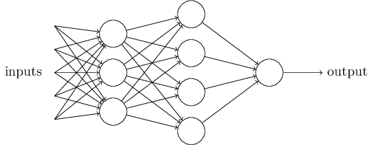
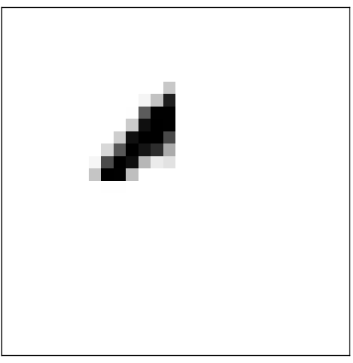

人类视觉系统是比较神奇的存在之一。考虑下面的数字手写体：


大部分人可以毫不费力的识别出这些数字：504192。其实这个识别的过程并没有想象的那么简单容易。人类大脑的两个半球，各有一个主要的视觉皮层，被称为V1，包含1400万神经元，百亿级别的的神经链接。并且人类的视觉处理不仅V1参与，整个一系列的视觉皮层--V2,V3,V4和V5--参与处理越来越复杂的图片处理。 我们的脑子好比一个超级计算机，经历了千万年的进化，变的超级适应于理解视觉世界。手写数字的识别并不简单。虽然我们人类非常擅长解释我们眼睛看到的东西，但是所有这个工作就是潜意识下完成的，所以我们并不觉得我们的视觉系统解决的问题有多么复杂。


当你尝试通过程序来识别上图的手写数字的时候，问题复杂性就出现了。一些看似简单的事变的极端困难。简单的直觉性的识别方法，变得很难用程序表达，比如：9的上面是个圆圈，右下方有条垂直的直线。当要精确描述这个规则的时候，大量的异常、附加条件以及特殊的情况涌现出来。情况变的令人失望。


神经网络用另一种方法解决这个问题。就是将一定数量的手写体数字，作为训练数据，如下，然后开发一个可以从训练数据中学习的系统。


换句话说，神经系统会自动从训练集中推断出识别数字的规则。而且，通过添加训练数据量，神经网络可以学习更多关于手写字体的知识，达到提高识别准确性的目的。所以，虽然上图只显示了100个训练样本，其实我们可以通过使用上千甚至十万百万的训练样本，训练一个识别率更高的神经网络。


本章中，我们将写实现一个识别手写数字的神经网络。整个程序只有74行代码，没有使用任何神经网络的开发库。但是这个程序的准确率在没有任何人工干预的情况下达到96%。并且，应用后续章节介绍的方法后，正确率可以达到99%。事实上，最好的商业的神经网络已经被银行用于处理支票，被邮局用于地址识别。

我们聚焦在手写字体识别这个问题，是因为它是学习神经网络的非常好的典型问题。它有两个很好的特点：一，这个问题具有一定的挑战性，二，它并不需要极端复杂的解决技巧和大量的计算资源。并且它是探索高级技术比如深度学习的非常好的例子，所以本书中，我们会经常的回归到这个问题上来。本书的稍后章节中，我们会讨论这些方法如何应用到其他问题上，比如计算机视觉，语音识别，自然语言处理等等领域。

当然，如果本章只是关于如何实现一个手写数字识别的程序，那么篇幅就不会这么长。事实上，我们会同时介绍很多关于神经网络的关键思想，其中包括两类重要的人工神经元：感知器和sigmoid神经元（the perceptron and the sigmoid neuron）,神经网络的标准学习算法，即随机梯度下降算法。通篇，我们的重点会放在解释事情为什么要这么做。当然，如果我只是介绍一些神经网络的基本概念的话，篇幅又会小很多，但是，深度的讨论是值得的。本章结束的时候，我们会知道什么是深度学习，为什么它很重要。

##感知器（perceptron）
什么是神经网络？我们首先解释一类人工神经元，名为感知器（perceptron）. 受到Warren McCulloch和Walter Pitts工作的启发，Frank Roseblatt在1950到1960年期间开发出感知器。现在，其他类型的神经元使用的比感知器要多（本书中，以及很多的现代神经网络模型中，使用的最多是是一个名为sigmoid的神经元）。我们很快就会讲到sigmoid神经元，为了更好的理解为什么sigmod神经元，我们首先要理解一下感知器。


什么是感知器，以及它是如何工作的呢？感知器有多个二值输入，$x1,x2,x3,…$，单个二值输出。如下图所示:


图例中的感知器，有三个输入$x1, x2, x3$，单个输出。一般情况下，它可能有更多或则更少的输入。Rosenbaltt提供一个计算输出的简单规则。他引入了权重的概念，实数$w1, w2, w3$，表达每个输入对于输出的重要性。输出可以取值0或1，这取决于输入的加权和是否小于一个阈值。阈值也是一个实数，是感知器本身的一个参数。更精确是数学表达如下：

$$
output=
\begin{cases}
0\quad if \sum_{j}w_jx_j\leq threshold\\
1\quad if \sum_{j}w_jx_j>threshold\\
\end{cases}
$$

这就是感知器的工具原理的全部。

这是感知器的基本数学模型，你可以把它看成一个基于权重的决策机器。举个例子，不是很贴切但是很容易理解，很快后面我们将遇到一个实际的例子：周末快到了，听说有个起司节在你们市举办。你非常喜欢起司，正在决定要不要去参加节日。你可能会综合考虑下面三个因素： 
 
* 1.	天气如何
* 2.	你的男朋友或女朋友有没有约你
* 3.	节日活动举办地点交通是否方便（你没有车）

我们用三个二值变量$x1, x2, x3$来表示以上的三个因素。$x1 = 1$表示天气很好，$x1=0$表示天气不好，类似的，$x2=1$表示有约，$x2=0$表示没有约会，$x3$也是如此。

现在, 我们假设你非常喜欢奶酪，即使你的男/女朋友不感兴趣，并且举办地点交通不方便，你也愿意去。但是你很讨厌糟糕的天气，所以如果天气很糟糕的话，你是不可能去参见奶酪节。你可以用感知器来建模这个决策过程。你可以设置天气的权重$w1 = 6$, 其他的条件权为$w2 = 2$, $w3 = 2$。$w1$的值很大，表示天气的影响很大，远大于约会和交通对你的影响。最后，假设你设置感知器的阈值为5。设置完感知器的输入权重和阈值后，你会发现如果天气好，你肯定会去，如果天气不好你肯定不会去，这个决策跟约会以及交通情况没有任何关系。

通过改变权重和阈值，我们可以得到不同的决策模型。比如，我们将阈值改为3，感知器会判定，在天气好，或则，你的朋友也愿意去并且交通方便的这两情况下，你都会去参加。降低阈值，表示你很愿意去参加奶酪节。

很明显，感知器并没有完全建模人类的决策过程。但是这个例子，解释了感知器可以通过加权考虑所有是输入条件，得出最后的决定。而且，一个复杂结构的感知器网络可以建模微妙复杂的决策过程：




上图所示的网络中，第一列感知器（称为第一层感知器），加权考虑输入变量，做一些基本的决策，第二层感知器呢？第二层的每个感知器，加权考虑第一层感知器的决策结果，从而输出自己的决策结果。这种方式下，第二层感知器可以在更复杂和更抽象的层次上决策。并且，更复杂和抽象层次的决策可以在之后层的感知器上决策。如此，一个多层的感知器网络，可以建模一个非常复杂的决策过程。

顺便说一下，之前在说感知器的时候，提到了感知器只有一个输出。但是在以上的感知器网络中，看起来来感知器有多个输出。其实不然，每个感知器还是只有一个输出，多条输出的箭头，只是表示感知器的输出被多个感知器用作输入而已。

我们来使用矩阵和向量简化一下感知器的数学描述，$\sum_{j}w_jx_j>threshold$有点复杂，我们做两点符号标记上的简化。第一个简化就是，把$\sum_jw_jx_j$改写成点乘的形式, $w\cdot x=\sum_{j}w_jx_j$，其中$w,x$是由权重和输入构成的向量；第二个简化就是把$threshold$从公式的右边移动到左边, 并且定义$b\equiv -threshold$，$b$被称为感知器的偏移值(bias)。简化后的规则如下：

$$
output=
\begin{cases}
0\quad if w\cdot x+b\leq 0\\
1\quad if w\cdot x+b>0\\
\end{cases}
$$

你可以把偏移值b看做是感知器输出1的难易程度的度量，或则术语化一点，感知器激活（fire）难易程度的度量。b比较大的时候，感知器很容易激活，b比较小的时候，感知器很难激活。很明显，引入偏移值的概念，只是对感知器的数学描述做了很小的简化。但是之后我们会看到，这个概念会导致更多的简化。所以，本书之后的部分，不再使用阈值的概念，会一直使用偏移值。


我们看到，感知器可以被用作决策模型。另外，感知器也可以用来实现基本的逻辑运行函数，与或非等等。比如，下图所示的感知器，有两个输入，权重都是-2，偏移值为3：


输入为00时输出为1，输入为01或则10时，输出为1，输入为11时，输出为0，所以这个感知器是个NAND门。

NAND门的例子显示我们可以用感知器做逻辑运算。事实上感知器网络可以计算任何逻辑运算。原因是NAND门是万能的，可以用来构建任何逻辑运算。比如，可以用NAND门构建加法电路，计算x1, x2之和。这个电路需要输出$x_1\bigoplus x_2$，和一个进位符，用来表示是否需要进位，例如当x1和x2均为1时，进位符为1。电路结构设计如下：


把图中的NAND门替换成感知器，就得到如下等价的感知器网络图，其中权重为-2，偏移值为3.


一个值得一提的细节是，最左边感知器的输出，用作了最下面的感知器的两个输入。在定义感知器的时候，我们没说这种输出用作感知器多个输入的情况是允许的。事实上，这个关系不大。如果你不允许这种设计存在，你可以把两个权重为-2的输入合并为一个权重为-4的输入。（如果你感觉这点改变不是很好懂，你应该停下来去理解一下，其实这两个设计是一致对等的）。如下图：


目前为止，图中的输入x1和x2，像是漂浮在感知器网络的左边的变量。事实上，通常的做法是额外再画一层感知器（称为输入层），如下图：


输入感知器的画法，如下图，有一个输出，没有任何输入： 


上面的例子说明了一个感知器的网络可以模拟一个由NAND门组成的任何电路。因为NAND门的万能性质，导致了感知器的万能性质。


感知器的万能计算特性，既令人鼓舞也令人失望，鼓舞是因为感知器网络跟任何其他的计算机器一样功能强大，令人失望是因为它看起来是一种新类型的NAND门，不算什么大新闻。

事实上，情况要不我们想想的要好。我们开发出了机器学习算法，自动调整网路中人工神经元的权重和偏移值。这种调整在接受外界的刺激后自动产生，不需要编程者的干预。这些机器学习算法，使我们使用神经元的方式跟传统的逻辑门完全不同：我们不用人工的设计由NAND门等逻辑门组成的电路，我们的神经网络可以自己学会处理和解决问题，并且包括一些通过人工很难设计电路来解决的问题。


##Sigmoid神经元

学习算法听起来很酷，但是我们如何来为一个神经网络设计一个这样算法呢？想像一下，为了解决一些问题，我们有了一个感知器组成的网络，假设输入就是手写数字的扫描图片中的像素，我们想让网络通过学习得到权重和偏移值，正确识别出的图片中的数字。为了理解学习的过程是怎样的，想象一下如果我们对权重和偏移值稍微修改一点，我们希望看到的结果是，网络的输出也在相应的小范围的变动。稍后我们会认识到，正是这个特性使得学习成为可能。图形化表示如下（当然，这个网络用来做图片识别就太简陋了）：


权重（或偏移值）的微小改变只会导致输出的微小改变，如果这个特性成立的话，我们就可以通过改变权重和偏移值，来使网络的行为越来越符合我们的预期。例如，网络将9识别成8了，我们可以找到方法，微小的调整权重或偏移值，使得网络的输出结果靠近9.我们重复这个过程，网络的输出就会越来越符合预期。网络就在不断的学习中。

问题是，当我们的网络由感知器组成的话，上述的特性不成立，权重或偏移值的微小改变，会导致输出的大幅度变化，甚至翻转。这种翻转会导致后续层次的感知器的输出大幅度的变化。所以，通过改变权重，9可能识别正确了，但是其他的数字的识别结果可能会失控。所以导致我们没办法渐进的调整这种网络的权重和偏移值。或许有更好的方法绕过这个问题，但是目前来说，对于感知器网络还没有绕过这个问题的好方法。

我们可以通过引入一种新的人工神经元克服这个问题，这种新的神经元被称为sigmoid神经元。Sigmoid神经元很类似感知器，但是为了满足上述的特性（微小的输入改变导致微小的输出改变），做了一点改变。


下面，我们来正式介绍sigmoid神经元。类似感知器，sigmoid神经元如下：


sigmoid神经元有输入,x1,x2,x3.但是输入除了可以是0,1离散值外，可以是任何实数，例如, 0.638。sigmoid神经元也有权重值w1,w2,w3和偏移值b,但是输出不是0，1,而是 , 其中 被称为sigmoid函数，定义如下：

$$\sigma(z)\equiv\frac{1}{1+e^{-z}}\quad(3)$$

结合z的定义，完全咱来后的输出如下：
$$\frac{1}{1+exp(-\sum_jw_jx_j-b)}\quad(4)$$

初看，sigmoid神经元跟感知器的差别非常大。Sigmoid神经元的代数表达式看起来复杂而且晦涩。事实上，sigmoid和感知器有很多相似点。Sigmoid神经元的表达式更多的是技术细节，并不会成为理解的障碍。

为了理解它跟感知器的差别，假设$z\equiv w\cdot x+b$是一个非常大的正整数,则$e^{-z}\approx0$,所以$\sigma(z)\approx1$.换句话说，当$z\equiv w\cdot x+b$为正数并且比较大，则sigmoid神经元的输出接近1，这点与感知器是一致的。假设相反，$z\equiv w\cdot x + b$为负数，并且很小，则$e^{-z}\rightarrow\infty$,导致$\sigma(z)\approx0$.换句话说，当$z\equiv w\cdot x+b$为负并且很小时，sigmoid神经元的输出也跟感知器一致。只有当$z\equiv w\cdot x+b$的取中间值的时候，才跟感知器有所区别。

关于$sigma$函数的代数表达式为什么是这样的？如何理解这个表达式呢？事实上， 函数的形式不重要，重要的是函数的曲线形状。下图是$\sigma$的曲线图：


这个形状是平滑版本的阶跃函数：


如果$\sigma$是阶跃函数的话，那么sigmoid就是一个感知器了，因为输出为1或则0完全取决于$w\cdot x+b$是正还是负。通过使用$\sigma$函数，我们得到的是个平滑版本的感知器。实际上，$\sigma$函数平滑曲线比较关键，而非函数的形式。$\sigma$函数的平滑意思就是，权重的小幅度变化$\Delta w_j$和偏移值的小幅度变化$\Delta b$会使得输出也产生小幅度的变化$\Delta output$.事实上，微积分告诉我们， $\Delta output$近似如下：
$$\Delta output\approx \sum_{j}\frac{\partial output}{\partial w_j}\Delta w_j+\frac{\partial output}{\partial b}\Delta b\quad(5)  $$

$\partial output/\partial w_j$和$\partial output/\partial b$分别表示output关于$w_j$和b的偏导数。对于偏导数不熟悉也不要紧张，虽然上述公式看起来比较复杂，它实际说明了一个简单的事情：$\Delta output$是$\Delta w_j$和$\Delta b$的线性函数。这种线性关系，使得通过改变权重和偏移值可以达到改变输出的目的。所以，虽然sigmoid神经元与感知器有很类似的行为，但是更容易找到调整权重和偏移值的方法。 

如果$\sigma$函数的关键在意他的函数形状，而不是他的代数形式，为什么选用等式（3）这种形式的函数呢？事实上，本书的后面会考虑其他函数作为神经元的激活函数(activation function)。函数形式的变化带来的最大改变就是公式（5）中的偏导数的变化。使用$\sigma$作为激活函数，是因为它的指数函数有很好的特性简化代数运算。通常情况下，$sigma$是个比较常用的神经网络的激活函数，也是本书中采用最多的激活函数。

如何解释sigmoid神经元的输出值呢？sigmoid神经元与感知器相比，一个明显的区别就是，神经元的输出不必是0或1，可以是0，1之间的任何整数。例如0.173, 0.689.等等。如果我们想用输出值表示图片的平均像素密度，这点很有用。例如我们想用输出值表示”输入的图片是9”或则”输入的图片不是9”，这点有时候又特别的麻烦。很明显，如果像感知器一样输出只有0或1，事情就容易的多。但实际上，可以这样处理一下，如果输出不小于0.5表示是9，小于0.5表示不是9.当使用这个约定的时候，我会显示声明，避免出现任何误解。

##神经网络的结构
在接下来这一节，我会介绍一个神经网络，在识别手写数字上表现的很不错。首先来熟悉一下相关的概念。假设有如下的神经网络：


稍早前提到的，最左边的一层称为输入层，这层里面的神经元被称为输入神经元。最右边的一层称为输出层。里面的神经元呗称为输出神经元。中间层被称为隐藏层，因为它们既不是输出层也不是输入层。隐藏层的隐藏听起来有些神秘，第一次听到的时候我认为它一定具有一些哲学或则数学的含义，但是它除了表示『既不是输入也不是输出』之外，没有任何其他意思。上图的网络中，只有一层隐藏层，有很多网络会有多层隐藏层。例如下图的网络中就有四层，有两层隐藏层：


由于历史的原因，这样多层网络有时被称为多层感知器或则MLPs，虽然它时候sigmoid神经元组成，而不是感知器。因为这个称呼过于混淆，本书中不准备使用MLP这个术语，但是我想提醒你的是这种称呼确实存在。


网络的输入和输出层的设计，往往都是比较简单直接的。例如，我们要识别一张图片是否未9，一个自然的设计就是将图片的像素作为输入。如果图片是个64x64的灰度图片，我们就有4096=64x64个输入神经元，并且输入值为映射到0和1之间。输出层只含有一个神经元，输出小于0.5表示不是9，大于0.5表示是9.


虽然输入和输出层的的设计通常比较直观和直接，隐藏层的设计却是一门艺术。没办法用几个简单的经验规则去总结隐藏层的设计过程。相反，研究者们开发出了许多的探索式的设计方法，帮助人们把网络训练成自己想要的样子。比如，这些方法包括如何权衡网络的规模与训练的时间。本书的后面将会涉及一个这样的设计方法。

目前为止我们讨论的神经网络都是一层的输出作为下一层的输入。这种网络被称为前向传播网络。意思就是网络中没有环路，信息永远是向前传递，永远不会向后反馈。如果有环路的话，会导致函数$\sigma$的输入依赖输出。这个没有意义，所以我们不允许有环路。

但是，在一些其他的模型中，环路是允许的。这些模型被称为递归神经网络。这些模型的思想就是一些神经元，会保持一段时间的激活状态，然后再变的关闭状态。这个激活的状态可以刺激其他的神经元，可能也在稍后的一段有限的时间内保持激活状态。这些又会导致更多的神经元被激活。所以随着时间的推移，我们得到一个瀑布式的激活。环路在这样的一个网络里不会导致问题，因为一个神经元的输出只会影响一段时间后的输入，而不是立即。


递归网络已经变的不如前向传播网络有影响力了，部分原因是因为它的学习算法（至少目前来看）不如前向传播网络强大。但是，递归网络依然是比较有趣的。它比前向传播网路更接近大脑的工作过程。它能解决的问题，用前向传播网络需要克服更多的困难。因篇幅有限，本书中我们只集中讨论前向传播网络。


##数字分类的简单网络
定义完神经网络之后，我们回到手写数字识别的问题上来。我们可以把手写数字识别的问题划分为两个子问题。第一个问题是，把一张包含很多数字的图片分成只包含一个数字的许多图片。比如，我们要把下面的图片

分成一下的六个单独的图片


人们可以很容易的完成这个切割问题。但是对计算机来说还是比较有挑战的。一旦分割完成后，程序需要做的是识别每个单独的图片上的数字。比如，我们需要程序识别成第一张图是5：  


我们会把精力集中在第二个问题上。因为实际上，一旦我们很好的解决了第二个问题后，第一个问题不是那么的难。有很多办法来解决分割问题。其中一个方法就是，尝试各种分割的方式，然后用解决第二个问题的数字识别器去评测每一个分割的方法。如果识别器识别每个分割后的图片没什么问题，则分割算法分数高，反之则分割算法分数低。中心思想就是，如果识别器遇到了问题，则问题可能是出在了所选的分割算法上。这个中心思想和几个其他的变种思想可以很好的解决分割问题。所以我们集中精力去构建神经网络，解决单个图片识别这个更有趣更有挑战的问题上。

我们的图片识别网络是一个三层的网络：


输入层对输入图片的像素进行编码。我们的输入是很多28x28像素的图片，所以我们的输入层包含了$28\cdot28=784$个神经元。简单起见，上图中我784个神经元并没有全部画出。输入的像素用灰度值表示，0.0表示全白，1.0表示全黑。中间值表示一定的灰度。

网络的第二层是隐藏层。我们把隐藏层中的神经元数量记为$n$,我们将测试不同的$n$值。例子中我们采用比较小的$n$值，$n=15$.

输出层包含10个神经元。如果第一个神经元激活，也就是第一个神经元的输出$\approx1$,则表示网络认为输入是0，如果第二神经元激活的话，则表示网络认为输入是1。以此类推，更准确的说，我们统计第0到9神经元的输出，找到输出值最高的神经元。比如说第6个的输出值最高，则表示网络认为输入是6。

你可能会奇怪我们为啥用10个输出神经元。毕竟，我们的网络需要输出的是输入图片对应的数字（0，1，2，...，9），只有十个可能的取值。一个看起来更自然的方法是用4个神经元，把每个神经元的输出当做一个二进制数字，最终取值取决于输出接近0还是1。4个神经元足够表示输出了，因为$2^4=16$,大于10.为什么我们采用10个神经元呢？这样不会低效吗？最后的判断是比较经验化的：我们测试了两种网络设计，结果显示，在这个特定的问题上，10个输出神经元比4个输出神经元表现更好。但是留下了一个问题给我们，为什么10个输出神经元的网络的会表现更好呢？有没有什么方法能预先告诉我们10输出神经元的设计比4个输出神经元的好呢？


为了理解这个问题我们来这么做，从基本原理出发去思考神经网络在做什么。首先我们使用10个输出神经元的设计。我们来看第一个输出神经元，它来决定输入是否是0.它通过权衡前面一层，也就是隐藏层的输出来做判断。那么这些隐藏层的神经元又在做什么呢？为了论证的需要，我们假设隐藏层的第一神经元在检测下面的图像是否出现在输入图片中：



它如何做到这点呢？它可以通过调整不同位置的像素的权重来完成：加大与上面图形重合的位置的像素的权重，减小其他位置的像素的权重，这样当上面图形出现时，神经元就会激活，没有出现时就不会激活。类似的，同样假设隐藏层的第2，3，4个神经元在检测下面的图像是否出现在输入图片中：


你可能已经猜到了，这四张图加一起就是0：


所以如果隐藏层的这四个神经元都激活的话，我们可以断定输入是0。当然，能断定输入是0的证据不止这四个图像的出现。有很多种，比如通过上面图像的转换，或则稍微的扭曲，同样可以断定输入是0。不管怎样，可以肯定的说，这四种图像出现时，输入是0.


我们这样假设神经网络的工作方式之后，可以很好的解释为什么10输出设计比4输出的要好。如果我们只有4个输出，则第一个输出神经元需要决定输出值的第一位比特位取值是什么。然而，没有简单的办法可以把第一位比特位的取值跟上图类似的简单图像关联起来。很难想象有什么好的理由，把数字的图像的部分形状和数字的比特位的取值关联起来。


上面所说的，都是一个启发式的方法。并不表示网络一定像我说的那样工作，隐藏层神经元去检测简单的部分图像是否出现。也许有更聪明的学习算法能让4输出神经元的设计表现更好。


##梯度下降学习

现在我们有了设计好的网络了，该如果学习识别数字呢？首先我们需要一个可以学习的数据集，称为训练集。我们使用MNIST数据集，包含了成千上万的手写体数字，以及他们的对应的分类。MNIST的名字来源于它是NIST和United States' National Institute of Standards and Technology收集和修改的数据集的一个子集。下面是一些例子：


当然，在测试神经网络的时候，不会使用我们的训练集的。

MNIST数据集有两部分。训练集部分包含60，000张图片。这些数据采样自250个人，其中一半是US Census Bureau的员工，另一半是高中学生。全部都是包含28x28个像素的灰度图片。测试集部分包含10，000张图片，他们也是28x28的灰度图。我们使用测试集评价我们网络的学习效果。为了能很好的评价学习效果，测试集采集自从250个不同的人。这让我们确保我们的网络能识别出在训练期间没有遇到过的图片。

我们把单个训练输入记为$x$。把$x$看做一个纬度是$28*28=784$的向量会比较方便。向量的每项表示图片中一个像素的灰度。把相应的输出记为$y=y(x)$,其中$y$是一个纬度为10的向量。例如，如果一个特定的训练图片x表示的是6，则$y(x)=(0,0,0,0,0,0,1,0,0,0)^T$是网络需要输出的值。注意T表示矩阵转置操作，把一个行向量转成一个列向量。

我们需要的是一个算法，帮我们找到权重和偏移值，使得对于每一个输入$x$,网络的实际输出$a$输出接近$y(x)$.为了衡量我们目标完成的质量如何，我们定义损失函数(有时也被称为代价函数，或则目标函数)如下：

$$C(w,b)\equiv\frac{1}{2n}\sum_{x}||y(x)-a||^2.\quad(6)$$


这里，$w$表示网络中权重的集合，$b$表示偏移集合，$n$表示训练集的数量，$a$表示当输入为$x$时，网络的实际输出。上面等式的求和在所有的输入x上进行。当然$a$的值依赖与$x,w,b$,为了简洁，我没有显示写出来这个依赖关系。$||v||$表示向量的长度。我们把C称为二次损失函数。有时也被称为均方差或则MSE.通过二次损失函数的定义可以看出，$C(w,b)$是一个非负数，因为求和的每一项都是非负数。并且，当对于所有输入$x$, $y(x)$几乎等于输出$a$的时候，$C(w,b)$值会很小，也就是$C(w,b)\approx0$.相反，当$C(w,b)$值比较大，也就说明对于多数输入$x$,$y(x)$的值跟$a$不够接近。所以学习算法的目标就是最小化函数C(w,b)的值。换句话说，我们要找出一组权重和偏移值，使得损失值尽可能的小。我们将使用一个叫梯度下降的算法来做这件事。


为什么要引入二次损失函数呢？毕竟，我们主要关心的不是正确分类的图片数量吗？
为什么不直接最大化这个数量值，而去最小化这么一个二次损失函数的间接的数据呢？问题在于这个数量值不是关于权重和偏移的平滑的函数。意思就是，大部分时候，权值和偏移的小改动不会改变数量值。这样我们就不知道如何修改权值和偏移值了才能使输出更符合预期。相比之下，如果是一个平滑的函数，我们就能知道如果改变权值和偏移，使网络的表现更好(原因我们后面再分析)。这就是为什么我们注意力集中在最小化这个二次损失函数，在这之后再去检查分类的正确率。

即使假设我们需要的是一个平滑的损失函数，你可能还有疑问，为什么选择等式（6）这样的二次函数呢?是专门设计的吗？或则，我们如果选择一个不同的损失函数，我们将得到完全不同的权值和偏移值吗？这个考虑是有道理的。后面我们会再次回到损失函数的讨论上来，并且对损失函数做出一些修改。暂时我们还是直接用这个二次损失函数，因为它在我们理解神经网络的基础的时候表现很好。

总而言之，我们训练网络的目标就是找到这样的一些权重和偏移值，使得二次损失函数$C(w,b)$的值最小化。这是一个适定问题（well-posed problem，适定问题需要满足三个条件：1，解存在。2，解是唯一的。3，解连续依赖于初始条件）,但是它的解依赖很多变量，包括权重，偏移，$\sigma$函数，网络结构，MNIST数据集，等等。事实上，我们可以忽略这些细节，集中精力理解最小化问题。所以，从现在开始我们暂时忘记损失函数的具体形式、神经网络网络中的链接，等等具体细节。相反，我们想象一下我们拿到了一个关于很多变量的函数，我们需要最小化这个函数的值。我们将开发出一个叫做梯度下降的方法来解决这类最小化问题。然后,我们再回到神经网络损失函数的最小化问题上来。


好，我们假设我们要最小化一个函数，$C(v)$。这个可以是任何包含多个变量的实函数，变量$v=v_1,v_2,...$。我将$w,b$换成了$v$，是为了说明函数可以是任何函数，我们不在神经网络这个上下文中来考虑这个问题。为理解最小化$C(v)$的问题，首先可以把函数想象成只有两个变量$v_1, v_2$的函数:


问题变成我们需要找到$C$在哪取得最小值。当然，通过上面的图，我们可以直接肉眼看出函数在哪取得最小值。这个例子可能有点简单。通常情况下，$C$可能是关于更多变量的函数，通常是没办法直接通过看图来找到最小值点的。

一个可能的办法是通过微积分知识来找到最小值点。我们可以通过计算导数来找到极值点。如果比较幸运，比如C是关于少数变量的函数，这个方法可能可行。但是当变量多起来后，这个方法就是一个噩梦。对于神经网络来说，我们通常需要比这个多得多的变量。最大的神经网络中，损失函数以极端复杂的方式依赖着百万级别的权重和偏移值，使用微积分方法实际中是行不通的。

幸运的是，有一个非常完美的分析提供了一个表现很好的算法。首先，把我们的函数现象成一个山谷。看一下上面的函数图像，应该不难想象。我们日常的经验告诉我们，球最终会滚到山谷的谷底。也许我们可以利用这个思想来寻找函数的最小值呢？我们随机的选择球的开始位置，然后模拟球滚动到山谷底部的运动。我们可以通过计算函数C的导数来模拟这个过程。这个导数会告诉我们关于山谷的局部形状的信息，因此我们知道球应该怎么滚动。


根据我的描述，你或许会觉得我们要用到牛顿运动方程，考虑摩擦力，重力，等等。实际上，我们不准备这么逼真的模拟这个过程，我们是在开发一个最小化C的算法，而不是精确的模拟物理定律。这个球的角度的分析是为了激发我们想象，而不是限制我们的思考。所以，与其陷入物理定律的复杂细节中，我们来问我们自己一个简单的问题：如果让我们当一天上帝，我们能决定物理定律，决定球如果滚动，那么为了使球能滚到谷底，我们会选择哪个或哪些定律呢？


为了更准确的描述问题，我们想象一下，如果我把球在$v_1$的方向上移动$\Delta v_1$,在$v_2$的方向上移动$\Delta v_2$，根据微积分得出:

$$\Delta C\approx\frac{\partial C}{\partial v_1}\Delta v_1+\frac{\partial C}{\partial v_2}\Delta v_2\quad (7)$$


我们将寻找到一个方法，去选择合适的$\Delta v_1,\Delta v_2$使得$\Delta C$为负值，也就是让球往下滚动，一直滚动到山谷。为了找到这个选择的方法，我们定义变量$\Delta v\equiv (\Delta v_1, \Delta v_2)^T$，其中$T$表示矩阵转置操作，把行向量转成列向量。并且引入梯度的概念，定义函数C的梯度为偏导数组成的向量，即$(\frac{\partial C}{\partial v_1},\frac{\partial C}{\partial v_2})^T$。我们把梯度向量记为$\nabla C$,也就是：

$$\nabla C\equiv(\frac{\partial C}{\partial v_1},\frac{\partial C}{\partial v_2})^T$$


很快我们将用变量$\Delta v，\nabla C$重写$\Delta C$。在这之前，我想提一点，人们有时候会卡在梯度的概念上。当第一次遇到$\nabla C$符号的时候，人们有时会困惑：我们应该怎么看待$\nabla$符号呢？$\nabla$到底表示什么意思呢？事实上，把$\nabla C$整体当做单个的数学符号比较合适。从这个角度出发，$\nabla$只不过是一个用来标记的符号，告诉你"嘿，$\nabla C$表示C的梯度向量"。当然，在某些高等概念中，也可以把$\nabla$看做单独的一个符号(比如微分操作的符号)，但是这里我们不需要这么做。

有了这些定义之后，等式7可以改写成下面的形式：

$$\Delta C\approx\nabla C\cdot \Delta v\quad (9)$$

这个等式也解释了为什么$\nabla C$被称为梯度向量：因为$\nabla C$表示C的改变量与v的改变量之间的关系，这正是梯度（或则变化率）概念的含义。不过最令人激动的是，这个等式也告诉我们了应该如果选择$\Delta v$来使得$\Delta C$是个负值。具体来说，如果我们选择

$$\Delta v=-\eta\nabla C\quad (10)$$

其中$\eta$是一个小的正数（被称为学习速率），则公式9告诉我们，$\Delta C \approx-\eta\nabla C\cdot\nabla C=-\eta\||\nabla C||^2$。因为$||\nabla C||^2\geq0$,所以这就保证了$\Delta C\leq0$,也就是说如果我们按照等式10去选择$\Delta v$的话，$\Delta C$会一直是个负值, C的值就会一直减小，不会增加。这正式我们需要的特性。所以可以得出我们移动球的规则如下：

$$v\rightarrow v'=v-\eta\nabla C\quad(11)$$

如果我们一直不断的如此更新v的值，C的值会不断的减小，直到取得最小值。


总结一下，梯度下降算法的过程就是反复的计算梯度$\nabla C$，然后向梯度相反的方向移动球。如下图所示：


注意梯度的这个更新规则并没有完全重现物理运动的过程。在现实生活中球是有动量的，导致球可以越过谷底，甚至往上滚动；在摩擦力的作用下，最终球会停在谷底。


为了让梯度下降能很好的起作用，我们选择的$\eat$不能太大，使得等式9的近似计算成立，同时又不能太小，太小会导致$\Delta v$值过小，结果是梯度下降算法非常的缓慢。

上面，我们解释了当C是两个变量的函数时的情况。事实上，当C是更多变量的函数时，上面的方法同样适用。假设C是m个变量的函数，$v_1, v_2, ...,v_m$.则：

$$\Delta C\approx\nabla V\cdot\Delta v\quad(12)$$

其中$\Delta v=(\Delta v_1,...,\Delta v_m)^T$,


$$\nabla C\equiv(\frac{\partial C}{\partial v_1},...,\frac{\partial C}{\partial v_m})^T\quad(13)$$

与两个变量的情况类似，我们选择:

$$\Delta v=-\eta\nabla C\quad(14)$$

则可以保证$\Delta C$为负值。所以v的更新规则如下：

$$v\rightarrow v'=v-\eta\nabla C\quad(15)$$


你可以把这个更新规则当做梯度下降算法的定义。它给我们提供了一个通过不断改变v的值来寻找C最小值的方法。但是，这个方法并不是在所有情况下都有效，在一些情况下可能没法找到全局最小值，后面我们将仔细讨论这个问题。事实上，实践中梯度下降算法通常是特别有用。


另外，梯度下降其实也是寻找最小值的最佳策略。假设我们要移动$v$一个固定的量，使得C值降低的最多，也就是最小化$\Delta C\approx\nabla C\cdot\Delta v$。如何选择$\Delta v$的方向呢？我们限制移动的大小$||\Delta v||=\epsilon$,其中是$\epsilon>0$的固定的比较小的值。也就是，我们固定移动的大小。可以证明的是，当$\Delta v=-\eta\nabla , \eta=\epsilon/||\nabla C||，||
\Delta v||=\epsilon$的时候，$\nabla C\cdot\Delta v$取得最小值。所以梯度下降可以在最少的步骤里降低C的值。


人们发明了很多梯度下降算法的变体，有些更逼真的模拟了现实的物理过程。这些模拟算法各有优点，但是都有个共同的缺点：需要计算C的二阶导数，这个是很费计算资源的。比如说，假设我们要计算二阶导数$\partial^2C/\partial v_j\partial v_k$，如果有百万的变量，则需要计算万亿的二阶偏导。这个计算量非常大。有办法避免这样的问题，这方面的研究也是个活跃的领域。本书中，我们主要还是用梯度下降算法。


我们如何把梯度下降应用到神经网络上呢？中心思想就是运用梯度下降找到权重和偏移来最小化等式6.为了了解如何做到这点，我们用权重和偏移重写梯度下降更新规则。我们的位置现在分为$w_k$和$b_l$两部分，梯度向量$\nabla C$也分为$\partial C/\partial w_k$和$\partial C/\partial b_l$两部分.更新规则分开写得到下面两条规则：

$$w_k\rightarrow w_k'=w_k-\eta\frac{\partial C}{\partial w_k}\quad(16)$$
$$b_l\rightarrow b_l'=b_l-\eta\frac{\partial C}{\partial b_l}\quad(17)$$

通过重复的应用这些规则，我们的球可以"滚下山"，极有可能找到损失函数的最小值。这些就是神经网络的学习规则。

应用梯度下降会有一系列的挑战的。后续的章节中我们会深入讨论。这里我先提一点,我们来回忆一下二次损失函数的定义6,这个损失函数形式为$C=\frac{1}{n}\sum_{x}C_x$,也就是它是单个训练数据损失的$C_x\equiv\frac{||y(x)-a||^2}{2}$的平均值。实际中，我们要计算$\nabla C$我们需要分别计算每个训练输入的$\nabla C_x$，然后取平均值$\nabla C=\frac{1}{n}\sum_x\nabla C_x$.问题是，当训练样本数量比较大的时候，这个过程会非常耗时。


一个称为随机梯度下降的算法可以用来加快这个学习的过程。中心思想是用随机选择的一小部分样本的$\nabla C_x$的平均值去估计梯度$\nabla C$.这个均值可以很好的估计真实的梯度$\nabla C$,而且可以加快学习的速度。


更准确的说，随机梯度下降算法随机选择少量的的训练数据，比如说数量为m个。我们把这些输入记为$X_1,X_2,...,X_m$,并称之为Mini-batch.如果m值足够大，则$\nabla C_{X_j}$的均值就足够接近全部$\nabla C_x$的平均值，也就是:

$$\frac{\sum_{j=1}^m\nabla C_{X_j}}{m}\approx\frac{\sum_x\nabla C_x}{n}=\nabla C\quad (18)$$

其中右边是在所有的训练集上求平均值。


交换两边得到：

$$\nabla C\approx \frac{1}{m}\sum_{j=1}^{m}\nabla C_{X_j}\quad(19)$$


证明我们可以用随机选择的mini-batch的梯度值估计整体的梯度值。


为了把这个跟神经网络显示的联系在一起，假定$w_k$和$b_l$表示网络中的权重和偏移。则随机梯度下降算法的更新规则如下：

$$w_k\rightarrow w_k'=w_k-\frac{\eta}{m}\sum_j\frac{\partial C_{X_j}}{\partial w_k}\quad(20)$$
$$b_l\rightarrow b_l'=b_l-\frac{\eta}{m}\sum_j\frac{\partial C_{X_j}}{\partial b_l}\quad(21)$$

其中的求和是在mini-batch中。然后我们选择另一个Mini-batch。以此类推，直到消耗完所有的训练输入，称为完成了一批次的训练。在那之后我们开始新的一批次的训练。


我们可以把随机梯度下降想象成政治选举：在一个mini-bath上进行要比在全体数据上进行要简单的多。比如我们有训练数据n=60，000，我们选择的minibatch大小m=10.这就意味着我们估计梯度的速度提升了6000倍。当然，我们的估计不是很完美，有统计波动。但是这个估计不需要非常的完美，我们在意的是大概往减少C的方向前进。事实上，在训练神经网络的时候，随机梯度下降普遍被应用的强大的算法。她的一些基础知识我们在本书的后续继续学习。


作为本节的结束，我讨论一个有时会困扰梯度新手的问题。在神经网络中，损失函数C是一个关于很多变量的函数，所以的权重和偏移。某种意义上定义了一个非常高纬度的平面。一些人不停的在想：我必须能可视化所有这些纬度。然后他们开始担心："4纬我都没法想象了，更别提5或则5百万纬度了，我们缺少什么特定的能力吗？一些厉害的真正的数学家拥有的能力"。毫无以为，答案是否定的。大多数专业的数学家甚至不能很好的可视化四纬空间。他们的技巧就是，相反的，开发一些其他的方式来表示发生的事。这正式我们在上面所做的：我们用了线性代数（而不是视觉）表示了怎么去移动来减小C值。擅长高纬度思考的人有很多进行高纬思考的工具，我们的线性代数就是其中一个例子。这些技术不像可视化三纬一样简单，但是一旦你建立了这些技术的能力，你会非常擅长高危的的思考。我不会讨论这些细节，但是如果你感兴趣的话，可以看看这些[讨论](http://mathoverflow.net/questions/25983/intuitive-crutches-for-higher-dimensional-thinking)，关于专业数学家用来做高纬度思考的方法。虽然许多讨论非常复杂，但是很多好的内容都是很启发和可用的，可以被任何人掌握的。


##数字分类网络的实现


我们来写个程序实现数字识别，用随机梯度下降和MNIST训练数据。我们用python(2.7),大概74行的代码。第一件事是获得MINIST数据。如果你使用git,可以通过下面方式获取数据：

```
git clone https://github.com/mnielsen/neural-networks-and-deep-learning.git
```

如果你不用git，可以从这里[下载](https://github.com/mnielsen/neural-networks-and-deep-learning/archive/master.zip)数据和代码。

顺便说一下，之前我们在介绍MNIST数据集的时候，说过它分为60，000个图片的训练集和10，000个图片的测试集。这是Minist官方的划分方式。我们准备重新划分一下数据：10，000测试集不变，然后将60，000训练集数据划分为50，000的训练集和10，000的验证集。本章中我们不会用到验证集，但本书的后续章节中，在寻找如何设置超参（如学习效率等等）的时候，验证集非常有用。虽然验证集不属于MNIST原始的划分方式，但是在神经网络中，这么划分非常常见。所以，现在开始，当我说训练集的时候，指的就是50，000的图片数据，而不是60，000.

除了使用MNIST数据外，我们还需要Python库Numpy,进行线性代数运算。如果没有，可以从这里[获取](http://numpy.org)。


给出全部代码之前，我们来解释一下核心的代码。核心类是Network,用来表示一个神经网络。下面是初始化Network对象的代码：

```
class Network(object):
    def __init__(self,sizes):
        self.num_layers = len(sizes)
        self.sizes = sizes
        self.biases = [np.random.randn(y,1) for y in size[1:]]
        self.weights = [np.random.randn(y,x) for x,y in zip(sizes[:-1],sizes[1:])]
```

代码中，列表sizes包含各层的神经元数量。所以，假如我们想创建一个第一层有2个神经元，第二层有3个神经元，输出层有1个神经元的Network,可以用下面的代码实现：

```
net = Network([2,3,1])
```
Network的权重和偏移都会用Numpy的np.random.randn函数产生的均值为0标准差为1的高斯分布随机初始化，。这些随机值定义的随机梯度下降开始的位置。后续章节中，我们将寻找更好的初始化的方法，目前我们还用这种方式初始化。需要注意的是，Network的初始化代码默认假设第一次神经元是输入层，所以没有为它们设置偏移值，因为对于输入层来说，偏移值没有用。

也注意一下偏移和权重都是存成Numpy的矩阵形式。所以，net.weight[1]是连接第二层到第三层的权重矩阵。（而不是第一层到第二层的，因为python列表的索引是从0开始的）。因为net.weights[1]比较复杂，我们简单标记这个矩阵为$w$.此矩阵的$w_{jk}$项表示第二层的$k^{th}$神经元到第三层$j^{th}$神经元的权重。下标$j,k$的顺序看起来有点奇怪，$j,k$交换一下不是更直观吗？保持这个顺序的最大的好处就是第三层的激活向量可以直接写成：

$$a'=\sigma(wa+b)\quad(22)$$


等式比较复杂，我们一点点分析。$a$是第二层的激活向量。为了计算$a'$,我们先把$a$和权重矩阵$w$相称，然后加上偏移向量b。然后对向量$wa+b$的每个元素调用函数$sigma$.(这个叫做向量化$\sigma$函数。)。很容易验证,对于计算一个$sigma$神经元的输出，等式22结果更等式4的一样。

知道这些后，很容易代码实现。首先定义$\sigma$函数;

```
def sigmoid(z):
	return 1.0/(1.0+np.exp(-z))
```

注意，当输入$z$是向量或则Numpy数组的话，Numpy会自动的对每个元素调用$sigmoid$函数，也就是向量化的形式。

然后给Network类添加一个feedfordward函数，对于给定的输入a，计算响应的输出，这个函数所做的就是层层应用等式22：

```
def feedforward(self, a):
	""" Return the output of the network if "a" is input """
	for b, w int zip(self.biases, sefl.weights):
		a = sigmoid(np.dot(w,a) + b)
	return a
```

当然，Network最主要的工作是学习。我们给Network添加一个SGD函数，实现随机梯度下降算法。代码清代如下，一些地方会比较神秘，我们一个个分析：

```
def SGD(self, training_data, epochs, mini_batch_size, eta, test_data=None):
	"""Train the neural network using mini-batch stochastic
        gradient descent.  The "training_data" is a list of tuples
        "(x, y)" representing the training inputs and the desired
        outputs.  The other non-optional parameters are
        self-explanatory.  If "test_data" is provided then the
        network will be evaluated against the test data after each
        epoch, and partial progress printed out.  This is useful for
        tracking progress, but slows things down substantially."""

    if test_data: n_test=len(test_data)
    n=len(training_data)
    for j in xrange(epochs):
    	random.shuffle(training_data)
    	mini_batches=[training_data[k:k+mini_batc_size] for k in xrange(0,n,mini_batch_size)]

    	for mini_batch in mini_batches:
    		self.update_mini_batch(mini_batch,eta)
    	if test_data:
    		print "Epoch {0}: {1} / {2}".format(j, self.evaluate(test_data), n_test)
    	else:
    		print "Epoch {0} complete".format(j)
```

training_data是（x,y）的列表，表示输入和对应的输出。epochs是训练从次数，mini_batch_size是mini_batch大小，eta表示学习速率$\eta$.如果提供给了测试集test_data,则在每次训练结束后评估一下学习的效果。这个对跟踪进度非常有用，但是会明显减慢训练的速度。


代码如下。每次训练的开始，首先随机打乱训练数据的顺序，然后分割成合适大小的mini-batch.这是从训练集中随机采用的比较简单的方法。然后对于每一个mini-batch，我们应用梯度下降算法。这个过程由self.update_mini_batch(mini_batch,eta)代码完成，它在mini_batch的训练数据上，依据梯度下降算法更新权重和偏移。update_mini_batch的算法如下：

```
def update_mini_batch(self, mini_batch, eta):
	"""Update the network's weights and biases by applying
        gradient descent using backpropagation to a single mini batch.
        The "mini_batch" is a list of tuples "(x, y)", and "eta"

    nabla_b=[np.zeros(b.shape) for b in self.biases]
    nabla_w=[np.zeros(w.shape) for w in self.biases]

    for x,y in mini_batch
    	delta_nabla_b, delta_nabla_w = self.backprop(x,y)
    	nabla_b=[nb+dnb ofr nb, dnb in zip(nabla_b, delta_nabla_b)]
    	nabla_w=[nw+dnw for nw, dnw in zip(nabla_w, delta_nalbla_w)]

    self.weights = [w-(eta/len(mini_batch))*nw for w, nw in zip(self.weights, nabla_w)]
    self.biases=[b-(eta/len(mini_batch))*nb for b ,nb in zip(self.biases, nabla_b)]

```

主要的工作在于这行：

```
delta_nabla_b, delta_nabla_w = self.backprop(x,y)

```


这行涉及一个称作为backpropagaton的算法，是一个计算损失函数梯度的快速算法。所以update_mini_batch的工作就是对于mini_batch中的每个函数计算梯度值，然后去更新self.weight和self.biases.

现在我不打算给出self.backprop的代码。我们将在下一章中学习backpropagation是怎么工作的，包括self.backprop的代码。目前我们把它当成一个黑盒子，知道它会返回梯度值就OK了。


我们来看一下整个程序，包括了文档注释部分：

```
network.py
~~~~~~~~~~

A module to implement the stochastic gradient descent learning
algorithm for a feedforward neural network.  Gradients are calculated
using backpropagation.  Note that I have focused on making the code
simple, easily readable, and easily modifiable.  It is not optimized,
and omits many desirable features.
"""

#### Libraries
# Standard library
import random

# Third-party libraries
import numpy as np

class Network(object):

    def __init__(self, sizes):
        """The list ``sizes`` contains the number of neurons in the
        respective layers of the network.  For example, if the list
        was [2, 3, 1] then it would be a three-layer network, with the
        first layer containing 2 neurons, the second layer 3 neurons,
        and the third layer 1 neuron.  The biases and weights for the
        network are initialized randomly, using a Gaussian
        distribution with mean 0, and variance 1.  Note that the first
        layer is assumed to be an input layer, and by convention we
        won't set any biases for those neurons, since biases are only
        ever used in computing the outputs from later layers."""
        self.num_layers = len(sizes)
        self.sizes = sizes
        self.biases = [np.random.randn(y, 1) for y in sizes[1:]]
        self.weights = [np.random.randn(y, x)
                        for x, y in zip(sizes[:-1], sizes[1:])]

    def feedforward(self, a):
        """Return the output of the network if ``a`` is input."""
        for b, w in zip(self.biases, self.weights):
            a = sigmoid(np.dot(w, a)+b)
        return a

    def SGD(self, training_data, epochs, mini_batch_size, eta,
            test_data=None):
        """Train the neural network using mini-batch stochastic
        gradient descent.  The ``training_data`` is a list of tuples
        ``(x, y)`` representing the training inputs and the desired
        outputs.  The other non-optional parameters are
        self-explanatory.  If ``test_data`` is provided then the
        network will be evaluated against the test data after each
        epoch, and partial progress printed out.  This is useful for
        tracking progress, but slows things down substantially."""
        if test_data: n_test = len(test_data)
        n = len(training_data)
        for j in xrange(epochs):
            random.shuffle(training_data)
            mini_batches = [
                training_data[k:k+mini_batch_size]
                for k in xrange(0, n, mini_batch_size)]
            for mini_batch in mini_batches:
                self.update_mini_batch(mini_batch, eta)
            if test_data:
                print "Epoch {0}: {1} / {2}".format(
                    j, self.evaluate(test_data), n_test)
            else:
                print "Epoch {0} complete".format(j)

    def update_mini_batch(self, mini_batch, eta):
        """Update the network's weights and biases by applying
        gradient descent using backpropagation to a single mini batch.
        The ``mini_batch`` is a list of tuples ``(x, y)``, and ``eta``
        is the learning rate."""
        nabla_b = [np.zeros(b.shape) for b in self.biases]
        nabla_w = [np.zeros(w.shape) for w in self.weights]
        for x, y in mini_batch:
            delta_nabla_b, delta_nabla_w = self.backprop(x, y)
            nabla_b = [nb+dnb for nb, dnb in zip(nabla_b, delta_nabla_b)]
            nabla_w = [nw+dnw for nw, dnw in zip(nabla_w, delta_nabla_w)]
        self.weights = [w-(eta/len(mini_batch))*nw
                        for w, nw in zip(self.weights, nabla_w)]
        self.biases = [b-(eta/len(mini_batch))*nb
                       for b, nb in zip(self.biases, nabla_b)]

    def backprop(self, x, y):
        """Return a tuple ``(nabla_b, nabla_w)`` representing the
        gradient for the cost function C_x.  ``nabla_b`` and
        ``nabla_w`` are layer-by-layer lists of numpy arrays, similar
        to ``self.biases`` and ``self.weights``."""
        nabla_b = [np.zeros(b.shape) for b in self.biases]
        nabla_w = [np.zeros(w.shape) for w in self.weights]
        # feedforward
        activation = x
        activations = [x] # list to store all the activations, layer by layer
        zs = [] # list to store all the z vectors, layer by layer
        for b, w in zip(self.biases, self.weights):
            z = np.dot(w, activation)+b
            zs.append(z)
            activation = sigmoid(z)
            activations.append(activation)
        # backward pass
        delta = self.cost_derivative(activations[-1], y) * \
            sigmoid_prime(zs[-1])
        nabla_b[-1] = delta
        nabla_w[-1] = np.dot(delta, activations[-2].transpose())
        # Note that the variable l in the loop below is used a little
        # differently to the notation in Chapter 2 of the book.  Here,
        # l = 1 means the last layer of neurons, l = 2 is the
        # second-last layer, and so on.  It's a renumbering of the
        # scheme in the book, used here to take advantage of the fact
        # that Python can use negative indices in lists.
        for l in xrange(2, self.num_layers):
            z = zs[-l]
            sp = sigmoid_prime(z)
            delta = np.dot(self.weights[-l+1].transpose(), delta) * sp
            nabla_b[-l] = delta
            nabla_w[-l] = np.dot(delta, activations[-l-1].transpose())
        return (nabla_b, nabla_w)

    def evaluate(self, test_data):
        """Return the number of test inputs for which the neural
        network outputs the correct result. Note that the neural
        network's output is assumed to be the index of whichever
        neuron in the final layer has the highest activation."""
        test_results = [(np.argmax(self.feedforward(x)), y)
                        for (x, y) in test_data]
        return sum(int(x == y) for (x, y) in test_results)

    def cost_derivative(self, output_activations, y):
        """Return the vector of partial derivatives \partial C_x /
        \partial a for the output activations."""
        return (output_activations-y)

#### Miscellaneous functions
def sigmoid(z):
    """The sigmoid function."""
    return 1.0/(1.0+np.exp(-z))

def sigmoid_prime(z):
    """Derivative of the sigmoid function."""
    return sigmoid(z)*(1-sigmoid(z))

```

程序识别数字的效果怎么样呢？首先我们加载MNIST数据。我们通过minist_loader.py来完成：

```
>>>import mnist_loader
>>>training_data, validation_data, test_data=mnist_loader.load_data_wrapper()


```


加载完MNIST数据之后，我们新建一个隐藏层包含30个神经元的Network:

```
>>>import network
>>>net=network.Network([784,30,10])
```

最后，我们用随机梯度下降算法在training_data上训练30批次，设置mini-batch的大小为10，学习速率$\eta=3.0$


```
>>>net.SGD(training_data, 30, 10, 3.0, test_data=test_data)
```

上面的过程在一台2015年的普通的机器上可能会持续几分钟。当然可以通过减小网络的规模，减小训练数据来加快训练的过程。注意这些代码是为了让你理解神经网络，而不是为了高性能的线上任务。

```
Epoch 0: 9129 / 10000
Epoch 1: 9295 / 10000
Epoch 2: 9348 / 10000
...
Epoch 27: 9528 / 10000
Epoch 28: 9542 / 10000
Epoch 29: 9534 / 10000
```

分类的准确率差不多在95%左右，在第28次训练后达到最大值95.42%.对于第一次尝试来说，这个结果很令人鼓舞。我应该提醒你的是，你运行代码后得到的准确率可能跟我的不太一样哦，因为我们用的不同的初始值来初始化牵着偏移。为了产生这个结果我采用了三次实验结果中的最好的一次。


让我们把隐藏神经元数量改成100，然后再次运行一下：

```
>>>net=network.Network([784, 100, 10])
>>>net.SGD(training_data, 30, 10, 3.0, test_data=test_data)

```

准确率提升到了96.59%。至少在本例子中，使用更多的隐藏神经元帮助我们拿到了更好的结果。
当然，为了获得这个准确率，我必须选择一个合适的训练次数，mini-batch大小，学习速率，等等。这些被称为超参，为了跟权重和偏移等参数区分开，后者是通过学习算法自动学习到的，而前者需要实验者人工设置。如果我们选择的超参不合适，结果可能比较差。例如，假设我们设置$\eta=0.001$

```
>>>net=network.Network([784,100,10])
>>>net.SGD(training_data, 30, 10, 0.001, test_data=test_data)
```

结果就不那么好了

```
Epoch 0: 1139 / 10000
Epoch 1: 1136 / 10000
Epoch 2: 1135 / 10000
...
Epoch 27: 2101 / 10000
Epoch 28: 2123 / 10000
Epoch 29: 2142 / 10000
```


但是可以看到随着时间的推移结果逐渐变好。这个现象提示我们增大学习速率可能有用，比如$\eta=0.01$，我们这么做之后，得到更好的结果了，再次提示我们增大学习速率。（如果一个修改提升了效果，就继续修改！）这样经过我们几次修改之后，学习速率达到$\eat=1.0$（也可能是3.0），接近了我么前面实验的值。所以，即使开始我们选择了不合适的超参，我们至少能拿到足够的信息改进我们的超参的值。

但是，通常来说，调试神经网络是比较有挑战的。特别是初始的超参产生的结果无异于噪音的时候。假设上面的网络，其他保持不变，但是初始学习效率$\eta=100$

```
>>> net = network.Network([784, 30, 10])
>>> net.SGD(training_data, 30, 10, 100.0, test_data=test_data)

```

学习速率太高，我们的选择错的太离谱：

```
Epoch 0: 1009 / 10000
Epoch 1: 1009 / 10000
Epoch 2: 1009 / 10000
Epoch 3: 1009 / 10000
...
Epoch 27: 982 / 10000
Epoch 28: 982 / 10000
Epoch 29: 982 / 10000
```

现在想象一下假如我们第一次遇到这个问题。当然，通过前面的实验，我们知道应该降低学习速率。但是如果我们第一次遇到这个问题，输出的结果就没有告诉我们该怎么做了。我们可能不仅仅考虑学习速率，而且还会考虑神经网络的所有其他方面。我们或许会怀疑权重和偏移的初始值设置不当导致网络很难学习？或则是训练集不够？又或则是训练次数不够？或则是神经网络结构的问题？学习速率太低了？太高了？当第一次遇到这个问题的时候，有太多的不确定性。

这个例子中我们学习到，调试神经网络不是靠运气的，跟其他的编程一样，是一门艺术。你需要掌握这么艺术才能得到好的结果。通常来说，我们需要构建出选择好的超参和结构的探索性方法。我们在本书中会一直探讨这么问题，包括我是怎么选择上面的超参的。


前面我跳过了MNIST数据加载的部分，为了完整期间，代码如下：

```
mnist_loader
~~~~~~~~~~~~

A library to load the MNIST image data.  For details of the data
structures that are returned, see the doc strings for ``load_data``
and ``load_data_wrapper``.  In practice, ``load_data_wrapper`` is the
function usually called by our neural network code.
"""

#### Libraries
# Standard library
import cPickle
import gzip

# Third-party libraries
import numpy as np

def load_data():
    """Return the MNIST data as a tuple containing the training data,
    the validation data, and the test data.

    The ``training_data`` is returned as a tuple with two entries.
    The first entry contains the actual training images.  This is a
    numpy ndarray with 50,000 entries.  Each entry is, in turn, a
    numpy ndarray with 784 values, representing the 28 * 28 = 784
    pixels in a single MNIST image.

    The second entry in the ``training_data`` tuple is a numpy ndarray
    containing 50,000 entries.  Those entries are just the digit
    values (0...9) for the corresponding images contained in the first
    entry of the tuple.

    The ``validation_data`` and ``test_data`` are similar, except
    each contains only 10,000 images.

    This is a nice data format, but for use in neural networks it's
    helpful to modify the format of the ``training_data`` a little.
    That's done in the wrapper function ``load_data_wrapper()``, see
    below.
    """
    f = gzip.open('../data/mnist.pkl.gz', 'rb')
    training_data, validation_data, test_data = cPickle.load(f)
    f.close()
    return (training_data, validation_data, test_data)

def load_data_wrapper():
    """Return a tuple containing ``(training_data, validation_data,
    test_data)``. Based on ``load_data``, but the format is more
    convenient for use in our implementation of neural networks.

    In particular, ``training_data`` is a list containing 50,000
    2-tuples ``(x, y)``.  ``x`` is a 784-dimensional numpy.ndarray
    containing the input image.  ``y`` is a 10-dimensional
    numpy.ndarray representing the unit vector corresponding to the
    correct digit for ``x``.

    ``validation_data`` and ``test_data`` are lists containing 10,000
    2-tuples ``(x, y)``.  In each case, ``x`` is a 784-dimensional
    numpy.ndarry containing the input image, and ``y`` is the
    corresponding classification, i.e., the digit values (integers)
    corresponding to ``x``.

    Obviously, this means we're using slightly different formats for
    the training data and the validation / test data.  These formats
    turn out to be the most convenient for use in our neural network
    code."""
    tr_d, va_d, te_d = load_data()
    training_inputs = [np.reshape(x, (784, 1)) for x in tr_d[0]]
    training_results = [vectorized_result(y) for y in tr_d[1]]
    training_data = zip(training_inputs, training_results)
    validation_inputs = [np.reshape(x, (784, 1)) for x in va_d[0]]
    validation_data = zip(validation_inputs, va_d[1])
    test_inputs = [np.reshape(x, (784, 1)) for x in te_d[0]]
    test_data = zip(test_inputs, te_d[1])
    return (training_data, validation_data, test_data)

def vectorized_result(j):
    """Return a 10-dimensional unit vector with a 1.0 in the jth
    position and zeroes elsewhere.  This is used to convert a digit
    (0...9) into a corresponding desired output from the neural
    network."""
    e = np.zeros((10, 1))
    e[j] = 1.0
    return e

```

上面我们说过我们的网络表现不错。这是什么意思呢？跟什么比较而言？为了理解什么叫"表现不错"，应该有个比较的基准。最简单的比较基准就是随机猜测，正确率是10%。可见我们的网络确实表现不错。

我们来换一个不那么随意的基准。我们来实验一个极其简单的方法：看一下图片有多"暗"。例如，2的图片要比1的图片暗，因为更多的像素是黑色的：


这个思路提示我们可以计算0，1，。。9等数字的平均灰度。当遇到一个新的图片时候，计算一下它的灰度，找一个最接近的灰度值。这个思路比较简单的，准确率达到了22.25%，进步不小。


找到准确率在20%到50%的办法不难。如果你够努力，也许会超过50%。但是要达到更高的准确率，就需要使用机器学习算法了。我们来实验机器学习算法之一，支撑向量机，SVM.如果你不熟悉SVM也不用担心，我们不需要理解SVM工作的细节，我们只是用一个叫scikit-learn的Python库提供的方法.


我们使用scikit-learn的SVM分类器，并采用默认的设置，准确率达到了94.34%。与上面的两个基准相比较，进步很多了。确实，这说明了SVM的表现跟我们的神经网络差不多，稍稍差了一点。后面我们将介绍一些新的技术，让神经网络的表现远好于SVM.

还没有结束，94.35不是SVM的最好成绩。SVM有一些可调的参数。Musller曾声称SVM进过一些优化后，准确率达到了98.5%.这个非常不错。神经网络能做到吗?


事实上能做到。在MNIST问题上，一些设计很好的神经网络打败了所有其他技术，包括SVM.2013年的一项记录是9979/10000.


##通向深度学习

虽然我们的神经网络表现很突出，但是这些表现显得有些神秘。网络中的权重和偏移是通过字段自动学习得到的。这就意味着我们没法解释网络怎么做的。我们能找到网络识别数字的原理吗？通过这些原理，我们能做到更好吗？

更直白的来说，假设一些年之后神经网络导致了人工智能的（AI）的产生。我们能理解智能网络的工作原理吗？最后可能网络对我们来说是透明的，我们无法理解权重和偏移等参数的意义，因为都是自动学习得到的。AI早期的研究者希望能通过构建AI帮助我们理解智能背后的原理，以及大脑工作的原理。但是我们可能既不能理解大脑也不能理解AI的工作原理。


我们回到开始的问题，假设我们想要判断一张照片是否为人脸：

.jpg)


我们可以通过数字识别类似的办法：把图片的像素作为网络的输入，输出一个值表示是或则否。

假设我们这么做，但是我们不用学习算法来训练，我们手动的设计这个网络，手动选择合适的权重和偏移。我们该怎么做呢？暂时完全忘掉神经网络吧，一个探索性的方法是把我们的问题分解成这样一系列子问题：图片的左上部分有眼睛吗？右上部分有眼睛吗？中间有鼻子吗？中间下面有嘴吗？上面有头发吗？等等。

如果这几个问题的答案都是肯定的，或则即使是大概肯定的，我们可以得出结论：图片应该是人脸。相反，如果大部分问题的答案是否定的，则结论是：图片不是人脸。

当然这是个粗糙的方法，有很多不足。也许这个人秃顶，没有头发。也许只能看到脸部的一部分，或则一些部分被挡住了。但是这个探索提示了我们，如果能用神经网络很好的解决这些子问题，则我们可能可以解决脸部识别的问题。下面是一种可能的结构设计，其中长方形表示子网络。注意这个不是真实的解决方案；只是用来帮助我们建立一个关于网络如何工作的感觉：


当然子网络还可以再分解成更小的问题。假设我们来考虑这个问题："左上角有眼睛吗？"，这个可以被分解成这样的问题：有眉毛吗？有睫毛吗？有虹膜吗？以此类推。当然，这些问题应该还包含位置信息，左上角的眉毛实在虹膜上面吗？这类信息。为了保持简单，我们暂时不考虑这些。解决左上角是否有眼睛的问题呗分解成下面的样子：


这些问题也可以再被分解，一层层往下。最终我们的网络需要需要回答的问题会非常简单，能在像素级别上来回答。这些简单问题可能是，图片的特定点上出现或则不出现特定的简单形状。这类问题可以通过跟像素相连的单个神经元回答。


最后的结果是，神经网络把非常复杂的问题（图片是否显示人脸）分解成像素级别可以回答的简单问题。通过多层网络来实现，前面的层回答非常简单和具体的问题，后面的层构建更复杂和抽象的概念。这种含有两层或更多隐藏层的网络被称为深度神经网络。

当然，我并没有说如何去递归分解这个网络。手动设置网络的权重和偏移当然是不可行。相反，我们使用机器学习算法让网络自主的从训练数据中学些权重和偏移，构建有层次的概念。

1980和1990年代的研究者使用随机梯度下降和bp算法徐莲深度网络。不幸 但是，除了一些特定结构的网络，其他的表现不好。网络会学习，但是非常慢，慢到没法在实际中去应用。


2006年开始，一些新的技术被开发出来，使得深度网络的学习称为可能。这些深度网络的技术基于随机梯度下降和BP算法，也引入了一些新的思想。这些技术使得更深更大的网络可以被训练-现在人们普遍的网络有5到10层的隐藏层。结果表明，在一些问题上，深度网络的表现要比浅层网络好很多。原因当然是深度网络可以构建复杂的有层次的概念。类似编程语言使用模块设计和思想来构建复杂的计算机程序。深度网络和浅层网络的比较类似于，有调用函数能力的语言更没有函数调用能力的语言的比较。抽象在神经网络和编程语言里存在的形式不一样，但是同样重要。


