上一章中我们学习了神经网络怎么通过梯度下降算法学习权重和偏移的。但是我们的讨论中缺了一块：我们没有讨论如何去计算损失函数的梯度。本章中，我将介绍一个计算梯度的快速算法：逆向传播算法(backpropagation)。

BP算法在1970年代首次被提出，但是直到David Rumelhart, Geoffrey Hinton, 和Ronald Williams 1986年的一篇论文，人们才意识到它的重要性。论文中提到在一些神经网络中，BP算法比之前的其他学习方法要的快得多，使神经网络可以解决以前没办法解决的问题。如今，BP算法已经是神经网络学习算法的主力军。

相比较其他章而言，本章会更数学化一点。如果你对数学不是很狂热，你可能试图跳过本章，把BP算法当做一个黑盒工具。那么为什么要花时间去学些黑盒内部的细节呢？

原因当然是为了理解。BP算法的核心是损失函数$C$的偏导数$\partial C/\partial w$的计算公式。这些公式告诉我们，改变权重和偏移的时候损失函数变化的快慢。虽然公式形式有些复杂，但是每个元素都有一个自然、直观的解释。所以BP算法不仅仅是一个需要学习的算法。实际上它告诉了我们权重和偏移的改变是如何改变网络的整体行为的。这就很值得深入学习了。

当然，如果还是想跳过本章，直接去下一章，也可以。我保证了即使你把BP当做黑盒，也可以顺利阅读剩余的章节。

##热身：基于矩阵运算快速计算神经网络输出

讨论BP算法之前，我们来热一下身，学习一下如何基于矩阵运算计算神经网络输出。上章的结尾已经大概看过了这个算法，但是我没有仔细介绍。

我们来熟悉一下权重的表示符号。我们将用$w_{jk}^l$表示连接$(l-1)^{th}$层$k^{th}$神经元到
$l^{th}$层$j^{th}$神经元的权重。例如下图：

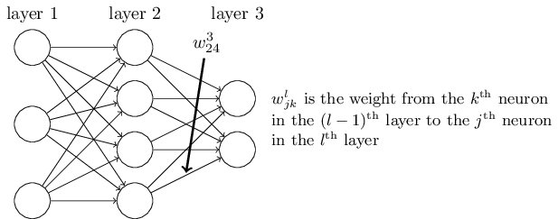

这种表示开始会比较麻烦，但是掌握了之后，你会发现很简单自然。一个奇怪的点就是$j,k$的顺序，你可能觉得顺序交换一下比较自然。后面我回解释为什么这个做。

偏移值和激活值我们也采用类似的表示。$b_j^l$表示$l^{th}$层$j^{th}$神经元的偏移值。$a_j^l$表示$l^{th}$层$j^{th}$神经元的激活值。如下图：

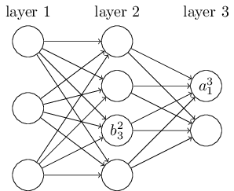

这样表示之后，$l^{th}$层$j^{th}$神经元的输出$a_j^l$就可以表示成：

$$a_j^l=\sigma(\sum_{k}w_{jk}^la_k^{l-1}+b_j^l)\quad (23)$$

其中求和是在$(l-1)^{th}$层的所有神经元中进行。为了用矩阵形式重写上面的公式，我们为每一层定义一个权重矩阵$w^l$。矩阵的第$j$行第$k$列就是$w_{jk}^l$。同样，为每一层定义一个偏移向量，$b^l$。向量的第$j$项就是$b_j^l$。最后，定义一个激活向量$a^l$，第$j$项是$a_j^l$。

重写公式23的最后一步，就是向量化函数$\sigma$。上章中我们就遇到过函数向量化的概念，回忆一下，过程就是对向量$v$的每个元素调用函数$\sigma$，表示为$\sigma(v)$。例如，我们向量化函数$f(x)=x^2$的效果就是：

$$f(\left[\begin{matrix}2\\3\\\end{matrix}\right]) =\left[\begin{matrix}f(2)\\f(3)\\\end{matrix}\right]  = \left[\begin{matrix}4\\9\\\end{matrix}\right]\quad(24)$$

就是这样，向量化的函数$f$对向量的每个元素求平方值。

用这些向量化的表示方式，公式23可以改写成下面这样优美简洁的方式：
$$a^l=\sigma(w^la^{l-1}+b^l)\quad(25)$$

这个公式让我们从整体的角度去理解网络的某一层的激活是怎样依赖它前一层的激活的：我们把前一层的激活跟本层的权重矩阵相乘，然后加上偏移向量，最后调用向量化的函数$\sigma$。这个角度比单个神经元的角度更简单和简洁（包含了较少的索引）。可以把它看成是逃离索引地狱的方式。并且，这个公式在实际中也是很有用的，很多程序库提供了矩阵相乘、向量相加、函数向量化的快速计算方法。事实上，上一章中就利用了这个公式来计算网络的输出的。


使用公式25计算$a^l$，我们先计算中间变量$z^l\equiv w^la^{l-1}+b^l$。这个变量很有用，我们把它称为：$l$层的加权输入。本章中，我们将大量的使用加权输入这个变量。公式25有时会写成加权输入的形式：$a^l=\sigma(z^l)$，$z^l$的第$j$项目是$z_j^l=sum_kw_{jk}^la_k^{l-1}+b_j^l$，$z_j^l$表示$l$层第$j$神经元的加权输入。


##关于损失函数的两个假设

BP算法的核心是计算损失函数C关于所有权重$w$和偏移$b$的偏导数$\partial C/\partial w, \partial C/\partial b$。要使BP算法成立，损失函数得满足两个假设。介绍这两个假设之前，最好有一个损失函数作为例子。我们将使用上一章中的二次损失函数：

$$C=\frac{1}{2n}\sum_x||y(x)-a^L(x)||^2\quad(26)$$

其中：$n$表示训练数据的数量；$x$表示单个训练数据输入，$y（x）$表示对应的输出；L表示网络的层数；$a^L=a^l(x)$表示当输入为$x$时，网络的输出向量。


那么BP要想成立，损失函数必须满足的连个假设是什么呢？第一个假设是，损失函数$C$可以写成单个训练数据的损失$C_x$的平均值的形式，也就是$C=\frac{1}{n}\sum_xC_x$。二次损失函数是满足这个假设的，其中$C_x=\frac{1}{2}||y(x)-a^L||^2$。本书中将要介绍的其他损失函数也都满足这个假设。

需要满足这个假设的原因是，BP实际上是为单个训练数据计算C关于$w,b$的偏导数$\partial C/\partial w, \partial C/\partial b$。然后在所有训练数据上计算偏导数的均值得到偏导数值$\partial C/\partial w, \partial C/\partial b$。

第二假设是，损失函数可以写成关于网络输出的函数形式：

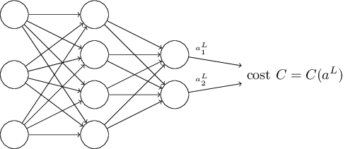

二次损失函数也满足这个假设，因为对于每个训练数据来说，损失函数可以写成：

$$C=\frac{1}{2}||y-a^L||^2=\frac{1}{2}\sum_j||(y_j-a_j^L)||^2\quad(27)$$

显然是关于网络输出的函数。当然，你也许会说为什么不看成关于$y$的函数，要知道，当输入x确定后，y也就确定了。


##哈达玛积，$s\bigodot t$

BP算法的基础是一些普通的线性代数运算--比如向量加法，向量和矩阵相乘，等等。这些运算中有一个是不太常见的。例如，假设$s,t$是两个同纬度的向量，我们用$s\bigodot t$表示这两个向量的哈达玛乘积，它的每个元素是$s,t$相应位置元素的乘积，即$(s\bigodot t)_j=s_jt_j$。例如：

$$\left[\begin{matrix}1\\2\\\end{matrix}\right]\bigodot\left[\begin{matrix}3\\4\\\end{matrix}\right]=\left[\begin{matrix}1*3\\2*4\\\end{matrix}\right]=\left[\begin{matrix}3\\8\\\end{matrix}\right]\quad(28)$$

好的矩阵程序库通常会提供哈达玛积的快速计算方法，这对实现BP算法很有用。

##BP算法背后的4个基础方程式

BP算法是关于权重和偏移的改变如何影响算术函数的取值，也就是怎么计算偏导数$\partial C/\partial w_{jk}^l, \partial C/\partial b_j^l$。为了计算这些偏导数，我们首先引入一个中间变量$\delta_j^l$，我们称之为$l^{th}$层$j^{th}$神经元的误差。BP算法会告诉我们如何计算误差$\delta_j^l$，然后把这个误差跟偏导数$\partial C/\partial w_{jk}^l, \partial C/\partial b_j^l$关联起来。


为了理解误差的定义，想象一下神经网络中存在着一个恶魔：

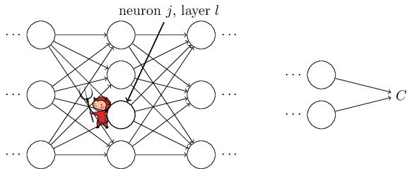

如上图，恶魔在$l^{th}$层$j^{th}$神经元中。每当有输入进来的时候，恶魔会扰乱神经元的操作。它会将神经元的加权输入增加$\Delta z_j^l$，这样，神经元的输出就变成$\sigma(z_j^l+\Delta z_j^l)$，而不是$\sigma(z_j^l)$。这个变化沿着网络往前传播，最终导致损失函数的改变量是$\frac{\partial C}{\partial z_j^l}\Delta z_j^l$。

现在，假设这个恶魔是友好的，它试图帮助降低损失函数的值。假设$\frac{\partial C}{\partial z_j^l}$的绝对值比较大（正数或则负数都行），则恶魔可以选择一个跟$\frac{\partial C}{\partial z_j^l}$符号相反的$\Delta z_j^l$来降低损失函数。相反，如果$\frac{\partial C}{\partial z_j^l}$的绝对值比较小，接近0，则恶魔已经没办法降低损失函数了，也就是这个神经元的已经接近最优了。所以直觉上,$\frac{\partial C}{\partial z_j^l}$是神经元误差的一个衡量标准。

通过这个故事的启发，我们定义第$l$层第$j$个神经元的误差$\delta_j^l$为：

$$\delta_j^l\equiv\frac{\partial C}{\partial z_j^l}\quad(29)$$

按照我们的惯例，我们定义$\delta^l$为$l^{th}$层误差向量。BP算法首先会给出计算每层误差向量$\delta^l$的方法，然后给出误差向量跟偏导数$\partial C/\partial w_{jk}^l, \partial C/\partial b_j^l$的关系。

也许你会奇怪，恶魔为什么去改变每层的加权输入呢？毕竟，改变每层的输出$a^l$，然后定义误差为$\frac{\partial C}{\partial a_j^l}$，这样更自然一些。实际上这么定义也没什么问题，问题是它会使我们的BP算法的代数表达更复杂一些。所以我们还是定义误差$\delta_j^l=\frac{\partial C}{\partial z_j^l}$。

***我们的计划：***BP算法的基础是4个方程式。这些方程式给出了计算误差$\delta^l$和梯度的方法。下面会依次介绍这四个方程。需要提醒你的是，不要希望能立即理解这些方程，这样你会很失望的。事实上，这些方程是的内容十分丰富，需要花费一定时间和耐心才能理解。好消息是，你付出的时间和耐心都是值得的，会一次次的得到回报的。

下面我们来这样深入学习这些方程：首先我们会给出方程的简单证明，解释一下为什么方程是对的；然后用伪代码实现方程，并且看看用python怎么实现这些伪代码；最后我们在直觉上讨论一下BP算法意味着什么，以及最早是怎么被发现的。

***网络输出层误差的计算方程，$\delta^L$:***    $\delta^L$的计算方式如下：

$$\delta_j^L=\frac{\partial C}{\partial a_j^L}\sigma'(z_j^L)\quad(BP1)$$

这是一个很自然的公式。右边的第一项，$\frac{\partial C}{\partial a_j^L}$表示损失函数关于网络输出$a_j^L$的偏导数，衡量了损失函数关于网络的$j^{th}$输出的变化率。如果$C$对特定神经元$j$的输出$a_j^L$依赖不大，则误差$\delta_j^L$就比较小，这正是我们所期望的。右边的第二项表示激活函数$\sigma$在$z_j^L$处的变化率。

注意到BP1公式右边的每一项都比较容易计算。具体说，计算完$z_j^L$后，计算$\sigma'(z_j^L)$；$\frac{\partial C}{\partial a_j^L}$的具体形式取决于具体的损失函数。假设损失函数是二次损失函数,即$C=\frac{1}{2}\sum_j||(y_j-a_j^L)||^2$，则$\partial C/\partial a_j^L=(a_j^L-y_j)$，明显这个非常容易计算了。

BP1很容易写成矩阵运算的形式:

$$\delta^L=\nabla_a C\bigodot\sigma'(z^L)\quad(BP1a)$$

其中,$\nabla_a C$向量的第$j$项为$\partial C/\partial a_j^L$。例如，如果损失韩式是二次损失函数，则BP1变成:

$$\delta^L=(a^L-y)\bigodot\sigma'(z^L)\quad(30)$$

如你所见，此公式形式简单，而且用类似Numpy的程序库很容易计算。

***关于$\delta^l，\delta^{l+1}$的方程：***

$$\delta^l=((w^{l+1})^T\delta^{l+1})\bigodot\sigma'(z^l)\quad(BP2)$$

其中$(w^{l+1})^T$表示$(l+1)^{th}$层权重矩阵$w^{l+1}$的转置。这个方程看似复杂，但是每一项都能很好的解释。假设我们拿到了$(l+1)^{th}$层是误差向量$\delta^{l+1}$，与权重矩阵的转置$(w^{l+1})^T$相乘的，可以看成把误差沿着网络向前传播，作为$l^{th}$层误差的一个衡量。然后计算哈达玛乘积。这个把误差沿着$l^{th}$层的激活函数向前传播，给出了$l^{th}$层加权输入的误差。

结合公式BP1和BP2我们可以计算每一层的误差$\delta^l$：首先计算输出层的误差，然后向前依次计算各层的误差。


***损失函数关于偏移的变化率：***具体如下：

$$\frac{\partial C}{\partial b_j^l}=\delta_j^l\quad(BP3)$$


这是很好的消息，因为上面我们已经知道如何计算每一层的$\delta^l$。BP3可以可以简化成这样:

$$\frac{\partial C}{\partial b}=\delta\quad(31)$$

***损失函数关于权重的变化率：***具体如下：

$$\frac{\partial C}{\partial w_{jk}^l}=a_k^{l-1}\delta_j^l.\quad(BP4)$$

这个方程可以重写成下面形式：

$$\frac{\partial C}{\partial w}=a_{in}\delta_{out}\quad(32)$$

我们可以用下面的图来描述这个方程：

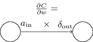

方程32有一个很好的推论：当激活值$a_{in}\approx0$时，梯度$\partial c/\partial w$也会比较小。这种情况下，我们说权重会学习的慢，意思即使权重在梯度下降过程中改变的幅度比较小.所以BP4的得到的一个结论就是连接低激活神经元的权重会学习的比较慢。

BP1到BP4的方程中，还可以得出其他的一些结论.让我们从输出层开始。考虑BP1中的$\sigma'(z_j^l)$。回忆上一章中的$sigma$函数的图像，当$\sigma(z)$的值接近0或则1的时候，$\sigma$函数变的非常的平坦，也就是$\sigma'(z)\approx0$，所以就是如果输出神经元低激活或高激活，则输出层的权重会学习的很慢，我们称之为饱和，会导致权值停止学习（或则学习的很慢）。对于输出层的偏移值也有类似的结论。

对于输出层之前的层也有类似的结论。注意到BP2中的项$\sigma'(z^l)$，它表明当神经元接近饱和的时候，$\delta^l$会比较小，所以，饱和的任何神经元的权值都会学习的非常慢。


总结来说，我们知道了，当输入神经元低激活，或则输出神经元饱和（低激活或则高激活），权重都会学习的慢。

这些结论并不奇怪。他们能帮助我们理解神经网络是怎么学习的。这四个公式对于任何激活函数都成立，不只是对于标准的$\sigma$函数（这是因为，后面我们会看到，这些公式的证明没有用到任何特定的激活函数的特征）。并且我们可以用这些方程去设计具有特定学习特征的激活函数。例如，我要选择一个激活函数，使它的到时$\sigma'$永远是正数，而且永远不会接近0.这样就可以避免学习变慢的情况发生。

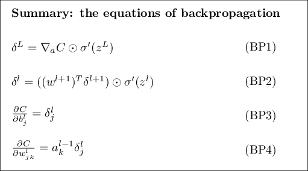

##四个方程的证明（可选）

我们现在来证明这四个基本方程BP1-BP4。四个方程都可以通过多变量微积分的求导的链式法则来推导。如果你比较熟悉链式法则，我强烈推荐在继续阅读之前自己推导一次。


我们从方程1开始推导。回忆一下误差的定义：

$$\delta_j^L=\frac{\partial C}{\partial z_j^L}\quad(36)$$

应用链式法则，我们可以得出：

$$\delta_j^L=\sum_{k}\frac{\partial C}{\partial a_k^L}\frac{\partial a_k^L}{\partial z_j^L}\quad(37)$$

其中求和是在输出层的所有神经元上进行的。显然，$a_k^L$只依赖于第$k$神经元的加权输入，也就是说，当$k!=j$时，$\partial a_k^L/\partial z_j^L=0$，所以方程37可以简化成下面的形式：

$$\delta_j^L=\frac{\partial C}{\partial a_j^L}\frac{\partial a_j^L}{\partial z_j^L}\quad(38)$$

又因为$a_j^L=\sigma(z_j^L)$，则$\partial a_j^L/\partial z_j^L=\sigma'(z_j^L)$，所以方程38变成下面的形式,也就是方程BP1：

$$\delta_j^L=\frac{\partial C}{\partial a_j^L}\sigma'(z_j^L)\quad(39)$$


下一个，我们来证明BP2方程。同样由定义出发，更具链式法则：

$$\delta_j^l = \frac{\partial C}{\partial z_j^l}\quad(40)$$


$$=\sum_{k}\frac{\partial C}{\partial z_k^{l+1}}\frac{\partial z_k^{l+1}}{\partial z_j^l}\quad(41)$$


$$=\sum_{k}\frac{\partial z_k^{l+1}}{\partial z_j^l}\delta_k^{l+1}\quad(42)$$


为了计算右边的第一项，我们知道：

$$z_k^{l+1}=\sum_{j}w_{kj}^{l+1}a_j^l+b_k^{l+1}=\sum_{j}w_{kj}^{l+1}\sigma(z_j^l)+b_k^{l+1}\quad(43)$$

求导得出:

$$\frac{\partial z_k^{l+1}}{\partial z_j^l}=w_{kj}^{l+1}\sigma'(z_j^l)\quad(44)$$

结合42和44，得出BP2方程：

$$\delta_j^l=\sum_{k}w_{kj}^{l+1}\delta_k^{l+1}\sigma'(z_j^l)\quad(45)$$


BP3和BP4方程也都是通过链式法则证明的，留给大家当做练习吧。

##BP算法


BP方程式给出了计算损失函数梯度的方法。现在我们来写出BP算法的过程：

1.***输入x***：设置输入层的激活$a^1$.  
2.***向前传播***：依次顺序计算$z^l=w^{l}a^{l-1}+b^{l}，a^l=\sigma(z^l)$，其中$l=2,3,...,L$。  
3.***输出误差$\delta^L$***:计算输出层的误差向量$\delta^L=\nabla_a C\bigodot\sigma'(z^L).$  
4.***逆向传播误差***：对于$l=L-1, L-2, ..., 2$，依次计算$\delta^l=((w^{l+1})^T\delta^{l+1})\bigodot\sigma'(z^l)$.  
5.***输出***：计算梯度$\frac{\partial C}{\partial w_{jk}^{l}}=a_k^{l-1}\delta_j^l, \frac{\partial C}{\partial b_j^l}=\delta_j^l.$


检查一下算法的过程，你就明白为什么算法被称为逆向传播算法。我们从输出层开始，逆向依次顺序计算每层的误差向量$\delta^l$.

BP算法计算的是为单个训练数据计算损失函数的梯度。实际中，经常跟一个叫随机梯度下降算法一起用。具体来说就是，给定一个大小为m的mini训练集:

1.***输入一批训练数据***  
2.***对于每一个训练数据x***:相应的输入为$a^{x,1}$，执行下面的操作：
  
* ***向前传播***：对于$l=2,3,...,L$，依次计算$z^{x,l}=w^la^{x, l-1}+b^l, a^{x,l}=\sigma(z^{x,l})$  
* ***输出误差***$\delta^{x,L}:$计算$\delta^{x,L}=\nabla_a C_x\bigodot\sigma'(z^{x,L})$.  
* ***逆向传播误差***：对于$l=L-1, L-2, ...,2$，计算$\delta^{x,l}=((w^{l+1})T\delta^{x,l+1})\bigodot\sigma'(z^{x,l})$  

3.***梯度下降***：对于$l=L, L-1, ..., 2$，按照规则$w^l\rightarrow w^l-\frac{\eta}{m}\sum_{x}\delta^{x,l}(a^{x,l-1})^T, b^l\rightarrow b^l-\frac{\eta}{m}\sum_{x}\delta^{x,l}$去更新网络的权重和偏移值。


##BP的代码实现

BP算法的代码在上章中已经遇到过，实现主要在update_mini_batch和backprop两个函数里。

```
class Network(object):
...
    def update_mini_batch(self, mini_batch, eta):
        """Update the network's weights and biases by applying
        gradient descent using backpropagation to a single mini batch.
        The "mini_batch" is a list of tuples "(x, y)", and "eta"
        is the learning rate."""
        nabla_b = [np.zeros(b.shape) for b in self.biases]
        nabla_w = [np.zeros(w.shape) for w in self.weights]
        for x, y in mini_batch:
            delta_nabla_b, delta_nabla_w = self.backprop(x, y)
            nabla_b = [nb+dnb for nb, dnb in zip(nabla_b, delta_nabla_b)]
            nabla_w = [nw+dnw for nw, dnw in zip(nabla_w, delta_nabla_w)]
        self.weights = [w-(eta/len(mini_batch))*nw 
                        for w, nw in zip(self.weights, nabla_w)]
        self.biases = [b-(eta/len(mini_batch))*nb 
                       for b, nb in zip(self.biases, nabla_b)]

```

```
class Network(object):
...
   def backprop(self, x, y):
        """Return a tuple "(nabla_b, nabla_w)" representing the
        gradient for the cost function C_x.  "nabla_b" and
        "nabla_w" are layer-by-layer lists of numpy arrays, similar
        to "self.biases" and "self.weights"."""
        nabla_b = [np.zeros(b.shape) for b in self.biases]
        nabla_w = [np.zeros(w.shape) for w in self.weights]
        # feedforward
        activation = x
        activations = [x] # list to store all the activations, layer by layer
        zs = [] # list to store all the z vectors, layer by layer
        for b, w in zip(self.biases, self.weights):
            z = np.dot(w, activation)+b
            zs.append(z)
            activation = sigmoid(z)
            activations.append(activation)
        # backward pass
        delta = self.cost_derivative(activations[-1], y) * \
            sigmoid_prime(zs[-1])
        nabla_b[-1] = delta
        nabla_w[-1] = np.dot(delta, activations[-2].transpose())
        # Note that the variable l in the loop below is used a little
        # differently to the notation in Chapter 2 of the book.  Here,
        # l = 1 means the last layer of neurons, l = 2 is the
        # second-last layer, and so on.  It's a renumbering of the
        # scheme in the book, used here to take advantage of the fact
        # that Python can use negative indices in lists.
        for l in xrange(2, self.num_layers):
            z = zs[-l]
            sp = sigmoid_prime(z)
            delta = np.dot(self.weights[-l+1].transpose(), delta) * sp
            nabla_b[-l] = delta
            nabla_w[-l] = np.dot(delta, activations[-l-1].transpose())
        return (nabla_b, nabla_w)

...

    def cost_derivative(self, output_activations, y):
        """Return the vector of partial derivatives \partial C_x /
        \partial a for the output activations."""
        return (output_activations-y) 

def sigmoid(z):
    """The sigmoid function."""
    return 1.0/(1.0+np.exp(-z))

def sigmoid_prime(z):
    """Derivative of the sigmoid function."""
    return sigmoid(z)*(1-sigmoid(z))
```


##为什么说BP算法快速呢？
为什么说BP算法快速呢？为了回答这个问题，我们来做个比较.我们来考虑梯度计算的其他方法。第一次拿到问题后，你想到了链式法则，决定用它来直接计算梯度。你会发现代数形式越来越复杂，所以放弃了；另一个比较自然的计算方法是近似计算：

$$\frac{\partial C}{\partial w_j}\approx\frac{C(w+\epsilon e_j)-C(w)}{\epsilon}\quad(46)$$

其中$\epsilon>0$,是个比较小的正数。$e_j$是$j^{th}$方向的单位向量。同样的近似计算方法也同样适用于偏移值偏导数的计算。


这种近似计算发方法看起来很好，实际上却非常的耗时。比如我们网络中有100万权值，为了计算每个$\partial C/\partial w_j$,需要计算100万次$C(w+\epsilon e_j)$，每次计算都需要通过整个网络向前传播计算；然后再计算100万次$C(w)$。

BP的高明之处在于通过一次向前传播和一次逆向传播，同时计算了所有的偏导数$\partial C/\partial w_j$.


##BP算法：整体情况


BP算法有两个比较神秘的地方：第一点，BP算法实际上在做些什么呢？我们能对这些矩阵和向量的乘积运算的构建更直观的感觉吗？。第二点是，BP算法最初是怎么被发现的？理解和证明BP算法，不代表你能发现BP算法。本节中我们将讨论这两点神秘之处。


假设我们对权重$w_{jk}^l$做了一些更改，比如$\Delta w_{jk}^l$：


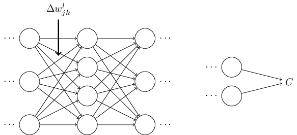


这个更改会导致对应神经元的输出发生改变:

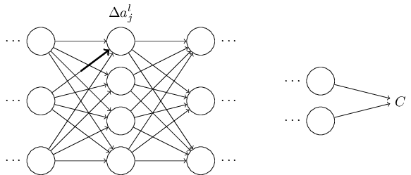


接着，会导致下一层的所有神经元的输出发生改变：

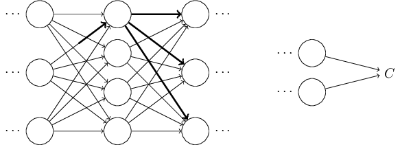

改变一层一层的向前传播，最终导致损失函数的改变：

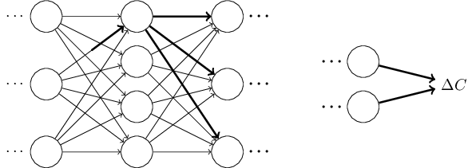


$\Delta C$更$\Delta w_{jk}^l$的关系如下：

$$\Delta C\approx\frac{\partial C}{\partial w_{jk}^l}\Delta w_{jk}^l\quad(47)$$

上面的过程提示我们，如果可以小心的追踪$w_{jk}^L$的改动是如何在网络中扩散并最终导致改变C的，也许我们就可以计算$\partial C/\partial w_{jk}^l$。

我们来试一下。$\Delta w_{jk}^l$首先会导致响应的神经元的输出改变$\Delta a_j^l$：

$$\Delta a_j^l\approx\frac{\partial a_j^l}{\partial w_{jk}^l}\Delta w_{jk}^l\quad(48)$$

$\Delta a_j^l$接着会导致下一层的所有神经元的输出的改变:
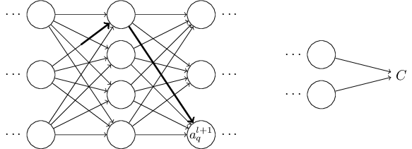

其中：

$$\Delta a_q^{l+1}\approx\frac{\partial a_q^{l+1}}{\partial a_j^l}\Delta a_j^l\quad(49)$$

结合方程48、49得到：

$$\Delta a_q^{l+1}\approx\frac{\partial a_q^{l+1}}{\partial a_j^l}\frac{\partial a_j^l}{\partial w_{jk}^l}\Delta w_{jk}^l\quad(50)$$

如此一层层的向前传播，最后导致C改变$\Delta C$，我们先假设，这个改变的传播只经过一条路径，并且依次经过了$a_j^l,a_q^{l+1},...,a_n^{L-1},a_m^{L}$这些神经元，则存在下面的关系：

$$\Delta C\approx\frac{\partial C}{\partial a_m^L}\frac{\partial a_m^L}{\partial a_N^{L-1}}\frac{\Delta a_n^{L-1}}{\partial a_p^{L-2}}...\frac{\partial a_q^{l+1}}{\partial a_j^l}\frac{\partial a_j^l}{\partial w_{jk}^l}\Delta w_{jk}^l\quad(51)$$

显然，$w_{jk}^l$的改变不止经过一条路径传播，而是经过有很多条路径，所以我们应该把每条路径的改变加一起，得到下面的方程：

$$\Delta C\approx \sum_{mnp...q}\frac{\partial C}{\partial a_m^L}\frac{\partial a_m^L}{\partial a_n^{L-1}}\frac{\partial a_n^{L-1}}{\partial a_p^{L-2}}...\frac{\partial a_q^{L+1}}{\partial a_j^l}\frac{\partial a_j^l}{\partial w_{jk}^l}\Delta w_{jk}^l\quad(52)$$

结合方程47,52，推出：

$$\frac{\partial C}{\partial w_{jk}^l}=\sum_{mnp...q}\frac{\partial C}{\partial a_m^L}\frac{\partial a_m^L}{\partial a_n^{L-1}}\frac{\partial a_n^{L-1}}{\partial a_p^{L-2}}...\frac{\partial a_q^{l+1}}{\partial a_j^l}\frac{\partial a_j^l}{\partial w_{jk}^l}\quad(53)$$

方程53虽然看起来很复杂，但是它有一个非常好的直观的解释。我们计算损失函数C关于网络中的一个权值$w_{jk}^l$的变化率，方程53告诉我们，网络中的每两个神经元之间的边都绑定了一个变化率因子，这个因子等于一个神经元的输出关于另一个神经元输出的偏导数。但第一个权重的边的变化率因子，是$\frac{\partial a_j^l}{\partial w_{jk}^l}$。每条路径的变化率因子就是路径上所有边的变化率因子的乘积。整个变化率$\partial C/\partial w_{jk}^l$，就是所有路径的变化率因子的求和。如下图：

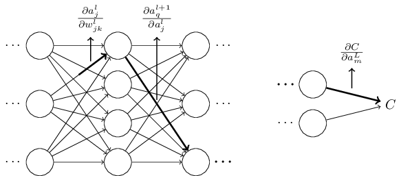

以上是我提供的一个启发式的论述，告诉你怎么去思考当你改变一个权值后网络中发生的事。可以按照以下的方式，你可以走的更远。首先，你可以写出方程53中每一项偏导数的具体表达式，应用一些微积分知识，这个不难完成。然后，可以尝试把求和的运算转成矩阵相乘的运算。这一步比较枯燥，需要耐心，但是并不需要什么高超的领悟力。这些完成之后，尽量简化方程，你会发现最后你就会得到BP方程。所以，你可以把BP看成计算所有路径变化因子之和的一种方式。

这里，我不准备去完成上面的过程。这过程比较复杂，需要特别小心。如果你准备好了，你可以尝试一下。如果没有，希望上面的描述可以帮助里理解BP算法所完成的事情。

那么BP算法的另一个神秘之处呢？BP最初是是怎么被发现的？实际上，如果你跟随着我上面的思路，你已经发现了你想传播算法。但是算法形式长一些，复杂一些。那么，那个比较简洁的形式是怎么被发现的呢？其实，在你把所有的长的形式写出来后，你会发现一些明显可以简化的点。简化之后，另一些明显的简化点又跳了出来。这样一遍一遍的简化，经过几次之后，就是我们之前看到的样子了（简单，但是比较难懂）。请相信我，这没有什么神秘之处，有的只是一些为了简化而付出的辛苦的工作而已。


