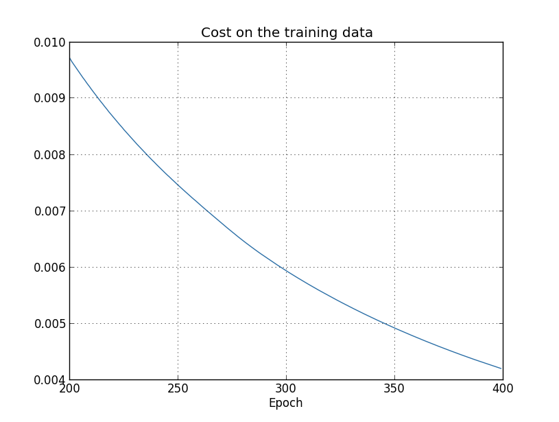
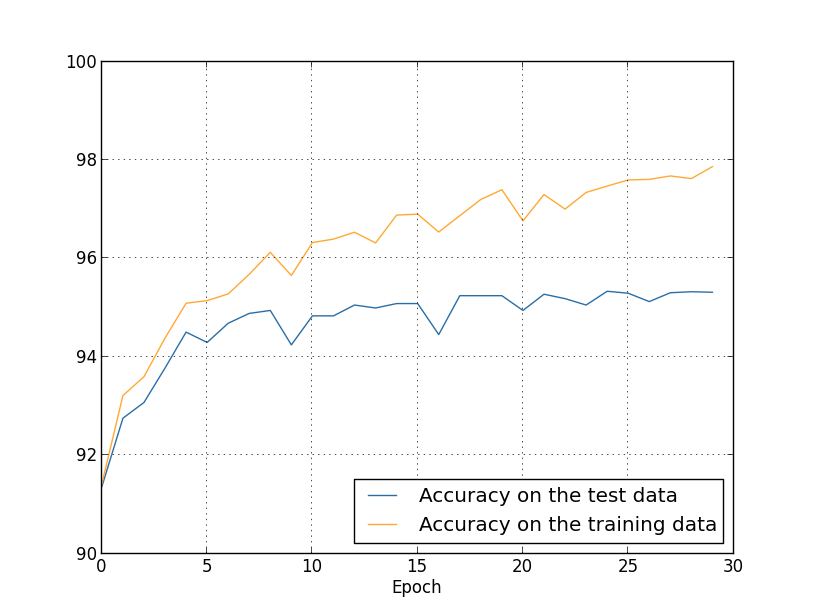
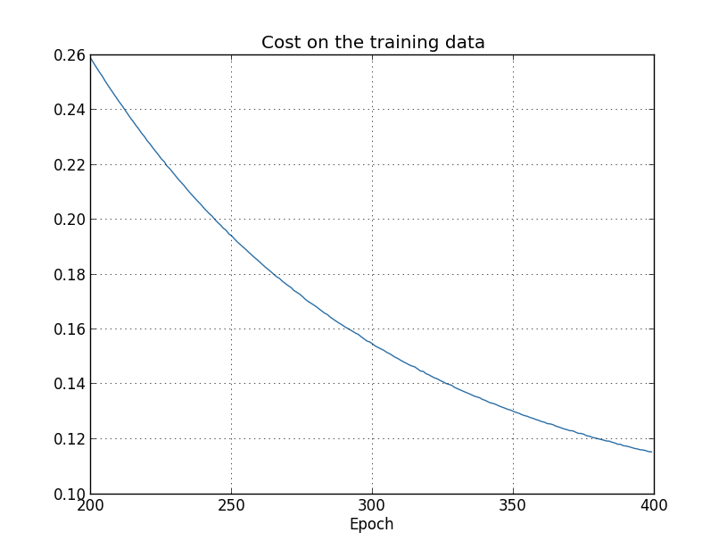
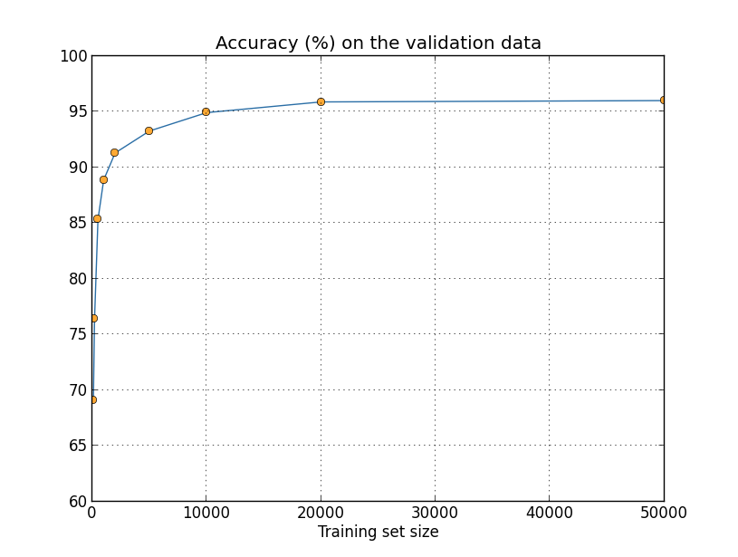
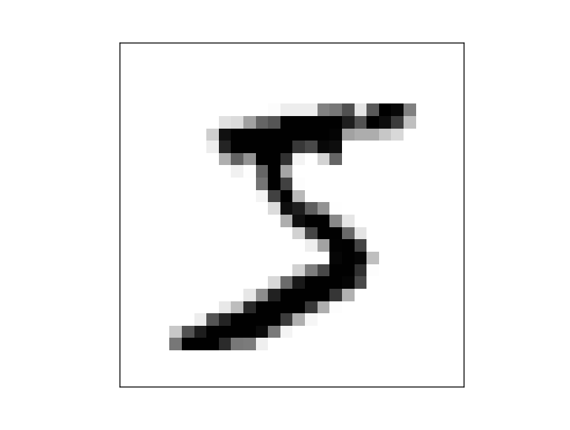
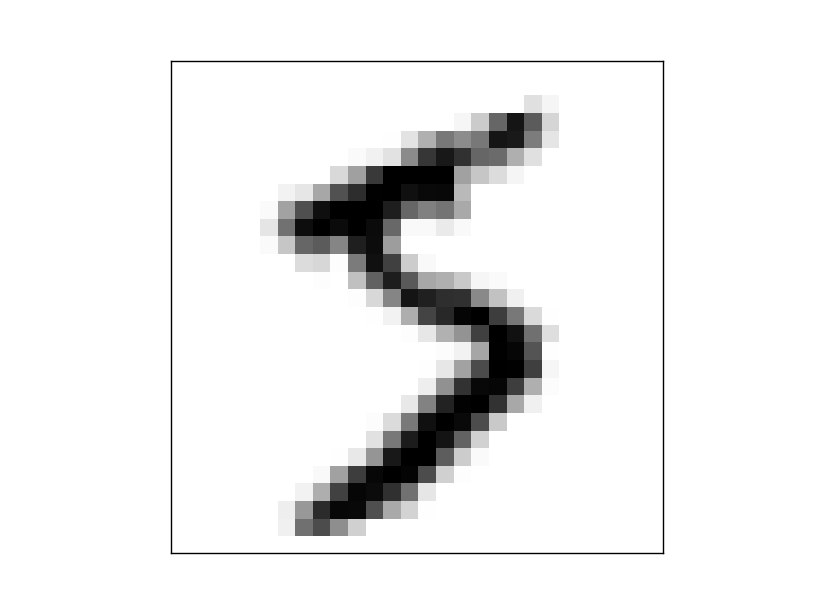
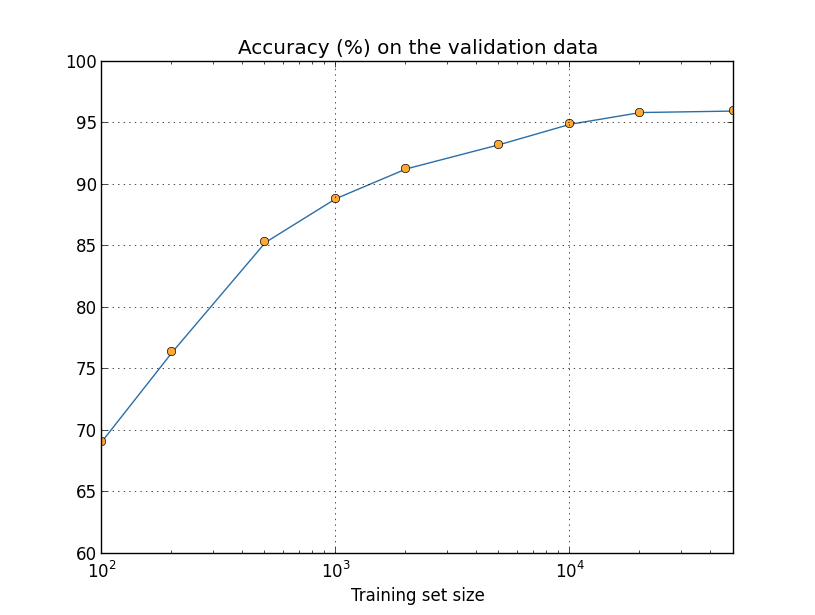
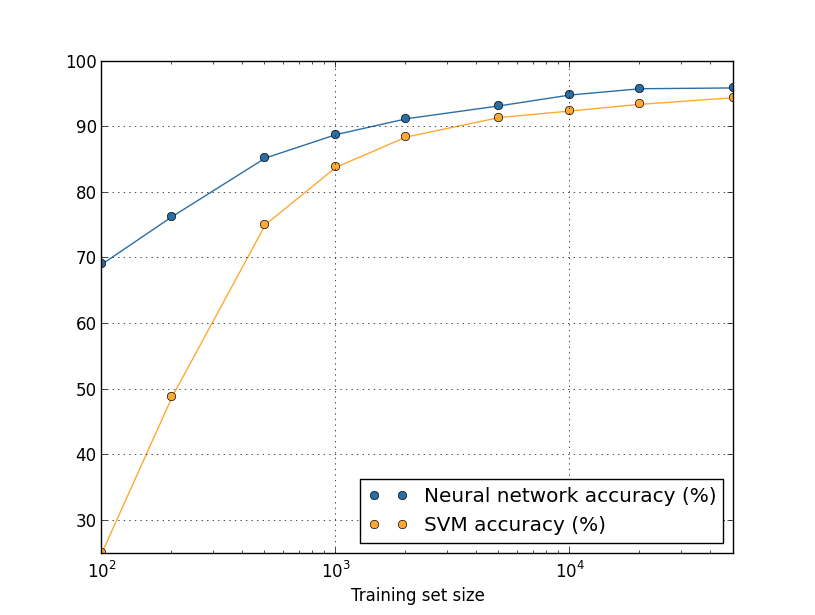
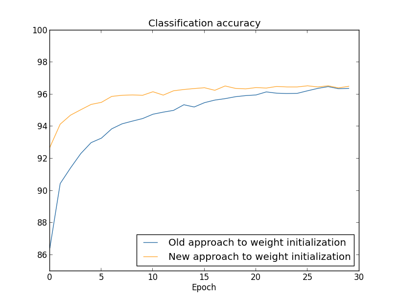

一个高尔夫球手练习高尔夫球时会花绝大多数时间练习基本的挥杆动作。在基本的挥杆动作的基础上，逐渐的才会练习其他动作。相似的，目前为止我们一直专注在理解BP算法， 它是我们的基础”挥杆”动作，学习神经网络的基础。这章中我会解释一些用来提升BP算法的技术，以提高神经网络的学习。

本章介绍的技术包括：1，新的cost函数，cross-enropy cost函数；2，regularization方法（L1 regularization, L2 regularization, drop out, 手动扩展训练集），提升神经网络的在非训练集上的泛化；3，更优的神经网络的初始化方法；4，选择更好的超参数的一些探索。我也会简单过一遍其他的技术，但不会深入讨论。这些技术的讨论都是互不依赖的，所以你可以直接跳到各节阅读。我们也代码实现了一些技术，用来提升第一章中学习的数字识别问题。

当然，我们没有覆盖了所有用于神经网络的训练技术，事实上我们只覆盖的很少的一些。这里的思想是，在学习很多技术的时候，最好的方法是深入的学习一些最重要的方法。掌握了这些重要技术的不止技术本身有用处，也会加深你对实际中出现问题的理解。这样在必要的时候，你也会迅速的掌握其他是技术。

##Cross-entropy 损失函数
大多数人觉得犯错误是很让人不开心的。学习钢琴后的不久，我有过一次演出的经验。那次我非常紧张，然后把一个八度音演奏的特别慢。我很困惑，不能继续演奏，直到有个人指出了我的错误。我感到很尴尬。虽然不开心，但是当我们错的很厉害的时候，我们也会学习的很快。我能保证下次演出的时候，我不会再错了。相反，错误不是很明显的时候，我们学习的会比较慢。


我们希望我们的神经网络能快速的从错误中学习。实际中这个会发生吗？我们首先来看一个特别简单的例子，例子中之一个神经元和一个输入：


我们将训练这个神经元做一件异常简单的事：输入1输出0。当然，对于这个问题，我们完全可以人工手动的配置权值和偏移值。但是应用梯度下降去学习权重和偏移的过程具有一定的启发性，所以我们来看下这个神经元是怎么学习的。

首先，我们设置初始的权重是0.6，初始的偏移值是0.9，我并没用什么特别的方法来选择这两个数字，而是随意选取的。这样，初始的输出值是0.82。离我们想要的输出0相差比较远。我们设置学习速率$\eta=0.15$，损失函数$C$用二次损失函数.


你可以看到，神经元不断的学到新的权重和偏移，损失函数不断减小。最后给出的输出是0.09，已经很接近我们想要的输出0了。现在，我们设置初始的权值和偏移值都是2，这样初始的输出值是0.98，比上面的0.82要错的更远，我们来看下运行的结果：


这个例子中，我们使用的学习速率$\eta$也是0.15。可以看到，开始的时候学习的很慢，权重和偏移几乎不怎么变化，损失函数减小的很少。学习大概150次了之后，学习才开始加快.

与人类的学习过程相比较，神经元的学习行为很奇怪。因为本节的开始部分我说过，当我们错误比较大的时候，我们往往学习的比较块。上面的两个例子看来，神经元的行为却相反。并且这种现象不止发生在这个单神经元的网络中，更一般的网络中也同样存在。学习为什么会慢呢？有什么办法可以避免吗？

为了理解问题的根源，细想一下我们神经元学习的方法是，通过损失函数的梯度来不断的改变权重和偏移值，学习的慢的意思，其实就是梯度比较小的意思。所以问题的关键是理解，梯度值为什么小。为了理解这个问题，我们来考虑梯度，也就是偏导数的计算方法。二次损失函数的定义如下：

$$C=\frac{(y-1)^2}{2}\quad(54)$$

其中，$a$是当输入为1时网络的实际输出，$y=0$。通过求导法则，我们知道偏导数的计算方式如下：

$$\frac{\partial C}{\partial w}=(a-y)\sigma'(z)x=a\sigma'(z)\quad(55)$$
$$\frac{\partial C}{\partial b}=(a-y)\sigma'(z)=a\sigma('z)\quad(56)$$

回一下一下$\sigma$函数的图像如下：


可以看出，当函数的值接近1的时候，图像变的非常平坦，也就是$\sigma'(z)$的值接近0，比较小。结合公式55，56可以看出，这导致偏导数$\partial C/\partial w,\partial C/\partial b$也会很小。这就是学习缓慢的根源。后面我们会看到，学习缓慢的问题是个比较普遍的问题，不止存在于我们的例子网络中。


###交叉墒损失函数(cross-entroy损失函数)

怎么解决学习缓慢的问题呢？我们可以通过使用一个叫做交叉墒的损失函数来解决。为了理解交叉墒损失函数，来看一下这个例子。假设神经元有多个输出$x_1,x_2,...$,对应的权重分别是$w_1,w_2,...$,偏移是b:


神经元的输出是$a=\sigma(z)$，其中$z=\sum_{j}w_jx_j+b$.交叉墒损失函数的定义如下：

$$C=-\frac{1}{n}\sum_{x}[ylna+(1-y)ln(1-a)]\quad(57)$$

其中n表示训练数据的数量。求和的过程是在所有的训练数据上进行的，$x,y$表示输入和对应的输出。

公式57能解决学习缓慢的问题，这点很不明显。甚至，它能作为损失函数这点，也是很不明显。我们首先来看下它为什么能作为一个损失函数。

它的两点性质使它可以作为一个损失函数：首先，它的取值非负。我们注意到(a),公式57中的所有项都是负的。（b）,前面有一个负号。

其次，输出越接近目标输出值，函数值越小。

总结来说，就是交叉墒函数是正数，而且网络输出越接近目标值，函数值越接近0.这正是损失函数需要的两个特征。更好的消息是，交叉墒函数没有学习缓慢的问题，为了理解为什么，我们来计算一下交叉墒函数的偏导数:


$$\frac{\partial C}{\partial w_j}=-\frac{1}{n}\sum_{x}(\frac{y}{\sigma(z)}-\frac{(1-y)}{1-\sigma(z)})\frac{\partial \sigma}{\partial w_j}\quad(58)$$

$$=-\frac{1}{n}\sum_{x}(\frac{y}{\sigma(z)}-\frac{(1-y)}{1-\sigma(z)})\sigma'(z)x_j\quad(59)$$

简化后可以写成：

$$\frac{\partial C}{\partial w_j}=\frac{1}{n}\sum_{x}\frac{\sigma'(z)x_j}{\sigma(z)(1-\sigma(z))}(\sigma(z)-y)\quad(60)$$

其中$\sigma(z)=1/(1+e^{-z})$，不难推导出等式$\sigma'(z)=\sigma(z)(1-\sigma(z))$.所以进一步简化公式60得出：

$$\frac{\partial C}{\partial w_j}=\frac{1}{n}\sum_{x}x_j(\sigma(z)-y)\quad(61)$$

这个公式告诉我们，权值的学习的速率是由$\sigma(z)-y$来控制的，也就是输出的错误程度。错误越大，学习的越快。这正是我们想要的特征。


类似的可以计算关于偏移的偏导数：

$$\frac{\partial C}{\partial b}=\frac{1}{n}\sum_{x}(\sigma(z)-y)\quad(62)$$

同样，也避免了学习缓慢的问题。


回到前面的例子中，我们用交叉墒损失函数代替二次损失函数，看看会发生什么;我们首先从权值为0.6、偏移为0.9开始：


不出所料，神经元学习的很快。现在我们来看一下权值和偏移值都是2.0的情况：


我们看到，正如我们所希望的，神经元也学习的很快。


本例子中我并没有说我用的学习速率$\eta$是多少。前面的例子里，我设置$\eta=0.15$。我们应该用相同的学习速率吗？事实上，损失函数改变后，不太可能准确的找到"相同的"学习速率，这是苹果和香蕉之间的比较。这里两个例子里，我简单通过实验找到了一个学习效率，能够使我们看清楚所发生的事情。如果你特别好奇，我使用的$\eta=0.005$。

你可能会反对，学习速率不一样，上面的比较就没有意义。不同的学习速率下，谁会关心学习的速度啊？其实这个反对的点不对。上图中的学习的速度其实不重要，重要的是速度的变化。具体来说就是，使用二次损失函数的情况下，当神经元错误比较大的时候，学习会缓慢，但是使用交叉墒损失函数的时候，没有这个问题。这个结论是不依赖与具体采用的学习速率$\eta$的。


我们学习了当个神经元的交叉墒损失函数。其实，很容易推广到多神经元多层的网络中去。具体说，假设$y=y_1,y_2,...$是目标输出值，$a_1^L,a_2^L,...$是网络是设计输出值，则交叉墒的定义为：

$$C=-\frac{1}{n}\sum_{x}\sum_{j}[y_jlna_j^L+(1-y_j)ln(1-a_j^L)]\quad(63)$$


这个跟公式57类似，差别在于需要在所有的输出上求和$\sum_{j}$.我不准备推导63的偏导数了，如果有兴趣你可以推到一下。但是它确实可以避免学习缓慢的问题的。


那么，我们如何选择二次损失函数和交叉墒损失函数呢？事实上，激活函数是$\sigma$函数的时候，交叉墒损失函数都是较好的选择。原因是，我们的权重和偏移都是通过某种随机方式初始话的，可能会导致初始的错误非常大，应该输出0的可能输出了1，或则正好相反。二次函数就会出现学习缓慢的问题。而交叉墒损失函数就没有这个问题。


##使用交叉墒分类MNIST数字
在使用梯度下降和BP算法的网络中，交叉墒函数很容易实现，我们稍后会在network.py的改进版本network2.py中实现它和本章中将要讨论的其他技术。现在让我们的来看一下交叉墒函数在MINIST问题上的表现。我们使用上面的网络结构--隐藏层有30个神经元，mini-batch大小为10，学习速率$\eta=0.5$,学习次数为30次。network2.py的接口跟network.py少有不同，可以通过help命令（network2.Network.SGD）来查看network2.py的接口文档，我们来看下怎么使用：


```
>>> import mnist_loader
>>> training_data, validation_data, test_data = \
... mnist_loader.load_data_wrapper()
>>> import network2
>>> net = network2.Network([784, 30, 10], cost=network2.CrossEntropyCost)
>>> net.large_weight_initializer()
>>> net.SGD(training_data, 30, 10, 0.5, evaluation_data=test_data,
... monitor_evaluation_accuracy=True)
```


注意，net.large_weight_initilizer()的作用是初始化权重和偏移，跟第一章中作用一样。需要运行这样的原因是，本章的后面，我们会修改权重和偏移的默认初始化方法。上面代码运行的结果是准确率达到95.49%。这个结果更使用二次损失函数达到的结果95.42%很接近。


再来看一下在100个隐藏神经元的网络的情况。使用交叉墒函数，其他的参数保持不变。我们的准确率达到96.83%。跟第一章使用二次损失函数的结果96.59相比，有了一定的提高。准确率看起来差别不大，但是考虑到错误率，从3.41下降到3.18，我们大概降低了1/14之一。这个进步还是不小的。


交叉墒损失函数的结果跟二次损失函数结果，相似甚至跟好一些，这很不错，但是，并不能证明交叉墒比较好。原因是我花了很少的时间来选择其他的超参。要想证明交叉上函数确实好一些，我们需要花些时间去调优一下各种超参。你会发现，结果确实证明了交叉墒损失函数要比二次损失函数好。


以上的模式会经常出现在本章和本书的后面内容里：我们讨论一个新技术，尝试后得到改进后的结果，然后我们花费很大的努力去优化其他的超参，使得改进的结果更加可信。这需要很大的工作量和计算量。我们不准备做这样的透彻耗时的研究。想法，我们会继续像上面一样做一些简单的测试。所以，需要记住的是，首先这些测试没有绝对的证明，其次，解释得出的结论可能不成立。

那为什么花费这么多篇章来讨论交叉墒呢？毕竟它对MNIST结果的提升很有限。本章的后面我们会讨论其他的一些技术--尤其是规则化,对结果会有很大的提升。所以，为什么重点讨论交叉墒呢？一部分是因为交叉墒使用的很广泛，值得深入学习。更大的原因是，饱和问题是神经网络中的重要的问题，本书中会经常的回到这个问题上。所以，交叉墒的讨论，是理解神经元饱和问题和解决办法的很好的实验。


###交叉墒是什么意思？从哪来的？
目前为止，我们都在讨论交叉墒函数的代数形式和实现形式。留下一些更广泛的概念性的问题没有去回答。例如：交叉墒是什么意思？如何直观的思考交叉墒？交叉墒最早是怎么被构造出来的？

我们从最后一个问题开始讨论：最早是什么激发了我们提出交叉墒的呢?假设我们已经发现了学习缓慢的问题，而且知道了问题的根源是公式55，56中的$\sigma'(z)$项。开始，我们可能会想：能不能通过选择一个损失函数，去掉公式中的$\sigma'(z)$项。也就是损失函数满足下面的公式：

$$\frac{\partial C}{\partial w_j}=x_j(a-y)\quad(71)$$
$$\frac{\partial C}{\partial b}=(a-y)\quad(72)$$

如果能找到一个损失函数使上面的公式71，72成立，则可以消除学习缓慢的问题。事实上，请过上面的公式可以推导出交叉墒的形式：

$$\frac{\partial C}{\partial b}=\frac{\partial C}{\partial a}\sigma'(z).\quad(73)$$

带入$\sigma'(z)=\sigma(z)(1-\sigma(z))=a(1-a)$,得到：

$$\frac{\partial C}{\partial b}=\frac{\partial C}{\partial a}a(1-a)\quad(74)$$

比较公式72得到：

$$\frac{\partial C}{\partial a}=\frac{a-y}{a(1-a)}.\quad(75)$$

由此得出：

$$C=-[ylna+(1-y)ln(1-a)]+constant\quad(76)$$

这是计算单个训练数据的损失，对于所以训练数据来说，需要球均值：

$$C=-\frac{1}{n}\sum_{x}[ylna+(1-y)ln(1-a)]+constant\quad(77)$$

公式77中的constant是公式76中的constant的均值。所以交叉墒不是什么凭空创造出来的，而是通过这种自然简单的方式发现的。


那怎么直观的思考交叉墒函数呢？深入的解释需要进入一些这里我不想进入的领域。但是，值得一提的是，交叉墒可以在信息论领域找到一个标准的解释。简单来说就是，交叉墒是对意外的一个衡量。具体的，我们的神经元目标是计算函数$x\rightarrow y=y(x)$，但是实际是在计算的函数$x\rightarrow a=a(x)$。假定$a$表示$y=1$的概率，那么$1-a$就表示$y=0$的概率。那么交叉上就表示，平均来说我们计算出$y$的真实值的意外程度。事实上，意外程度在信息论学科里面有一个准确系统的表达方式。如果你感兴趣的话，可以参考[这里](http://en.wikipedia.org/wiki/Cross_entropy#Motivation)和[这里](http://books.google.ca/books?id=VWq5GG6ycxMC).


##Softmax
本章中，我们会很多次的使用交叉墒函数来解决学习缓慢的问题。这里，我想介绍解决此问题的另一个方法：softmax层。本章的余下部分并不会使用softmax，所有如果你比较着急，可以跳过这部分。但是softmax还是值得学习的，部分是因为它比较有趣，还一部分是因为在本书的第六章中，我们讨论深度学习的时候会使用到它。

softmax是一种定义输出层的方式。开始的部分跟sigmoid层类似，定义加权输入为$z_j^L=\sum_{k}w_{jk}^La_k^{L-1}+b_j^L$.但是不直接调用sigmoid函数得到输出，而是调用一个所谓的softmax函数。根据次函数，$j^{th}$神经元的输出$a_j^L$为：

$$a_j^L=\frac{e^{z_j^L}}{\sum_{k}}e^{z_k^L}\quad(78)$$
其中，分母是在所有的输出神经元中求和。

如果你不是很熟悉softmax函数，公式78看起来会特别晦涩。我们使用它的原因很不明显，它能解决学习缓慢问题的原因也不明显。为了理解这个问题，假设我们有四个输出神经元，对应的四个加权输入$z_1^L,z_2^L,z_3^L,z_4^L$。下图中显示了变量之间的关系，可以通过增加$z_4^L$看看会发什么什么变化：


增加$z_4^L$值，得到：


当你增加$a_4^L$的时候，对应的输出$a_4^L$也会增加，其他输出会减少。类似的，当你减小$z_4^L$时，$a_4^L$也减小，其他的输出会增加。事实上，如果你仔细的看，会发现输出$a_4^L$的改变量正好等于其他所有输出的改变量，符号相反。愿意是，softmax函数保证了所有输出的和为1：

$$\sum_{j}a_j^L=\frac{\sum_{j}e^{z_j^L}}{\sum_{k}e^{z_k^L}}=1\quad(79)$$

公式78还说明，所有的输出都是非负数。因为指数函数是非负的。综合来讲，就是softmax层的使出是一些和为1的非负数。也就是说，softmax层是输出可以看错一个概率分布。


softmax的输出是一个概率分布的事实，非常好。很多问题上，可以很方便的模拟计算输出为$j$的概率。所以，在MNIST问题上，我们可以将$a_j^L$看做数字为$j$的概率。

相比而言，sigoid输出层的输出，不能看做一个概率分布。

我们开始建立一些softmax函数的理解。公式78告诉我们softmax层的输出之和为1，且是非负数。所以公式78的具体形式不再神秘，而是一种将输出转化为概率分布的自然方法。你可以把softmax看过一种重新调节$z_j^L$并将他们组成概率分布的一种方法。


***学习缓慢的问题：***我们已经比较熟悉softmax函数了，但是对于它为什么能解决学习缓慢的问题，所知甚少。为了理解这个问题，我们定义一个对数似然损失函数。我们使用$x$表示任意一个输出，$y$表示对应的目标输出。那么，训练输出对应的对数似然损失就是:

$$C\equiv - lna_y^L\quad(80)$$

所以，比如，我们使用MNIST图片，输入是一张7的图片，则对数似然损失是$-lna_7^L$。加入网络的表现比较好，则它比较确认输入是7。所以$a_7^L$的输出接近1，导致$-lna_7^L$接近0.相反，如果网络的表现很糟糕，则$a_7^L$的输出会接近0，呆滞$-lna_7^L$的取值比较大。所以对数似然函数的特征符合损失函数的特征。


学习缓慢的问题怎么样了呢？回忆学习缓慢的根源在于梯度变小，对数似然损失函数的梯度计算公式为：

$$\frac{\partial C}{\partial b_j^L}=a_j^L-y_j\quad(81)$$
$$\frac{\partial C}{\partial w_{jk}^L}=a_{k}^{L-1}(a_j^L-y_j)\quad(82)$$

这些公式保证了我们不会遇到学习缓慢的问题。事实上，softmax输出层与对数似然损失函数的组合特别类似与sigmoid输出层与交叉墒损失函数的组合。


那么具体问题中如何选择的？事实上，很多情况下二套组合的表现都很不错。本章的后面，我们会使用sigmoid输出层和交叉墒函数。稍后的第六章中，我们有时会使用softmax输出层和对数似然函数,目的是让我们后面的网络跟目前一些权威的学术论文中的网络更接近一些。大多数情况下，如果你将输出看错概率分布的话，softmax加对数似然函数的组合都是比较值得使用的组合。这个结论不是绝对的，但是在一些离散的分类问题（MNIST问题）上很有用。


###过拟合与正规化
诺贝尔奖获得者物理学家Enrico Fermi有一次接受提问：学生为了解决一个未知物理问题的，提出了一个模型；这个模型的结果与实验的结果吻合的特别好，但是Fermi却表示怀疑。他问到模型有几个可以设置的参数，学生回答说4个。Fermi说："我记得我的朋友Johnny von Neumann曾经说过，通过4个参数我可以装下一头大象，5个参数我可以让大象扭动自己的鼻子"。

这句话表达的思想就是，具有很多参数的模型可以描述的现象非常多。即使模型的数据跟一有数据非常的吻合，也不能说明模型就是一个很好的模型。或许这只是说明了模型可以描述一致数据中的所有现象，但是并没有领悟到现象背后的本质。如果是这样的话，模型在以后数据上会表现会非常好，但是在新的数据上就回出问题。对于模型的真正的测试实在它之前没见多的数据上进行的。


Fermi和von Neumann对于有四的参数的模型表示怀疑，而我们的有30个隐藏神经元的MNISTS分类网络拥有24,000个参数。100个隐藏神经元就有80,000个参数。最先进的深度神经网络有时拥有百万甚至数十亿的参数，我们能够相信网络的输出吗？


我们通过一个例子来理解下这个问题，例子中我们呢的模型在新的数据上变现的很糟糕。我们使用30个隐藏神经元，拥有23，860个参数的网络，但是我们不用50，000个MNIST的训练图片，而是用1，000个图片。这样能使泛化问题变的更明显。我们用类似的方式训练，学习速率$\eta=0.5$,mini-batch大小为10.这次我们训练了400次，比之前多了很多次，因为我们的训练数据不如之前的多：


```

>>> import mnist_loader 
>>> training_data, validation_data, test_data = \
... mnist_loader.load_data_wrapper()
>>> import network2 
>>> net = network2.Network([784, 30, 10], cost=network2.CrossEntropyCost) 
>>> net.large_weight_initializer()
>>> net.SGD(training_data[:1000], 400, 10, 0.5, evaluation_data=test_data,
... monitor_evaluation_accuracy=True, monitor_training_cost=True)

```

图形化实验的结果得到:




结果令人鼓舞，损失值一直在下降。

我们再看一下在测试集上的准确率：


在训练的前面的200次中，准确率一路上升，达到82%。然后上升变慢，在差不多280次左右停止上升了。之后一次在这个水平上线波动。相比直线，损失值还是下一致下降。也就是280次学习之后，网络学到的东西不再能泛化到测试数据上。所以不是有用的学习。我们称280之后为过拟合或则过度训练。


也许你会怀疑原因是我们在比较训练集上的损失值和测试记上的准确率，这也许是一个苹果和香蕉的比较。我们来看下测试集上的损失：


我们看到损失值在15次学习之前一致下降，之后反而开始上升。这事过拟合的另一个信号。但是这个留下了一个难题，过拟合的点是15次呢还是280次呢？从实用的角度来书，我们真正关心的是测试集上的准确率，而测试集上的损失只不过是准曲率的代理。所以将280次作为过拟合点更合理一些。


过拟合的另一个信号如下，训练集上的准确率：


看到测试集上的准曲率达到了100%，而测试集上只达到了82.27%。所以我们的网络真的试纸在学习训练集数据的细节，而没有领悟背后原理。


过拟合是神经网络的主要问题之一。特别是在一些现代的网络中，因为权重和偏移数量十分巨大。我们需要检测过你的方法，同事也需要能降低过拟合的方法。


检测过拟合的最直接的办法就是像上面例子一样，跟踪测试集上的准确率，当发现准确率不再上升的时候，停止训练。当然，严格来说，这并不一定说明过拟合了，也许训垃集和测试集上的准曲率同事停止上升了。但是这个策略仍然可以预防过拟合。

事实上，使用本策略，我们将启用验证集。回忆一下，前面我们加载MNIST数据的时候，分成了三个结合：

```
>>> import mnist_loader 
>>> training_data, validation_data, test_data = \
... mnist_loader.load_data_wrapper()

```

我们一直在使用training_data和test_data，而忽略了验证集validation_data。验证集包含了单独1，000张图片。我们将适应validation_data防止过拟合。使用方式与上面的使用测试集方式类似，一旦在验证集上的准确率停停止上升，则停止训练。这个策略称为早停策略。当然，实际中，我们不可能立即知道过拟合发生了，我们将继续训练一段时间后才能确信过拟合了。


为了使用验证集而不是测试集防止过拟合呢？事实上，这是一个通用的策略，用验证集测试比如训练次数，学习速率，网络结构等超参，为超参选择合适是取值。

当然，这并没有回答为什么用验证集而不用测试集防止过拟合。却提出了一个更一般的问题:为什么用验证集而不是测试集是设置超参呢？应为在设置超参的时候，我们会尝试各种超参的组合。如果用测试集去设置这些超参的话，结果可能是超参过拟合了测试集。通过使用验证集选择超参，然后用测试测试最终表现，可以是我们确信网络的表现是真实有效的。换句话说，你可以把验证集当做一个学习超参的训练集，让我们学习到超参的取值。这种寻找超参的方式被称为隔离法。因为验证集和测试集一直是被隔离的。


实验中我们最终反复在测试集上测试我们的网络，验证我们的想法--网络结果啊，超参取值啊，等等--这种做法会不会使最后的结果在测试集上过拟合呢？这是一个很深很困难的问题。目前来说，对于我们的这个实际问题，我们不准备担心这个问题。我们依然使用上面的三个集合的方式。

目前我们看的是1，000个训练集的时候过拟合的问题。如果训练集有50，000个呢？我们来看下（其他参数不变）情况:



我们看到，相比1000个训练集的情况，这次训练集和测试集上的准确率比较接近：训练集上的97.86和测试集上的95.33，相差2.53。这个比上面的差值17.73小了很多。过拟合任然存在，但是明显减小了。一般来说，减小过拟合的方法之一就是增大训练集规模。在足够大的训练数据上，即使是大型的神经网络也很难过拟合。不幸的是，数据获取很昂贵或很难，所以这个办法实际中不一定行的通。


##正规化（Regularization）
增加训练数据是降低过拟合的办法之一。有没有其他的办法来降低过拟合的发生呢？一个可能的方法就是降低网络的规模。但是，大规模网络比小规模网络有更大的潜力，所以降低规模是我们不愿意采用的办法。  

庆幸的是，即使对于指定的网络和指定的训练集，还是有其他办法降低过拟合的。即所谓的*正规化*技术。这节中，我介绍一个叫*权值衰减*，也称为*则L2正规化*的技术。L2正规化的思想，是在损失函数中添加一项*正规化项*，L2规则化之后的cross-entropy损失函数如下：  
$$C=-\frac{1}{n}\sum_{xj}[y_j\ln a_j^L + (1-y_j)\ln (1-a_j^L)]+\frac{\lambda}{2n}\sum_{w}w^2.   (85)  $$

第一项是常规的cross-entropy损失函数，在这之后再添加了一项，是网络中所有节点的权重平方和，乘以$\lambda/2n$，其中$\lambda>0$，称为规则化参数，$n$是训练数据量。稍后会讨论下如何选择$\lambda$的值。林外值得一提的是，规则化项中没有包含神经元的biases，稍后我们也会讨论这点。  

当然，其他的损失函数也是可以规则化的，例如quadratic损失函数，规则化之后的形式如下：
$$C=\frac{1}{2n}\sum_{x}||y-a^L||^2+\frac{\lambda}{2n}\sum_{w}w^2.    (86) $$

规则化后的损失函数，可以统一写成如下形式：
$$C=C_0+\frac{\lambda}{2n}\sum_{w}w^2. (87)$$
其中$C_0$表示原始的未规则化的损失函数。

直觉上，规则化的效果是，在同样的情况下使网络更愿意学习到小权重。只有在大权重显著降低损失函数第一项的情况下，才会被学习到。换句话说，规则化可以看作是减小损失函数$C_0$与学习小权重值之间的一个权衡。两边的重要性通过$\lambda$控制：$\lambda$较小是我们倾向于最小化$C_0$，$\lambda$较大时，我们倾向于小权重值。  


为什么规则化的这个权衡能降低过拟合呢？原因很不明显，但是确实很有效果。我们将在下一节中讨论为什么有效果。首先我们通过一个例子来说明规则化确实降低了过拟合。

构造这样一个例子，首先需要搞清楚怎么把我们的SGD（随机梯度下降）算法应用到一个规则化的神经网络中。具体来说，就是我们需要知道在规则话的神经网络中，怎么去计算偏导数$\partial C/\partial w$和$\partial C/\partial b$. 从(87)公式可以推导出如下公式：
$$\frac{\partial C}{\partial w}=\frac{\partial C_0}{\partial w}+\frac{\lambda}{n}\quad(88)$$
$$\frac{\partial C}{\partial b}=\frac{\partial C_0}{\partial b}\quad(89)$$

其中$\partial C_0/\partial w$和$\partial C_0/\partial b$两项可以用上一章中介绍的BP算法计算。所以总体来说，计算规则化后的损失函数的梯度方式是：bp算法的计算结果偏导数后，权重的偏导数基础加上$\frac{\lambda}{n}w$，偏移的偏导数保持不变。所以梯度学习规则如下，偏移值的规则不变：
$$b\rightarrow b-\eta\frac{\partial C_0}{\partial b}$$
权重的规则变为：
$$w\rightarrow w - \eta\frac{\partial C_0}{\partial w}-\frac{\eta\lambda}{n}w\quad(91)$$
$$=(1-\frac{\eta\lambda}{n})w-\eta\frac{\partial C_0}{\partial w}\quad(92)$$

除了w乘上了个系数$1-\frac{\eta\lambda}{n}$，没有发生任何其他的变化。这个系数有时候被称为权值衰减，因为它使权重变小了。初看，以为这个改变会使权值不断逼近零。但这个想法是不是对的，因为如果会能使非规则化损失函数减小的话，其他项可能会使权值增加。

这些是梯度下降算法的情况。对于随机梯度下降算法，情况又是怎么样的呢？在非规则化随机梯度下降算法中，我们用含有m个训练数据的mini训练集的梯度的平均值估计梯度$\partial C_0/\partial w$,与此类似，规则化的随机梯度下降算法变成如下：
$$w\rightarrow(1-\frac{\eta\lambda}{n})w - \frac{\eta}{m}\sum_{x}\frac{\partial C_x}{\partial w}$$

其中x是mini训练集中的每个训练数据，$C_x$表示么个训练样本的非规则化的损失值$C_0$。除权重衰减系数之外，这跟常规的SGD算法完全一致。最后，说明一下在规则化学习中，偏移值的学习规则，这个跟非规则化是完全一致的：
$$b\rightarrow b-\frac{\eta}{m}\sum_{x}\frac{\partial C_x}{\partial b}$$
其中x表示mini训练集中的每个训练数据。

我们来看下规则化对我们网络性能的长生什么影响。我们将使用的网络含有30个隐藏神经元，mini-batch大小为10，学习速率为0.5，损失函数使用cross-entropy函数。不同的是，这个我们采用了规则化，并且设置规则化参数$\lambda=0.1$。需要注意的是，程序中我们使用了变量名是lmbda，是因为python中，lambda是保留字。再次使用test_data而不是validation_data。严格来说我们需要使用validation_data,原因前面有说过。但是为了使结果能跟之前的很好对比，我还是决定使用test_data.你可以很容用替换成validation_data，你会发现结果很相似。

```
>>>import minist_loader
>>>training_data, validation_data, test_data =   
mini_loader.load_data_wrapper()
>>>import networks
>>>net=network2.Network([784, 30, 10], cost=network2.CrossEntropyCost)
>>>net.large_weight_initializer()
>>>net.SGD(training_data[:1000], 400, 10, 0.5,
evaluation_data=test_data,
lmbda=0.1,
monitor_evaluation_cost=True,
monitor_evaluation_accuracy=True,
monitor_training_cost=True,
monitor_training_accuracy=True)
```
跟非规则化网络相同，训练集上的损失值在不断的减小：  

不同是，这次测试集上的准确度持续增大，一直到前400次的学习:  


很明显，规则化降低了过拟合。并且提高了准确度，最高值达到87.1%，相比之前的最高值82.27%。400次的训练之后，我们还能达到更高的准确率。看起来，规则化是我们的网络泛化的更好，很大程度的降低了过拟合。

我们回到有50,000个训练数据的训练集呢？我们之前已经看到了，在这个大训练集上的过拟合明显下降了。那么规则化还会降低过拟合吗？我们把训练次数,学习效率，mini训练集个数等超参保持不变。但是，我们的规则化参数$\lambda$需要改变一下，因为我们的训练集数量从1000增加到了50,000，$1-\frac{\eta\lambda}{n}$会发生变化。如果$\lambda$保持不变，这个衰减系数的影响会很小。所以这次我们设置$\lambda=5.0$.

然后我们开始训练我们的网络：
```
>>>net.large_weight_initializer()
>>>net.SGD(training_data, 30, 10, 0.5,
evaluation_date=test_data, lmbda=5.0,
monitor_evaluation_accuracy=True,
monitor_training_accuracy=True)
```

结果如下：


有很多好消息。首先，测试集上我们的准确率从95.49%（未规则化）提高到96.49%，这是个很大的提升。还有，我们也看到训练集和测试集之间的准确率相差也显著减少了，低于1%，虽然还是有差值还是很明显，但是不可否认，我们很显著的降低了过拟合。


最后，我们试试使用100个隐藏神经元，设置规则化参数$\lambda=5.0$，准确率会怎么样。这次我不会仔细的分析过拟合的细节，只是为了看一下，用我们学到的新技巧：cross-entropy算是函数以及L2规则化，我们最高能把准确率提高到多少。

```
>>>net=network2.Network([784,100,10], cost=network2.CrossEntropyCost)
>>>net.large_weight_initializer()
>>>net.SGD(training_data, 30, 10, 0.5, lmbda=5.0,
evaluation_data=validation_data,
monitor_evaluation_accuracy=True)
```
最后在验证集上得到的准确率是97.92%。相比30个隐藏神经元，这事个很大的提升了。事实上，再次调试了一下，在运行60次训练，$\eta=0.1$,$\lambda=5.0$的情况下，我们突破了98%的大关，在验证集上的准确率达到了98.04%。对于只有152行的代码来说，这个成绩很不错了。

综上所述，我们知道规则化可以降低过拟合以及提高准确率。事实上，规则化的作用不止这些。从实验的经验看来，我们多次训练我们的MINIST网络，使用随机初始化的不同的权重，我们会发现非规则化的网络容易陷入局部最小值，多次的实验或得到差别较大的结果。相比之下，规则化的网络，多次训练的结果差不是很大。

到底发生了什么？直觉上来想，如果损失函数没有规则化，那么在其他条件都一致的情况下，权重向量的长度极有可能会不断增长，产生大权重值。随着训练的进行，最终可能会导致权重向量非常大。当权重向量长度比较长的情况下，由于梯度下降带来的变化只会对权重向量产生微小的改变，这样最后导致权重向量卡在一个方向上。我认为这种现象会使我们的学习算法很难探索权重向量空间，最终导致很难去发现损失函数的全局的最小值。

##为什么规则化会降低过拟合
通过实验经验，我们看到规则化确实能降低过拟合。很令人振奋，但是不幸的是，原因很不明了。人们常用来解释的故事是这样的：某种意义下，小权重值复杂度低，所以对数据给予的解释也就更简单和有力。这是一个非常简要的故事，然而包含了一些看起来很奇妙和神秘的色彩。我来仔细分析一下这个故事。假设我们有一批数据需要建模：


毫无疑问，我们在研究现实世界的现象，$x,y$代表现实世界的数据。我们的目标是建立一个模型，通过$x$预测$y$。我们可以使用神经网络来建模，但是我准备使用功能简单的模型：多项式模型，使用x的多项式建模y。这么做的原因是，多项式模型跟透明。当我们理解了多项式的例子，我们在去讨论神经网络。图中有十个点，我们能找到唯一的9次多项式精确的建模，$y=a_0x^9+a_1x^8+a_2x^7+a_3x^6+a_4x^5+a_5x^4+a_6x^3+a_7x^2+a_8x^1+a_9$，多项式的图如下所示：


这个模型可以精确的表示这些点。但是，我们也有是用线性的模型大致的切合一下这些点，$y=2x$:


哪个模型更好呢？哪个更接近事实呢？对于显示世界的其他数据，哪个会泛化的更好呢？

这些都是非常难的问题。事实上，没有更多的数据的前题下，以上的三个问题都无法回答。我们考虑下两种可能性：（1）9次多项式真的描述了现实世界的现象，会很完美的泛化到其他是数据，(2)线性的模型是对的，模型没有完美描述数据点的原因是一些噪音造成的，比如测量误差等等。

没办法判断哪种可能性是对的。（或则，存在第三种可能性）。逻辑上说，两种都可能是对的。并且两个模型存在不可忽视的差别。虽然在我们 的这个小的例子里，两个模型的差别不是很大。但是，假设x的值非常大呢，比例子中出现的x的值都大很多呢。两个模型预测的y值就回相差很大。因为9次幂多项式的值会主要由$x^9$项决定。更线性模型预测的值，相差会非常大。

存在这么一个观点，在科学上我们应该倾向于简单的解释，除非迫不得已。当我们找到能解释我们很多数据的简单模型的时候，我们会大喊"找到了"。毕竟，简单的模型不太可能仅仅是巧合。并且，我们猜测，这个模型肯定是描述了现象中的一些隐藏的事实。比如这个例子，$y=2x+noise$看起来比$y=a_0x^9+a_1x^8+...$更简单。所以我们猜测$y=2x+noise$描述了一些影藏的事实。从这个角度出发，9次幂的模型只是学习到了一下误差而已，泛化到其他的数据点的时候，会出错的，而线性模型会有更好的泛化性。

我们来看一下这个观点对神经网络意味着什么。假设我们的网路大部分权重值比较小，比如在规则化的网络中比较常见的一样。小权重值意味着，我们的网络的行为不会因为小部分的输入的改变而改变太大。这就使得我们规则化的网络很难被数据中的噪音影响到。也就是单个数据现象很难影响到网络的输出，规则化的网络会更在意数据中普遍存在的现象。于此对比，权重值比较大的网络中，输入的微小改变会导致网路输出的很大变化。啥意义非规则化的网络很用大的权重学习出一个复杂的模型，模型中包含了很多训练数据中的噪音。简单说就是，规则化的网络会学习出相对简单的模型，基于训练数据中的普遍模式，而拒绝学习数据中的噪音。这就迫使网络去真正学习数据，从而更好的泛化。

这种对简单模型的倾向性应该让你感到焦虑。人们通常把这个思想叫做"Occam's Razor"，而且把它当做一个科学的原则狂热的应用它。但是，它当然不是一个通用的科学原则。倾向于简单模型没有任何逻辑原因。事实上，有时候复杂模型结果是对的。

我来介绍两个这样的例子，例子中比较复杂的模型是正确的。1940年物理学家Marcel Schein宣布发现了一种新的自然粒子。他当时就职的公司General Electric，非常高兴并对外公布了这个想发现。但是物理学家Hans Bethe表示怀疑。Bethe拜访了Schein，观察了Schine的新粒子的照片。每一张照片中Bethe都发现了一些问题，并且建议丢弃照片。但是有一张照片没发现任何问题。但是Bethe认为这个可能是个统计上的侥幸。Schein说："但是这个侥幸的概率也是1/5啊。"最后Schein说:但是在我所有的照片里，每一个好的照片，你都用了一个不同的解释，但是我用了单独的一个解释了所有的现象。他们是新粒子。Bethe回应说：『是的，但是你的一个解释是错误的，我的五个解释是对的』。后续的工作确认了Bethe是对的，Schein的新粒子根本不是新的粒子。

第二个例子是，1859年，天文学家Urbain Le Verrier发现水星的轨道跟牛顿万有引力理论预测的少有偏差。变差非常非常小，当时出现各种解释，最后大家认为牛顿定律大致上是对的，但是需要一些小的修正。1916年，爱因斯坦宣布她的相对论理论，能很好的解释这个偏差，这个相对论理论更牛顿定律有着根本上的不同，而且基于更复杂的数学理论。尽管相对论理论的复杂性，在今爱因斯坦的相对论理论的正确性是呗普遍接受的，牛顿重力理论，甚至它的修正后的理论，是错的。部分是因为爱伊斯坦理论解释了很多牛顿理论无法解释的现象。而且，爱伊斯坦理论预测了很多牛顿重力理论没有预测到的现象。但是在早先的时期，这些都没有被注意到。如果只用理论的简单新来判断，修正的牛顿理论相比爱伊斯坦的相对论很明显是更简单的。

两个故事给到我们三个启示，首先，决定两种模型哪个更简单，可能是个很微妙的更业务逻辑有关的事情。其次，即使我们能决定了哪个更简单，这个原则也得非常小心的使用。再次，模型的测试不是一个简单的事，比如它在预测新现象时候的表现，在新环境下的表现，等等。

也就是说，我们要保持谨慎，要知道规则化网络比非规则化网络能更好的泛化只是一个经验性的事实。所以本书的后续中，我们有经常是用规则化技术。我引用上面的例子是想说明为什么没有人能总结出一套令人信服的理论去解释为什么规则化会有利于网络的泛化。事实上，学者们一直致力于使用新的规则化方法，比较他们的差别，并且试图理解他们为什么会表现好或则坏。你可以把规则化当做一个组装机。虽然它会经常有帮助，但是对于到底规则化发生了什么，我们没有一个完整的令人满意的系统的理解，只是一些不完整的启发式的经验法则。

还有一些更深层次的事情。关于泛化到底怎么发生的。规则化给了我们一个魔法棒，帮助我们网络更好的泛化，到那时没给我我们一个关于泛化如何工作的原则上的解释，更别提最好的泛化方式了。

这个问题尤其让人恼火的是，每天的生活中，我们人类泛化的能力非常好。给小孩子几张大象的照片，他们很快就能认识大象。当然，他们也会偶尔犯错误，把犀牛当做大象。但是总的来说，这个处理的过程还是非常准确的。我们拥有一个系统--大脑--含有巨大数量的自由参数。看多一张或则极少的训练数据图片后，就能很好的识别其他的图片。我们的大脑可以说是规则化的非常好。到底怎么做到的呢。目前我们不得而知。我预期在不远的将来，我们会开发出强有力的规则化技术，是得神经网络能在很小的数据集泛化的非常好。

事实上，我们都网络泛化的比期待的要好。一个有100个隐藏神经元的网络包含80，000个参数。但是我们的训练集只有50，000个图片。这就相当于我们用一个80，000次幂的多项式去拟合50，000个数据点。无论如何，我们的网络应该会过拟合的非常严重。但是实际上，如前面所看到的那样，我们的网络泛化的很不错。为什么会这样呢？具体原因我们还不太理解。有一种猜测：多层网络结构中的梯度下降算法有一种自我规则化的效果。这很幸运，同时令人不安的是我们不理解为什么会这样。单同时，在允许的情况下，我们还是会采用了实用的规则化。我们神经网络还是不错的选择。

本节的最后，我来解释一下一个遗留的问题：为什么L2规则化没有限制偏移值。毫无以为，通过简单的修改就可以是规则化程序起规则化偏移值。历史经验看来，这么做对结果改变不是很明显，所以没有规则化偏移值的惯例。值得一提的是，大的偏移值，并不会像大的权重值那样，使网络对输入敏感。所以我们不必担心大的偏移值会使网络学习到数据中噪音。相反，大偏移值会带来一些好处，比如需要的时候，大偏移值会让网络更容易饱和。总得来说，我没一般不会在规则化中对偏移值进行限制。


##规则化的其他技术
L2规则化之外还有很多规则化的技术，多到难以一一举例，本节中我主要的介绍三种其他的降低过拟合的技术：L1规则化，dropout，人工增大训练数据集。我们不会让之前那样深入的学习这些技术，相反，我们的目标是熟悉主要的思想，了解归一化技术的多样性。

**L1规则化**：我们在非归一化损失函数后，加上所有权重的绝对值之和：
$$C=C_0+\frac{\lambda}{n}\sum_{w}|w|\quad(95)$$

直观上，这个跟L2规则化很类似，惩罚大权重，是网络倾向于小权重。显然，L1规则化项跟L2规则化项不一样，所以它的效果也跟L2不太一样。我们来理解一下L1跟L2的网络行为有哪些不同之处。

我们来看下（95）的偏导数：
$$\frac{\partial C}{\partial w}=\frac{\partial C_0}{\partial w}+\frac{\lambda}{n}sgn(w)\quad(96)$$

其中$sgn(w)$表示$w$的符号,也就是，$w$为正则取值为$+1$，$w$为负则取值为$-1$。有了这个公式我么很容易推出权重的更新规则：
$$w\rightarrow w=w-\frac{\eta\lambda}{n}sgn(w)-\eta\frac{\partial C_0}{\partial w}'\quad(97)$$

其中，我们可以通过mini-batch的估计出$\partial C_0/\partial w$.我们来跟L2规则化的权重更新公式比较一下：

$$w\rightarrow w'=w(1-\frac{\eta\lambda}{n})-\eta\frac{\partial C_0}{\partial w}\quad(98)$$

两个公式可以看出，两种规则化方法都使权值减小。跟我们的直观感觉是一致的。但是两者对权值缩小的方式是不一样的。L1中，权值以一定的幅度减小到零。L2中，权值减小的幅度是跟权值大小成比例的。所以，当一个特定的权值绝对值$|w|$比较大，则L1缩减权值的幅度要远小于L2.相反，$|w|$比较小时，L1缩减的幅度又远大于L2。最后的效果就是，L1使网络集中在小范围的比较重要的权重和连接上，而使其他的权重趋向于零。

上面的讨论中，我忽略了一点，那就是偏导数$\partial C/\partial w$在$w=0$的时候未定义。原因是函数$|w|$在$w=0$处不可倒。不过没关系，我在$w=0$的时候，使用非规则化的梯度更新规则。这事没问题的，直观上来看，规则化的效果是减小权值，显然潜质为零的时候没办法再减小了。具体点说，就是公式（96）和（97）中，我们约定$sgn(0)=0$.如此，则L1规则化后网络的更新规则就变得很简单完整。

**Dropout**:Dropout是一个根本上不太一样的规则化技术。与L1和L2不同，Dropout并不会修改损失函数。相反，droupout修改网络本身。在研究dropout的结果和原理之前，我我们来介绍一下它的工作机制。

假设我们要训练一个网络：


具体来说，假设我们有一个训练输入$x$以及一个需要的输出$y$。正常情况下，我们通过正向传入$x$,以及逆向传到的梯度来学习。在加入了dropout之后，训练过程略有不同。开始训练前，我们随机的挑选一些隐藏的神经元，零时的删除这些神经元，输入输出保持不变。我们得到如下的网络。值得一提的是，临时删除的神经元还在，只是呗临时删除：


我们正向传输输入$x$，然后逆向传输结果，通过整个修改过的网络。mini-batch中所有数据都如此处理完之后，我们更新下权值和偏移值。然后我们不断重复这样一个过程：恢复之前被零时删除的神经元，然后选择一批行的神经元删除，然后在训练，更新权值和偏移，如此不断。


这样一遍一遍的训练后，网络学习到了一组权值和偏移。当然，这些权值是在网络的一般隐藏神经元呗临时除去的情况下学习到的。当我们运行完整网络的时候，会有一倍多的神经元被激活。所以我们吧隐藏神经元的权值减半。

这种dropout的过程看起来很奇怪。这个过程怎么能起到规则化的左右呢？为了解释这个，我们暂时先不想dropout过程，想象一下常规的训练过程。具体的，比如我们用同一批数据训练多个网络。当然，每个网络的初始化不一样，这样训练的结果是每个网络可能给出不一样的结果。我们可以加上一个例如投票的机制，去决定最终的结果。比如我们有5个网络，其中3个输出的结果是"3",则结果极有可能是"3",另外两个网络极有可能是错误的。这种去平均的方案很多时候被证明是非常有效的，对防止过拟合。原因是可冷不同的网络以不同的方式过拟合了，平均一下输出的结果可以减少这种过拟合。

这个跟dropout有什么关系呢？直觉上来说，每次漏掉不同的神经元，很类似每次训练不同的神经网络。所以dropout的过程，很像是大量的不同网络的结果的平均值。不同的网络会有不同的过拟合，所以，dropout网络极有可能降低过拟合。


在早期的一个用到dropout的论文了有一个启发是的解释：dropout降低了神经元之间的复杂的相互依赖，因为每个神经元不能依赖特定的其他神经元。因此，迫使网络学习到更鲁棒的特征。换句话说，如果我们把网络用在预测上，dropout会使网络对部分特征的缺失表现得更健壮。在这点上，dropout有点类似L1和L2，L1,l2通过减小权值，使得网络对单个网络的单个链接的确实表现的更健壮。

当然，对dropout的真正的评价是，它已经成功的提升了很多神经网络的表现。这篇论文介绍了这个应用在很多不同任务上的技术。对于我们来说，有人把这技术应用到的MINIST的数字分类任务上。论文指出，最高达到的准确率是98.4%，通过用L2规则化的改进，他们把准确率提高到了98.7%.类似的，图片和语音处理等任务上，也取得了可观的成绩。在大数据量，深度学习领域，过拟合问题比较突出，dropout技术很有用处。

**人工扩展训练集：**我们看到，用1000个训练图片时，我们的准确性降到了80%多。一点也不奇怪，因为少的训练集表示网络接触到的手写体样本就很少。我们用不同数量的训练集来训练我们有30个隐藏神经元的网络，看看结果如何。设定mini-batch大小为10，学习速率$\eta=0.5$，规则化参数$\lambda=5.0$.训练集全量的时候，设定训练次数为30，随着训练集的减小，我们适当增大训练次数。为了保持权重衰减系数一样，全量数据我们设定$\lambda=5.0$,随着数据量的减小，适当减小$\lambda$.



可以看到，分类的准确度随着训练集的增大而显著提高。也许，这个趋势还会继续。当然，上图显示我们准确率好像有点饱和了。看下图：


很明显，曲线还是在上升的。也许说明，我们如果用百万或则千万这样大很多的训练集来训练的话，即使我们的小型网络也会表现好很多。

使用更多的训练集是非常好的主意。但实际上，数据是很昂贵的，甚至是不可能的。然后，有另一种方式来扩展数据集。比如，在minit图片识别的例子里，5这张图片：


我们把它旋转一定的角度，比如说，15度：


任然还可以看出是同一个数字，但是在像素级别上，已经完全不同于minit训练集中的数据。可以相信的是，添加这个数据后可以提升网络的学习效果。而且，显然我们不止可以添加一张图片，我们可以吧现有训练集中的图片全部旋转后再添加回来，用这个扩展之后的训练集来提升网络效果。

这个方法非常有用并且应用广泛。我们来看下几篇论文，文中吧这个方法的几个变种方法应用在了minist问题上。其中一篇设计的网络了结构跟我们用过的网络很类似，前向传播网络，800个隐藏神经元，使用的cross-entropy损失函数。在标准的minist训练集上训练之后，在测试集上的分类准确率达到了98.4%。随后他们扩展了训练集，不仅仅使用了旋转，还用到了拉伸，位移等操作，使准确率提升到了98.9%。他们还通过所谓的"弹性变形"处理--一种模拟手部肌肉的随机波动的图片处理方法，使准确率提升到更高，99.3%。他们使用这种在真是手写中出现的变化，扩展了网络的学习经验。

这个思路下的很多方法可以用来提高不仅仅是手写体识别的很多机器学习任务。总体是原则是使用模拟显示世界的各种变化因素来扩展训练集。这些方法不难想象。比如我们要训练一个网络识别语音。即使有各种例如背景噪音的干扰的情况下，人类也能识别语音。所以我们可以使用添加背景噪音的方式扩展训练集。也可以用加快或减慢语音的方式扩展训练集。这些方式不总是有用的--比如，相比较添加噪音的方式，通过去添加降噪过滤器的方式，可能更有效果。当时，扩展训练集的方法，依然是值得尝试的方法。


**大数据和比较分类准确率的意义：**我们看一下神经网络的准确率是如何随着训练集的规模变化的：


假设我们不用神经网络，还是用其他机器学习方式分类图片，如果第一章中提到的SVM模型。不用担心自己不了解SVM,跟第一章的例子类似，我们不必理解SVM的细节。相反，我们只要会用scikit-learn库提供的SVM就行了。线面对比一下SVM跟神经网络的差别：


图中最令人震惊的事，可能是无论训练集多大，神经网络模型的表现都优于SVM。但是我们不用过多的解读这个，因为我们使用的是scikit-learn的SVM的默认设置，而神经网络这边我们已经做了很多的优化。一个更不明显但是有趣的现象是，50,000个图片训练出来的SVM模型（94.48%）比5，000个图片训练出来的神经网络（93.24%）准确率更高。换句话说，更多的训练数据可以弥补所采用的模型产生的区别。

无论是在做开发还是在读别人的论文，脑中要谨记着这一点。许多论文集中精力提高标准测试数据集上的表现。一种标准的研究成果声明形式是:"我们的技术在标准的测试Y上提升了x%".这些声明的确很有趣，但是必须知道的是，这些是否实在只用特定训练集的情况下取得的。想象这样一个例子，人们穿件测试数据集，设定研究奖金。很有可能这些提升是因为新的数据集而不是算法的提升。在实际的应用中，好的数据和好的算法都是我们想要的。寻找好的算法很好，需要警惕的是，在寻找好的算法过程中滑到了实际是在寻找好的数据的行为里。

**总结：**我们已经完成了对过拟合和规则化的话题，当然，后面我们会再次回到这个话题。像我多次提到的一样，过拟合多神经网络是一个主要的问题之一，尤其是我们的计算机的计算能力越来越强，网络的规模越来越大。所以对强大的规则化技术的需求非常巨大，现在这事一个非常活跃的研究领域。


##权值初始化

当我们创建神经网络的时候，我们不得不选择一个方式去初始化权值和偏移值。目前为止，我们用的初始化的方式，都是第一章中简要说明的一种方式，使用的是独立高斯分布的，平均值为0，标准差为1的方法产生的。这个方式表现还不错。我们回顾一下这个过程，看看能否找到更好的方式初始化，以帮助网络的学习。

结论是，我们能比标砖高斯方式做的好很多。为什么呢？我假设我们的网络有大量的输入，比如1000。再假设我们用标准高斯分布来初始化输入层与第一隐藏层的链接。从现在开始，我将主要精力集中在输入层与第一隐藏层的第一个神经元之间的链接上，而忽略其他链接：


简单起见，我们假设输入神经元的输入中，一般是0一般是1。更通用的情况后面再讨论，这里先从简单的例子里理解一下精髓。输入值的加权和为$z=\sum_{j}w_jx_j+b$.因为有一般的输入为0另一半为1，所以$z$的取值符合均值为0标准差为$\sqrt{510}\approx22.4$的高斯分布。也就是，$z$与一个非常宽的高斯分布：


从图中可以看出，$|z|$有很大的概率取值大于1，也就是$z\geq1$或则$z\leq1$.如此，则输出$\sigma(z)$的值则会非常接近1或则0。这样就意味着这个影藏层的神经元饱和了。然后会导致什么呢，正如我们所知道的，会导致神经元学习的特别慢。这个问题类似前面章节学习到的输出层的神经元饱和问题，但是我们通过换损失函数解决了这个问题，但是不幸的是，换损失函数的方式不能解决这个问题了。

我们讨论的是第一层影藏层的神经元会遇到的问题，类似的，其他影藏层的神经元也会有类似问题，如果权重用高斯分布去初始化的话。

有没有好的初始化方法能避免这种饱和的问题呢？假设我们有一个神经元，有$n_{in}$输入权值。我们应该用均值为0标准差为$1/\sqrt{n_{in}}$的高斯分布去初始化它们。就是我们把高斯分布压扁，降低神经元饱和的概率。我们继续用均值为0标准差为1的高斯分布初始化偏移值，原因后面再说。这种方式初始化之后呢，加权和$z=\sum_jw_jx_j+b$的值还是符合一个高斯分布，但跟之前相比较但是图像会很尖。假设还是上面的那个例子，500个输入为0，另外500个输出为1。很容易算出，$z$符合均值为0标准差为$\sqrt{\frac{3}{2}}=1.22$的高斯分布。这个图像比之前的尖锐很多：


这样的一个神经元饱和的概率打打减小，也就不会有学习太慢的问题。

上面说过，用均值为0标准差为1的高斯分布随机数初始化偏移值。事实上，对于饱和的问题来说，怎么初始化偏移值关系不大，有些人会把所有的偏移值初始化为0，依赖梯度下降去学习偏移值。因为关系不大，所以我们继续用之前的方法初始化偏移值。

我们来用MNIST的例子比较一下新旧权值初始化方式的差异。跟以前一样，我们使用30个隐藏神经元，mini-batch大小为10，规则化参数$\lambda=5.0$,损失函数使用cross-entroy函数。为了让比较结果明显些，我们吧学习步长从$\eta=0.5$降低到$\eta=0.1$.首先使用老的方式初始化权值：

```
>>>import minist_loader
>>>training_data,validation_data,test_data=
minist_Loader.load_data_wrapper()
>>>import network2
>>>net=network2.Network([784,30,10], cost=network2.CrossEntropyCost)
>>>net.large_weight_initializer()
>>>net.SGD(training_data,30,10,0.1,lmbda=5.0,
evaluation_data=validation_data,
monitor_evaluation_accuracy=True)
```
然后使用新的方式初始化权值，方法更加简单，因为network2默认的初始化方式就是使用新方法。忽略net.large_weight_initializer()就可以：

```
>>>net=network2.Network([784,30,10],cost=network2.CrossEntropyCost)
>>>net.SGD(training_data,30,10,0.1,lmbda=5.0,
evaluation_data=validation_data,
monitor_evaluation_accuracy=True)

```

实验结果如下：



两种方式，最后达到的分类准确率几乎一样，都超过96%。但是新的方式，很快达到了这个水平。并且第一批训练完后的准确率就达到了93%，而老的方式才到87%。看起来，新的方式让我们从一个更好的出发点，更快的得到好的结果。使用100个隐藏神经元也有类似的结果发生：


这个例子里，最后两个曲线并没有完全重合。但是我得实验表明，多训练一段事件后，连个曲线还是会重合的。基于这些实验的结果看来，新的方式只加速了训练过程，并没有提升最后的训练效果。然而在第四章中，我们会看到一些例子，不但速度得到提升，最后的训练效果也得到了提升。

$1/\sqrt{n_{in}}$初始化方式改进了网络的学习。基于这个基本的思路，很多权值初始化的方式被提出啦，我们就不一一列举了，因为这个$1/\sqrt{n_{in}}$方式对我们的例子来说效果已经很好了。感兴趣的话，可以看一下Yoshua Bengio的2012的论文的14，15页。

###手写数字识别：代码部分

基于本章讨论的思想，我们来实现一个新版本的神经网络网络：networkd2.py.


###如何选择神经网络的超参

目前为止，我都没有解释怎么去选择侏儒学习速率$\eta$,规则化系数$\lambda$等超参的值。我只是用了几个值，效果还不错。实际中，在应用神经网络解决实际问题的时候，可能很难去找到好的超参的取值。想象一下，我们第一接触MINIST问题，并开始着手解决，对使用什么超参一无所知。假设，我们的第一次实验中，使用了30个隐藏神经元，mini-batch大小为10，损失函数用cross-entroy，训练了30批次。但是学习效率$\eta=10.0$,规则化参数$\lambda=1000.0$.如下：

```
>>> import mnist_loader
>>> training_data, validation_data, test_data = \
... mnist_loader.load_data_wrapper()
>>> import network2
>>> net = network2.Network([784, 30, 10])
>>> net.SGD(training_data, 30, 10, 10.0, lmbda = 1000.0,
... evaluation_data=validation_data, monitor_evaluation_accuracy=True)
Epoch 0 training complete
Accuracy on evaluation data: 1030 / 10000

Epoch 1 training complete
Accuracy on evaluation data: 990 / 10000

Epoch 2 training complete
Accuracy on evaluation data: 1009 / 10000

...

Epoch 27 training complete
Accuracy on evaluation data: 1009 / 10000

Epoch 28 training complete
Accuracy on evaluation data: 983 / 10000

Epoch 29 training complete
Accuracy on evaluation data: 967 / 10000
```

我们网络的准确率比瞎猜好不了多少。

你可能会说："这个简单，只要降低学习速率和规则化参数"。但是不幸的是，你并不先验的知道需要调整这两个超参。也许不管怎么选超参，30个隐藏神经元的网络都不行呢？也许我们需要的是100个神经元？也许300个？也许多个隐藏层？也许也别当时定义输出？也许网络确实在学习，只不过需要更多的训练？也许mini-batch太小？也许需要换回平方差损失函数？也许需要不同的权值初始化方式？等等等等。很容易迷失在超参空间里。特别是，你的网络规模很大，训练数据很多。需要几个小时几天甚至几周才能出结果。它会打击你的自信心。也许神经网络不适合这个问题？也许你改辞职去养蜂？

本节里，我会介绍一些设置超参的方法。当然，不会覆盖所有的超参优化的方式。这个是个很大的话题，并且也没有被王全解决的话题。而且在实践者当中还没有达成一致。总是有别方式去更好的初始化你的网络的超参。让我门从下面的接个方式开始吧。

***一般策略：***应用神经网络解决问题的时候，第一挑战就是得到非平凡的学习。也就是准确率高于随机猜测。我们来看下一些策略。

例如，你第一次拿到MINIST问题。你自信满满，热情高涨，但是却像上面的例子一样彻底失败了，你感到一点沮丧。接下来要做的是降低问题的规模。挑出训练集和验证集中的所以0和1的图片，然后试着训练一个网络去区分这两个数字。不仅仅是因为这个问题天然的比区分是个数字简单，还因为使训练集的规模降低了80%，使训练速率加快了5倍。使你可以更频繁的实验，试图去理解怎么建立一个好的网络。

你还可以通过降低网路的规模去加快网络的学习。比如[784,10]比[784,30,10]训练起来会快很多，稍后还可以把隐藏层加回来。

你还可以通过加快监视的频率来加速实验的过程。在network2.py中我们在没个训练批次结束后查看训练效果。在我的电脑上，50，000个图片一侧批次，网络结构为[784,30,10]的时候，大概需要十秒钟左右。当然，十秒钟不是很久。但是如果你想是实验十几个超参的取值，这就会变得很烦。实验上百个超参就回更加繁琐了。我们可以更快的获取反馈结果，比如没1，000个图片。甚至，不用整个10，000个验证集去验证训练效果，用更小的验证集去验证。关键点是网络燕郊看到了足够多的图片，拿到一个不错的大概的效果的估计。当然，我们的程序network2.py现在没有做这种监视。为了说明的需要，我们吧我们的训练集降低到1000.

```
>>> net = network2.Network([784, 10])
>>> net.SGD(training_data[:1000], 30, 10, 10.0, lmbda = 1000.0, \
... evaluation_data=validation_data[:100], \
... monitor_evaluation_accuracy=True)
Epoch 0 training complete
Accuracy on evaluation data: 10 / 100

Epoch 1 training complete
Accuracy on evaluation data: 10 / 100

Epoch 2 training complete
Accuracy on evaluation data: 10 / 100
...
```

准确率还是很低。但是有一个胜利就是，我们现在没一秒能拿到一个反馈。这样就可以更快的实验各种超参的取值了。升值同步的实验各种超参。

上面的例子里，我们的$\lambda=1000.0$,因为我们降低了训练集的规模，我们确实需要减小$\lambda$来保持权重衰减值一致。也就是$\lambda=20.0$.这么做之后得到下面的地址：

```
>>> net = network2.Network([784, 10])
>>> net.SGD(training_data[:1000], 30, 10, 10.0, lmbda = 20.0, \
... evaluation_data=validation_data[:100], \
... monitor_evaluation_accuracy=True)
Epoch 0 training complete
Accuracy on evaluation data: 12 / 100

Epoch 1 training complete
Accuracy on evaluation data: 14 / 100

Epoch 2 training complete
Accuracy on evaluation data: 25 / 100

Epoch 3 training complete
Accuracy on evaluation data: 18 / 100
...
```

啊哈，我们得到一个信号。虽然不是一个非常好的信号，但是是一个信号。我们可以修改超参去达到更好的效果。也许我们会猜我们需要提高学习效率。（你可能看出来了，这是个很傻的猜测，原因稍后讨论，暂时先更随我的思路.）所以我们先实验$\eta=100.0$

```
>>> net = network2.Network([784, 10])
>>> net.SGD(training_data[:1000], 30, 10, 100.0, lmbda = 20.0, \
... evaluation_data=validation_data[:100], \
... monitor_evaluation_accuracy=True)
Epoch 0 training complete
Accuracy on evaluation data: 10 / 100

Epoch 1 training complete
Accuracy on evaluation data: 10 / 100

Epoch 2 training complete
Accuracy on evaluation data: 10 / 100

Epoch 3 training complete
Accuracy on evaluation data: 10 / 100

...
```

效果不好。表明我们的猜测是错误的，问题不是出在学习速率太低上。所以我们实验$\eta=1.0$

```
>>> net = network2.Network([784, 10])
>>> net.SGD(training_data[:1000], 30, 10, 1.0, lmbda = 20.0, \
... evaluation_data=validation_data[:100], \
... monitor_evaluation_accuracy=True)
Epoch 0 training complete
Accuracy on evaluation data: 62 / 100

Epoch 1 training complete
Accuracy on evaluation data: 42 / 100

Epoch 2 training complete
Accuracy on evaluation data: 43 / 100

Epoch 3 training complete
Accuracy on evaluation data: 61 / 100

...
```

好多了！我恩继续调整各个超参，逐渐的提高效果。一旦我们发现了一个更好的$\eta$,我们接着去找更好的$\lambda$.然后去实验更复杂的网络，比如加上10个隐藏神经元。然后再继续调整$\eta$和$\lambda$.然后增加20个隐藏神经元，然后再继续跳转$\eta$与$\lambda$.如此不断的继续，在每个阶段，用我们的削减了的验证集，用这种不断进化的方式不断提高效果。随着过程不断继续，等待结果的事件越来越长，我们可以逐渐的降低监视的频率。


这个一般的策略看起来很可靠。但是我想在说一下超参调整的初始状态，就是找到这些超参让网络学习到任何有用的东西。事实上，上面的讨论已经很乐观了。处理什么都没学到的网络的过程会非常的令人沮丧。你可能好几天去调整超参，却得不到一点有意义的回应。所以我想再次强调的是，在调参的初几阶段，你应该保证你能快速的得到反馈。直觉上看起来简化问题和网络结构会拖慢我们的进度。事实上，它会加快我们的进度，因为你们更快的发现有用信号的网络。一旦你得到了这样的信号，你就可以通过调参更快的取得进展。正如许多事情一样，万事开头难。

以上是一个一般策略。下面我们来看一下设置超参的具体建议。我将重点讨论学习速率$\eta$,L2规则化参数$\lambda$,以及mini-batch的大小。事实上，很多规则同样适合于其他的超参，包括网络结构，其他的规则化，以及本书中后面将提到的其他超参，比如co-efficient.

***学习速率:***假定我们用三种学习速率来学习MINIST问题，分别是$\eta=0.025$,$\eta=0.25$和$\eta=2.5$.其他的超参不变：20批次，mini-batch大小为10，$\lambda=5.0$,50,000图片的训练集。结果如下：


$\eta=0.025$的时候，损失一直下降，直到最后一批次的训练。$\eta=0.25$的时候，损失开始的时候下降，但是在20批次之后，就接近饱和了，变化很小，看起来是一些震荡。最后，$\eta=2.5$的时候，从开始就震荡，而且震荡更大了。为了理解震荡的原因，我们来回忆一下随机梯度算法，这个算法的目标是逐步的使我们下降到损失函数的谷底。


如果$\eta$太大，则每一步的歩长比较大，很有肯能越过最低值，导致损失值的上升。这个很有可能就是当$\eta=2.5$的时候损失值震荡的原因。$\eta=0.25$的时候，开始的时候我们走向谷底，接近谷底之后，震荡开始出现了。$\eta=0.025$的时候，前30批次的训练中都不存在震荡的问题。当然，$\eta$值太小了又会有另一个问题，就是损失下降太慢的问题。一个更好的方法就是前20次设置$\eta=0.25$,之后设置$\eta=0.025$.这个可变学习效率的方法稍后讨论，暂时我们先关注一下如果找到更好的单一的学习速率值。

记住这张图，我们来这样设置$\eta$。首先，我们估计$\eta$的一个阈值，使训练集上的损失立即开始下降，而不是震荡或则增加。这个估计不需要很准确。你可以从$\eta=0.01$开始。如果开始几次训练中损失下降，你依次尝试$\eta=0.1,1.0$。直到找个一个$\eta$值使算是震荡或则增加。相反，如果开始几次训练中震荡或则上升，则一次尝试$\eta=0.001,0.0001$,知道找到一个$\eta$值使得损失在开始几次训练中下降。这个步骤会给我们一个阈值的大概猜测。可以优化你的选择，比如选一个最大的使损失开始几次就下降的$\eta$,比如$\eta=0.5$或则$\eta=0.2$(这个值不需要特别的准确)。大概估计出$\eta$的阈值。

显然，实际使用的$\eta$值不应该大于这个阈值。事实上，这个值应该比阈值小2倍左右。这样的学习速率可以训练很多批次，而且不会导致学习缓慢的问题。MINIST的数据中，按照这个原则找到一个估计的阈值是0.1，优化之后，我们估计阈值$\eta=0.5$.按照上面的方法，建议使用$\eta=0.25$.事实上，我们发现前30批次的先练中，$\eta=0.5$没有带来问题。

这些看起来都很直接。但是，使用训练损失去选择$\eta$貌似跟我之前说的一些内容冲突了：使用削减的验证集去演化超参。事实上，我们会用验证集准确率去选择规则化参数，mini-batch大小，网络结构比如层数和神经元数量。为啥学习效率跟其他的不一样呢？坦白说，这事我本人的喜好。原因是其他的超参的目标都是去改进验证集上的最后的分类准确率，所以使用验证集去选择这些超参就很合理。然而学习速率只是顺带的影响最后的准确率，它的主要目的是控制梯度下降的步长。所以监视训练损失是检测步长是否太大的最好方法。这是个个人的偏好。实际上你使用哪个标准不会有太大的区别。

***使用早停方式决定训练次数：***正如本章前面讨论的，早停的意思是在没次训练完成后，我们计算验证集上的准确率。不再提升的时候停止训练。所以设置训练次数非常简单。这样就意味着我们不用搞清楚训练次数怎么依赖其他的超参的。并且，早停的机制可以自动的防止过拟合问题。而且在训练的早期，我们可以关闭早停的机制，这样就可以看到任何过拟合的信号，以便你采用规则化方法。

为了实现早停的机制，我们需要更明确的说明一下，什么叫做准确率不再提升了。正如我们看到的，准确可能会有升有降，即使整体趋势是在下降。如果第一次碰到准确率下降就停止的话，可能没有等到后面的提升。一个更好的规则就是，没有提升后再等待一段时间。比如在MINIST例子中,我们可以在最后最后十次的训练中都没有提升后再停止。这样既不会错误后面的提升，也不回永远等待。

这个"十次不再提升"的规则对MINIST问题的早期探索很好。但是，网络在达到一个准确率后可能会稳定很长一段事件后，再次有所提升。如果你想得到很好的效果，"十次不再提升"规则就太激进了。我建议可以是这个规则开始你的实验，随着你对网络的理解越来越好，逐渐的采用更加灵活的规则："二十次不再提升"，"五十次不再提升"，等等。当然，这个又引进了一个新的超参需要优化。实际中，这个超参通常很容易优化而得到不错的结果。类似的，MINIST之外的其他问题，"十次不再提升"规则或多或少的有些激进，具体问题具体分析。通常一些实验之后，都很容易找到不错的早停策略。

***学习速率规划：***一直以来我们的$\eta$是个常量。然而如果$\eta$是可变的话，会带来很多好处。在学习过程的初期，权值可能错的很离谱，所以最好使用大的学习速率快速学习，之后，我么可以降低学习速率更好的精调整权值。


那么我们如果规划我们的学习速率值呢？很多办法都可以。一个很自然的办法就是仿照早停机制的思想。保持学习速率不变，直到测试正确率开始变差。然后降低学习速率，不如除以2或则10。重复这个过程，直到学习速率是原来的1024或则（1000）分之一。

可变的学习速率，可以提升效果，但是也打开了一扇大门。这扇门也可能是个头疼的事。你可能不断的尝试各种学习速率规划。对于第一次实验来说，我建议使用常量学习速率。这样可以拿到第一个不错的近似值。然后如果你想得到最好的效果，上面提到的学习效率规划的方法，值得尝试。

***规则化参数，$\lambda$：***我建议从不规则化（$\lambda=0.0$）开始，为$\eta$设置一个值。使用这个$\eta$值和训练集图选择一个$\lambda$值。从$\lambda=1.0$开始，乘10或则除以10，不断尝试，只要能改进测试集的效果。当你找到一系列的$\lambda$值，你就可以精调你的$\lambda$了。之后，你应该回过头来，再次去优化$\eta$值了。

***前面我是怎么选择超参的：***如果你使用本节推荐的方式调超参，你会发现，你得到的$\eta$和$\lambda$不总是跟我之前用的用的值一致。原因是为了本书的叙述的，有些时候去最后话超参不太实际。想想之前我们做的那么多比较，新旧方式，带不带规则化，等等。为了让必考有意义，我尽量保持超参一致（或则按比例缩放）。当然，同一组超参没有理由对任何方法都是最优的，所以有时候我所使用的超参不是最优化的，而是一种妥协。

除了妥协的方法，我本可以对于每一次方法逗优化出最优的超参值。原则上那是个更好的更公平的方法。但是我们已经做了数十种的比较。实际上我发现这个很费时间。所以我使用了这个妥协的办法。


***Mini-batch大小：***我们该如何设置mini-batch大小呢？为了回答这个问题，首先我们来假设我们在做在线学习，也就是mini-batch大小为1.

对于在线学习最明显的担忧是只含有单个训练数据的mini-batch会导致梯度估计出现很大的错误。事实上，这些错误不是很大的问题。原因是单个梯度的估计不需要特别的准确。我们需要的是一个估计值，精确度足够是我们的损失函数值下降就可以了。有点类似与我们看着一个左右摇摆大概$10-20$度的指南针去南极一样。只要你不时的停下来查看指南针，指南针指向平均值是对的，你就可以到达南极。

基于这个讨论，听起来我们应该采用在线学习。实际的情况会比较复杂。上一章中我指出，可以使用矩阵运算一次同时计算mini-batch中的所有数据的梯度更新，而不是依次循环计算。依赖与你的硬件和所使用的线代库，这个优化可以节省很多时间。也就是一次计算100个训练数据的梯度比依次计算100个训练数据的梯度要快很多。

起初这个看起来对我们不会有太大的帮助。比如一个大小为100的mini-batch，它的权值更新规则如下：
$$w\rightarrow w'=w-\eta\frac{1}{100}\sum_{x}\nabla C_x\quad(100)$$

其中求和表示在mini-batch中的所有训练数据上求和。相对的，在线学习的更新规则为：

$$w\rightarrow w'=w-\eta\nabla C_x\quad(101)$$

即使100只花费50倍的更新事件，看起来还是在线学习比较好，我们可以更快的更新权值。假设，我们把学习速率提到100倍，则规则100变成：
$$w\rightarrow w'=w-\eta\sum_{x}\nabla C_x\quad(102)$$

这个跟规则100特别相似。只是花费了50倍的时间。当然，跟100次的在线学习并不一样，因为mini-batch的$\nabla C_x$是用同样一组权值计算得到的，然在线学习并不是这样的。看起来使用大些的mini-batch会提升速度的。

考虑以上的这些因素，选择最优的mini-batch大小几一个折中的过程。太小了，则不能发挥硬件和矩阵运算的优势。太大了，则权值更新的速率太慢。你需要的是选择一个折中的值，最大化你的学习速度。幸运的是，mini-batch大小的选择更其他的超参的值比较独立。所以比不需要最优的其他超参来调优mini-batch的大小。所以可行的方法是用一些可以接受的（不用是最优的）值来设置其他的超参。然后实验一些不同的mini-batch大小，想之前那样适当缩放$\eta$值。打印出准曲率更时间的关系，从中挑选出最优的mini-batch大小，使效果的提升最快速。然后用这个mini-batch大小去接着优化其他的超参。

当然，毫无以为你已经发现了，我并没有在我们的例子中优化mini-batch的大小。事实上，我们并没有用最快的方式去更新权值。我只是简单的直接用了大小为10的mini-batch，并没有学习如果降低mini-batch的大小。部分是因为我想介绍除了大小为1的mini-batch,部分还是因为我准备的实验中，速度的提升比较有限。然而，在实际的实现中，我们多数情况下是会实现最快的mini-batch大小，达到最大话整体速度的目的。

***自动化技术：***我一直介绍的方法都是手动调超参的方法。手动调试对于理解网络行为是个很好的方法。然后，不奇怪的，现在有很多自动调整的方法。一个比较普遍的方式就是网格搜索。具体可以看James Bergstra和Yoshua Bengio在2012年发表的论文。这里就不详细说明了。


***总结：***按照上面的规则不会让你的网络达到最好的效果。但是它给你未来的进步提供一个好的开始和基础。特别的，我在上面是分开独立讨论每一个超参的。实际上，他们之间存在着相互关系。你在实验$\eta$的时候，感觉你已经拿到了最后的值，然后开始优化$\lambda$,结果发现这个完全搞乱了$\eta$的值。综上所述，需要记住的是，上面讨论点都是经验性的，不是定死不变的。你应该寻找出问题的信号，并且愿意去实验。具体来说，这个意味着小心的观察网络的行为，特别是测试集的准确率。

选择超参的取值的困难，还在于怎么选择超参的知识在各种研究论文和软件程序中广泛传播，并且经常只在单个实践者的脑子中。有很多论文推荐了很多建议操作的方法（有时甚至是互相冲突的）。但是很少有论文系统话的提炼这些知识。Yoshua Bengio有一篇2012年的论文中给出了一些使用BP和梯度下降算法训练的建议，包括深度学习。Bengio讨论了很多细节，包括如何系统话的搜索超参空间。另一篇不错的论文是1998年Yann LeCun, Léon Bottou, Genevieve Orr 和 Klaus-Robert Müller发表的。这些论文逗在2012年的一本介绍很多神经网络训练技巧的书里。这书很贵，但是里面的许多文章都单独的被作者发表过，或许可以通过搜索引擎检索到。

在你看这些文章的同时，特别是你做实验的同时，有件事变的很明朗，那就是超参的优化并不是一个被完全解决了的问题。总有另一种方法可以提高你的效果。作家中流传着一句话叫做：书永远不会写完，只是放弃写了。神经网络的优化也是如此：超参的空间如此巨大，没办法完成优化过程，只有放弃优化，留给后来人继续优化。所以，你的目标应该是开发出一套可以让你快速做好优化工作的流程。这很重要。

超参调参的难度是一些人开始抱怨相比其他的机器学习技术，神经网络需要大量的工作。我听过很多这样的抱怨："一个精调参的神经网络是很得到最好的效果，这个没错，但是，我可以使用随机森林或则SVM或则其他的自己喜欢的的技术，同样可以。我没有时间来找到对的神经网络"。当然，从实际出发，有一个容易应用的技术很不错，并且并不知道机器学习是否能解决这个问题。另一方面来说，如果获取最好结果很重要，你也许应该尝试其他的需要专业知识的方法。虽然机器学习如果能简单最好，但是没有理由她必须简单。


##其他技术
本章中说到的每一个技术都值得学习，原因不止是我解释的那些。更大的一点原因是，让你门熟悉神经网络中会出现哪些问题，该如何分析，最后如何去克服。某种意义上，我们已经学习了如何去思考神经网络。本章剩下的部分，我大致过一下其他的技术。这些技术的讨论不会让之前的讨论的那么深度。


###随机梯度下降的变化

BP随机梯度下降在minit问题上表现非常好。然而还有很多其他的优化损失函数的方法。并且有时这些方法的表现优于mini-batch随机梯度下降。本节中我们主要介绍两种方法，Hessian技术和动量技术。


***Hessian技术：***我们先把神经网络放一边。考虑一下以下的这个抽象问题，损失函数$C$是一个关于许多变量的函数，也就是$C=C(w),w=w_1,w_2,w_3,...$,根据泰勒公式，在w点附近的函数值可以用一下方式计算：

$$C(w+\Delta w)=C(w)+\sum_{j}\frac{\partial C}{\partial w_j} + \frac{1}{2}\sum_{jk}\Delta w_j\frac{\partial^2 C}{\partial w_j\partial w_k}\Delta w_k + ... \qquad(103)$$

公式可以改写成以下比较简洁的形式：
$$C(w+\Delta w)=C(w)+\nabla C\cdot\Delta w+\frac{1}{2}\Delta w^TH\Delta w+...\quad(104)$$

其中$\nabla C$是常规的梯度向量，$H$被称为Hessian矩阵，第$jk$个元素是$\partial^2/\partial w_j\partial w_k$.假设我们丢弃后面的一些项来近似计算C，则得到下面的近似计算公式：

$$C(w+\Delta w)\approx C(w) + \nabla C\cdot\Delta w+\frac{1}{2}\Delta w^TH\Delta w.\quad(105)$$

更具微积分的知识，我们知道，当

$$\Delta w=-H^{-1}\nabla C.\quad(106)$$
的时候，公式105右边的值可以取得最小值。（严格来说，这只是个极值。如果要保证这极值是最小值而不是一个最大值，我们得假设Hessian矩阵为正。直觉上来将，就是意味着损失函数C看起来是一个山谷，而不是一个山峰）。

105是损失函数的近似计算，所以当我们移动点$w$到$w+\Delta w=w-H^{-1}\nabla C$的时候，能减小损失函数的值。这就提供了一个最小化损失函数的算法：

* 选择一个开始的位置点，$w$
* 更新点的位置$w'=w-H^{-1}\nabla C$,其中Hessian矩阵和$\nabla C$在$w$的位置计算。
* 更新点的位置$w''=w'-H^{-1}\nabla C$,其中Hessian矩阵和$\nabla C$在$w'$的位置计算。
* ...

实际上105只是个近似的计算，所以最好学习的步长小一点。我们设置$\Delta w=-\eta H^{-1}\nabla C$,其中$\eta$被称为学习速率。


这种最小化损失函数的算法叫做Hessian优化。有理论和经验表明，Hessian优化比梯度下降方法在更短的步骤里收敛。特别的，通过引入二阶导数的信息，Hessian能避免梯度下降算法的许多问题。而且，Hessian算法有相应的BP计算方法。

如果Hessian方法这么好，为什么我们不再我们的神经网络里使用呢？不幸的是，虽然他有很多有点，但是却有一个非常大的缺点：应用起来非常困难。部分原因来基于Hessian矩阵的计算规模问题。假设你的网络里有$10^7$个权值和偏移值，相应的Hessian矩阵就包含$10^7\times10^7=10^{14}$项。这已经很大了。实际上，有很多梯度下降的变种方法是受到了Hessian优化方法的启发的，但是避免了Hessian方法的超大规模矩阵的计算问题。我们来看一下其中的一个例子，基于动量的梯度下降算法。

***基于动量的梯度下降：***直观上来说，Hessian的优点是它不仅包含了梯度的的信息，而且包含了梯度如果变化的信息。动量梯度下降算法基于同样的思想，但是避免了二阶倒数的大矩阵问题。为了理解动量算法，我们来回忆一下梯度下降的算法，当时我们想象的是一个球从山上滚向山谷。当时我们只是粗略的模拟了球滚下山谷的情况。动量算法在梯度下降算法上修改了两点，更像这个物理过程了。首先，引入了"速度"参数，这是我们优化的目标。梯度改变速度，而不是直接改变位置，就像物理过程中力量改变速度，间接的改变位置一样。其次，动量算法引入摩擦力的概念，摩擦力会不断的降低速度。

我们来更数学化描述一下这个过程。我们为每一个权值$w_j$分别引入一个速度变量$v=v_1,v_2,v_3...$。然后把梯度下降的更新规则$w\rightarrow w=w-\eta\nabla C$改成：
$$v\rightarrow v'=\mu v-\eta\nabla C.\quad(107)$$
$$w\rightarrow w'=w+v'.\quad(108)$$

两个方程式中，$\mu$是一个超参，控制系统的阻尼力度，或称摩擦力。我了理解方程式的意义，首先我们来考虑$\mu=1$的情况，也就是没有摩擦力。观察方程式你发现，梯度$\nabla C$"力"改变速度$v$，速度$v$控制着权值$w$的改变速率。直观上，我们不断的把梯度力量加到速度上。这就意味着如果在几轮的学习中如果梯度的方向是（大致）一致的。我们在那个方向上会构建出一个客观的动力。举例来说，比如，如果我们从一个斜坡往下动，会发生什么呢：


没一步之后我们速度会增大一些，所以我么会越来越快的移动到山谷。这个就是为什么动量算法会比普通梯度算法快速的原因。当然带来的一个问题就是，当我们到达谷底时候，我们会越过谷底。或则，如果梯度平凡改变的话，我们会发现我们在错误的方向上移动。这就是超参$\mu$存在的意义。前面我说过，$\mu$控制系统的摩擦力；具体来说就是，你应该把$1-\mu$当做系统的摩擦力。当$\mu=1$的时候，系统没有摩擦力，速度完全有梯度改变。相反，$\mu=0$的时候，系统存在很大的摩擦力，速度完全提不起来，方程107和108退化成普通的梯度下降方程$w\rightarrow w=w-\eta\nabla C$.实际中，选择一个0到1之间的$\mu$值，可以是我们构建出一定的速度，并且不至于越过谷底。我们可以想选择$\eta$和$\lambda$类似，用削减后的验证集去为$\mu$选择一个值。

我一直没有提$\mu$的名字，那是因为这个名字很令人困惑：动量协效率(momentum co-efficient).因为$\mu$跟动量没什么关系，跟类似与摩擦力。然后这个名字已经广泛使用了，我们也沿用这个名称吧。

动量算法的好处之一就是几乎不用修改梯度下降算法。我们还依然使用BP算法计算梯度，依然使用随机采样的mini-batch。实践中动量算法运用的很多，经常会加速学习的过程。

***其他最小化损失函数的方法：***很多其他的最小化方法被开发出来，哪种方法最好没有统一的普遍适用的结论。随着深入的学习神经网络，很值得去深入理解这些技术，理解 他们的工作原理，有点和缺点，以及怎么在实践中应用。我之前提到的一片论文对这几种方法做了一个比较，包括结合梯度算法，BFGS,L-BFGS方法。Nesterov的加速梯度算法，在动量算法的基础上进行了改进，最近表现的很多错。但是，我么后续的书中任然使用随机梯度下降算法，因为朴素的随机梯度下降算法非常好用，尤其是在应用了动量算法之后。


###人工神经元的其他模型

目前为止，我们构建的神经网络都是采用了$sigmoid$神经元。原理上，采用$sigmoid$构建的网络可以计算任何函数。实践中，采用其他神经元的网络的表现有时会超过$sigmoid$神经元。根据具体应用的不同，其他神经元的网络可能会学习更快，在测试集上泛化更好，或则都有。我们来介绍一个其他类型的神经元模型。

tanh可能是最简单的一个变种模型：把$sigmoid$函数替换成双曲线tangent函数。输入为$x$，权值为$w$，便宜为$b$的tanh神经元输出为：
$$tanh(wx+b)\quad (109)$$


其中tanh是双曲线tangent函数。次函数其实跟sigmoid函数有非常密切的关系。我们来回忆一下tanh函数的定义:
$$tanh(z)=\frac{e^z-e^{-z}}{e^z+e^{-z}}\quad(110)$$

很容易证明下面等式：
$$\sigma(z)=\frac{1+tanh(z/2)}{2}\quad(111)$$


tanh实际就是sigmoid函数的缩放移位。从图像上也可以看出来：


有一个区别就是tanh的取值范围是-1到1，人不是0到1。这意味着如果你用tanh去构建网络，你输出的标准化会跟sigmoid有所不同。

类似与sigmoid神经元，tanh网络可以计算任何输出为-1到1之间的函数。并且，BP算法和随机梯度下降算法同样适用。

应该用哪种网络呢，tanh还是sigmoid？这个问题没有先验的回答。然后一些理论和经验表明tanh有时表现的好一些。
我们来举一个理论上的争论的例子。我们来考虑l+1层上的第j个神经元的权值$w_{jk}^{l+1}$.BP方程得知，相应的梯度值为$a_k^l\delta_j^{l+1}$.由于所有的输出都是正数，所有这项的符号取决于$\delta_j^{l+1}$的符号。这就意味着如果$\delta_j^{l+1}$是正的，则所有权值$w_{jk}^{l+1}$在梯度下降算法中都将减小。如果$\delta_j^{l+1}$为负的话，怎所有权值$w_{jk}^{l+1}$在梯度下降中都将增大。也就是，同一个神经元的权重要么同事增大要么同时减小。这是个问题，因为一些权值需要增大而另一些需要减小。而这个只有在一些神经元正激活一些负激活才有可能发生。这个讨论建议替换sigmoid函数为一些允许正负激活的函数，比如tanh函数。确实，tanh函数是关于零点对称的。就是tanh(-z)=-tanh(z),我们可能期望这样的特性，简单说就是隐藏层的激活能偶正负平衡。

应该怎么看待这个论点呢？应该要知道，这个是提议性质的，也是启发和探索式的，并非严格逻辑证明了tanh神经元要比sigmoid神经元要好。或许sigmoid的一些特点抵消了这个问题呢？确实，对于许多问题上tanh呗发现会比simoid神经元好一点，有时并没有好。不幸的是，对于任何特定的应用，我们没有一个准确快速的规则去判断哪种神经元会学习的更快，泛化的更好。


另一种sigmoid神经元的变种被称为矫正线性神经元或则矫正线性单元。输入为$x$,权值为$w$，偏移为$b$的矫正线性单元的输出为
$$max(0, w\cdot x+b)\quad (112)$$

函数$max(0,z)$的图像如下：


此函数更sigmoid和tanch函数显然不同。然后类似于sigmoid和tanh神经元，矫正线性神经元也可以用来计算任何函数，也可以用BP算法和随机梯度下降算法训练。

什么时候适合使用矫正线性神经元呢？最近一些图像识别上的工作发现矫正线性神经元的很多有点。但是，跟tanh类似，我们还没有深入理解什么时候矫正线性神经元比较合适，更别提理解为什么了。为了给你一些感觉，我们回顾一下sigmoid神经元饱和后停止学习的情况，比如输出接近0或者1的时候。像本章反复看到的一样，问题出在$\sigma'$在这时梯度或下降，从而降低了学习的速率。tanh函数也有类似的问题。相比之下，矫正线性神经元却不存在这个问题。另一方面来说，如果输入为负的话，梯度消失了，神经元完全停止学习。这些是为什么矫正线性神经元表现比sigmoid和tanh好不好理解的原因之二。


我说了很多的不确定性，说明了我们还没有完整可靠的理论来判断哪一种激活函数更好。这个问题事实上比我描述的还要难，因为有几乎无数中可能的激活函数。给定一个问题，哪个激活函数最好呢？哪个会学习的更快呢？哪个测试准确率会最高呢？我很惊讶的是我们对此了解太少了。理想情况下，我们应该有套理论告诉我们，怎么去选择激活函数。另一方面，我们有不能让理论的却让阻止我们。我们已经有了许多有力的工具。可以做很多事。虽然本书的剩余章节我们会继续是用sigmoid神经元，原因他们足够强大并且能给神经网络的核心思想提供具体的解释，但是要记住，这些思想也同样可以使用与其他类型的神经元，并且有事会带来很大的好处。

###神经网络的几个故事

有一次，我去参加一个基础量子力学的会议，我注意到了一个特别奇怪的口头习惯：当演讲结束后，观众席上的问题开始了，开头都是"我非常同意你的观点，但是...",量子基础不是我的专业领域，我注意到这类问题，是因为在其他科学会议上我极少或则没有提问者对演讲者的观点表示赞同。当时，我觉得问题的出现表示量子力学领域取得了一些本质的进展，人们转动了一些轮子。后来我发现我的评价过早。演讲者在更人类大脑遇到的最难的一些问题在斗争。当然进展会很慢。当时听一听人们是如何思考的也是很有价值的。即使他们没有无可辩驳的新进展做汇报。


我可能在一些现在的书上发现类似的句子"我非常同意...".为了解释我们所看到的东西，我们经常会说:"直觉上"，"简单来说"，后面跟上一个故事来说明一些现象或什么的。这些故事貌似有理，但是提供的证明非常的单薄。如果你查看一下演讲报告你会发现很多类似的证据不足的故事出现在各种研究论文中。我们应该如何看待哲学故事呢？

在科学的许多领域，特别是处理简单现象的领域，为一个理论获取可靠、可信任的证明是可能的。但是在神经网络领域，有太多的参数和超参，以及他们之间极端复杂的相互联系。在这样的一个极端复杂的系统里，得出一个可靠通用的观点是非常难的。理解数据网络的全部就像是量子力学一样，挑战人类大脑的极限。相反，我们经常赞成或则反对一些普遍的观点。结果这些通用的观点或被修改或被放弃。

一种看待这些直觉故事的观点就是这些故事都带着隐含的挑战。比如之前我关于dropout的一个观点：这个技术降低饿了神经元之间的相互依赖，因为神经元不能依赖一些 特定的神经元的输出，这就迫使她从各种随机的其他神经元的子集中学习更鲁棒的特征。这是一段丰富的观点。人们可以围绕这个观点开展一些丰富的研究，搞清楚这个的哪些是真的，哪些是假的，哪些需要修改和优化。实际上，现在有一小部分研究者在研究dropout（以及它的一些变体）。视图了解她的原理，局限在哪。沿着我们讨论的过的直觉行的方法。每一个直觉不仅仅是一个解释。而且是一个对研究和理解的挑战。


当然，一个人不可能研究所有的探索式的解释。需要整个神经网络的研究则花费几十年的时候去简历强大的基于证据的神经网络理论。难道这几意味着我们应该拒绝启发式的解释吗？不！事实上我们需要这些解释去启发和知道我们思考。就像探险时代：早期的探险者依赖着错误的理论。然后这些错误呗改正过来。当你度食物理解很少的时候-就像是探险者对地理理解很少，勇敢探索比可可要求每一步都严格正确更重要。所以，你应该把这些故事去指引你的思考，同事记住这些故事的局限性。换句话说，就是我们需要这些故事去激励和其他我们，逻辑缜密的深入理论来解开事情的真相。


