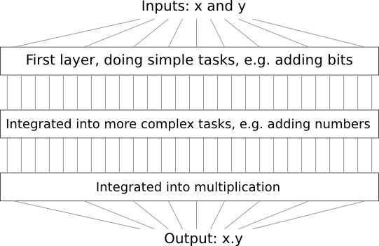
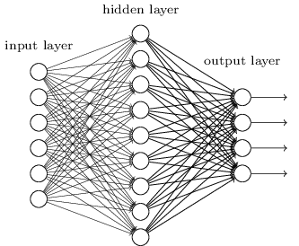
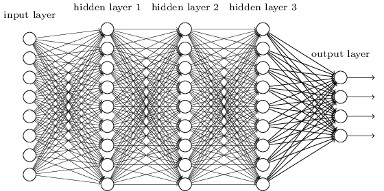
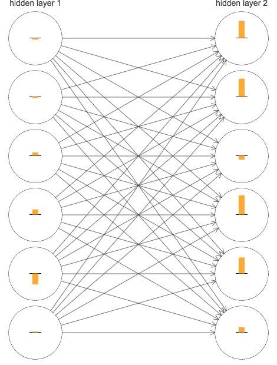
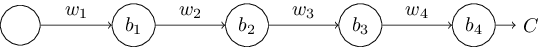
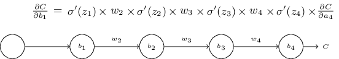
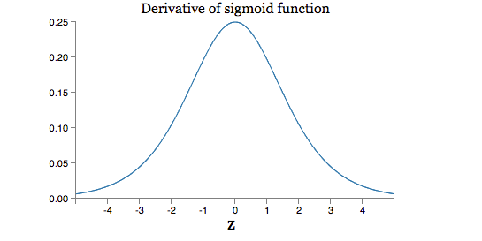
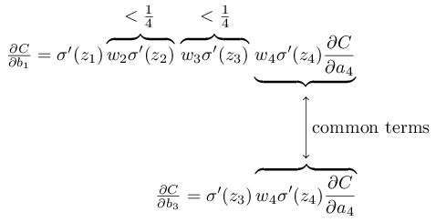

想象一下你是一位工程师，需要从头开始设计一台电脑。有一天你正在办公室里设计你的逻辑电路，设置AND门，OR门，等等，然后你的老板进来了，带来一个坏消息：客户加了一个不可思议的需求，就是整个电脑的设计必须只包含两层，如下图：


你彻底傻了，跟老板抱怨：客户疯了吧。
老板说：我也觉得他们疯了，但是客户是上帝，他们要什么我们就得给什么。

事实上，也不能说客户完全疯了。假定你的AND逻辑电路的输入可以是任意多个，NAND门电路也是输入也是任意多的，则任何一个函数都可以用这些设备通过两层设计出来。

但是，可以实现的设计不一定都是好设计。实际中，我们在解决实际问题（大多数的算法问题）的时候，我们通常先解决问题的子问题，然后综合起来，得到原始问题的解法。也就是，我们通过多层次的抽象来解决问题。


比如，我们要设计一个电路用于计算两个输入的乘积。一般我们会通过两个输入的加法子电路来实现。这些实现加法的子电路，又会通过位加法的子子电路来实现。简单来说，这个设计会类似下图的结构：



就是这样子，我们最终的设计至少会包含三层。实际上可能包含的更多，因为子任务可能会进一步划分，我们领会这里思路就好了。

所以，较深的电路设计会让设计的过程变的简单一些。然后他们不止是对设计有帮助。有数学研究发现，对于一些函数来说，浅层设计要比深层设计多使用指数倍的电路原件。例如，1980年代的一系列论文显示，对于奇偶性的计算任务，如果用浅层设计来实现，需要指数倍的门电路。相反，如果使用深度设计来实现，可以使用一个很小规模的电路来实现：你只要先计算每两位的奇偶性，然后用计算的结果去计算四位的奇偶性，以此类推，最后计算整个数的奇偶性。所以，深度设计在本质上就比浅层网络更强大。

目前为止，本书中的神经网络的设计都像那位疯了的客户一样。几乎所有的设计中都只有一层隐藏层:


这些简单的浅层的网络已经非常好了：在前面的章节中，我们的数字识别准确率达到了98%以上。直觉上来说，我们期望包含多层隐藏层的深度网络会更好：


这些深度网络，可以使用中间层构建多层次的抽象，就像布尔电路设计一样。例如，我们在做视觉模式识别的任务，则第一层的神经元可能学习识别边界，第二层的可以识别复杂的由边界构成的图形，比如三角形、长方形等等。第三层的神经元可以识别更复杂的图形。以此类推。这种多层次抽象的能力看起来会让深度网络在负载模式识别的问题上具有不可抗拒的优势。而且，类似于电路设计，也有理论研究结果表明，深度网络本质上会比浅层网络更强大。


我们如何来训练这种深度网络呢？本章中，我们会尝试使用我们的主力学习算法--随机梯度下降算法。但是我们遇到了问题，我们的深度网络没有表现的比浅层网络更好。


经过上面个讨论，这个失败的结果确实很意外。我们没有放弃深度网络，我深挖一下，试图去理解深度网络难以训练的原因。我们仔细观察后发现，深度网络中的不同层学习的速度差别很大。具体来说就是，当网络后面的层学习很好的时候，前面的层的学习经常会卡住，几乎学不到任何东西。这个问题不是运气的问题。其实，学习变慢是有原因的，跟基于梯度的学习算法有关。

随着问题的研究的深入，我们发现相反的现象也会发生：前面层的学习很好，后面的层学习会卡住。事实上，我们会发现，深度网络中，基于梯度下降的学习算法有一种内在的不稳定性。这种不稳定性导致前面或则后面层的学习卡住。

这些听起来都是坏消息。但是深入研究这些问题，我们逐渐领悟了深度网络的训练需要什么。而这些调查是对下章内容的很好的准备。下章中我们将使用深度学习解决图片识别的问题。


##梯度消失问题

那么，深度网络的训练问题出在哪？

为了理解问题，我们回忆一下前面使用的包含一层隐藏层的神经网络。我们还是用MNIST数字图片作为例子。

如果愿意，读者可以在自己的电脑上训练。你需要Python2.7,Numpy,代码可以下列方式取得：

```
git clone https://github.com/mnielsen/neural-networks-and-deep-learning.git
```

当然，只是阅读也是可以的。

我们通过PythonShell加载MNIST数据：

```
>>> import mnist_loader
>>> training_data, validation_data, test_data = \
... mnist_loader.load_data_wrapper()
```

构建网络：

```
>>> import network2
>>> net = network2.Network([784, 30, 10])
```

网络是784输入神经元对应每张图片的$28x28=784$个像素。隐藏层包含30个神经元。输出层包含10个输出神经元，对应图片的10个可能的取值（0,1,2,3,...,9）。

我们试着训练30次，mini-batch大小为10，学习速率$\eta=0.1$，规则化参数$\lambda=5.0$。一边训练一边用验证集validation_data测试分类的准确率：

```
>>> net.SGD(training_data, 30, 10, 0.1, lmbda=5.0, 
... evaluation_data=validation_data, monitor_evaluation_accuracy=True)
```


准确率达到96.48%（左右，每次运行都不太一样）。


然后我们添加一层隐藏层，也包含30个神经元，然后使用同样的超参训练：

```
>>> net = network2.Network([784, 30, 30, 10])
>>> net.SGD(training_data, 30, 10, 0.1, lmbda=5.0, 
... evaluation_data=validation_data, monitor_evaluation_accuracy=True)
```


准确率达到96.90%，有了一定的提升。很好：增加网络深度有帮助。我们再加一层，同样包含30个神经元：

```
>>> net = network2.Network([784, 30, 30, 30, 10])
>>> net.SGD(training_data, 30, 10, 0.1, lmbda=5.0, 
... evaluation_data=validation_data, monitor_evaluation_accuracy=True)
```

准确率回到了96.57%，添加这层没起到作用。我们再增加一层试试：

```
>>> net = network2.Network([784, 30, 30, 30, 30, 10])
>>> net.SGD(training_data, 30, 10, 0.1, lmbda=5.0, 
... evaluation_data=validation_data, monitor_evaluation_accuracy=True)
```
准确率又下降了，到了96.53%。虽然下降的不多，但是也很失望。


结果看起来有些奇怪。直觉感觉，增加的网络层使网络可以计算更复杂的分类函数，从而更好的分类。而且，情况不应该变糟糕才对，因为最坏情况下，额外增加的网络层什么也不做就行了。但是情况并非如此。


那么这是怎么回事呢？我们假设增加的网络层原则上确实有帮助，问题出在我们的学习算法没有找到合适的权重和偏移。我们来找出学习算法的问题，改进它。


为了理解问题出在哪，我们来图形化网络是如何学习的。下图中，我画出了网络[784,30,30,10]的一部分。每个神经元上都有一个小柱子，表示神经元变化的频率。大的柱子表示神经元训练过程中变化快，小的柱子表示变化的慢。更准确的说，柱子代表每个神经元的梯度$\partial C/\partial b$。我们知道这个变量不仅决定了训练中偏移值的变化频率，还决定了加权输入变化的频率。如果你记不太清细节也没关系：记住柱子的大小表示每个神经元权重和偏移改变的快慢就可以了。


为了简图图形，我只花了2个隐藏层的前6个神经元。省略了输入层，因为它们没有权重和偏移，也省略了输出层。因为我在做层与层之间的比较，相同数量的层之间的比较更有意义。图像是在训练的开始时画出来的，也就是在网络初始化之后不久：





网络是随机初始化的，所以神经元变化率不一样没什么奇怪的。但是有一个现象很明显：第二隐藏层的变化比第一隐藏层的变化率普遍大很多。导致第二隐藏层的神经元要比第一隐藏层的神经元学习快很多。这是巧合还是另有原因呢？

为了弄清情况是否如此，最好能有一个比较两个隐藏层学习速率的方法。我们把$l$层的$j$神经元的梯度记为：$\delta_j^l=\partial C/\partial b_j^l$。我们可以用向量$\delta^l$表示$l$层的学习速率。如此，可以通过比较$||\delta^1||,||\delta^2||$来比较这两层的学习速率。


我们计算得到$||\delta^1||=0.07, ||\delta^2||=0.31$。所以，第一隐藏层确实比第二隐藏层学习的快。

添加更多的隐藏层会怎么样呢？在[784,30,30,30,10]网络中，三个隐藏层的学习速率分别是0.012,0.060,0.283。再一次说明，前一层的学习要比后一层的学习慢。在添加一层的呢，4个隐藏层的学习速率分别是0.003,0.017,0.070,0.285.情况依然存在。


我们已经看过了训练之初的情况，我们回到2层隐藏层的网络，看一下整个训练过成中两层的学习速率对比：


实验中使用了1000张图片，训练了500次。这里我并没有使用mini-batch的训练方式，是因为这种方式会产生不少噪音，使用我上面的参数使结果更明显。


可以看出，两层的开始速率就不同（这个我们已经知道了）。然后同时快速的下降，然后反弹。但是第一隐藏层速率始终比第二有层慢。

更复杂一些的网络呢？我们来看一下网络[784,30,30,30,10]的情况：


情况依然存在；网络[784，30，30，30，30，10]呢：


再次，前面的隐藏层比后面的隐藏层学习的慢很多。这里，第一隐藏层要比最后隐藏层慢100倍。难怪我们之前训练深度网络遇到了问题。


这里我们观察到了一个重要的现象：至少在一些深度网络中，梯度会随着逆向向前传播而变小。这种现象被称为：梯度消失问题。


梯度为什么会消失？有办法避免吗？训练深度网络的时候怎么处理这个问题？事实上，这个现象是不可避免的，而且相反的现象也存在：有时梯度会逐渐增大，称之为梯度爆炸问题。总得来说，深度网络中的梯度是不稳定的，不是消失就是爆炸。这种不稳定性是深度网络中基于梯度的学习算法的基础问题之一。


梯度不稳定问题确实是一个问题吗？暂时抛开神经网络，想象一下我们需要最小化函数$f(x)$，导数$f'(x)$比较小不好吗？这不是说明我们呢已经接近极值了吗？类似的，深度网络找中前面的网络层的梯度较小也许是因为我们确实不需要太多调整权重和偏移呢？


毫无疑问现实情况不是这样的。我们的网络是随机初始化的。初始的值不太可能做好我们需要网络要做的工作。具体来说，比如使用[784,30,30,30,10]来分类MNIST图片。随机初始化的第一隐藏层会丢掉图片的大部分信息。这样，即使后面的层训练的很好，也会很难分类图片，原因是没有足够的信息。所以，第一层不用学习是不太可能的。所以如果我们需要训练深度网络，就必须解决梯度不稳定的问题。

##是什么导致了梯度消失？深度网络的梯度不稳定

为了理解梯度是怎么消失的，我们来考虑下面这个最简单的网络：每一层只有一个神经元:



其中,$w_1,w_2,...$表示权重，$b_1,b_2,...$表示偏移。$C$表示损失函数。这么画是为了说明损失函数是关于$a_4$的函数。


我们将研究一下第一隐藏神经元的梯度$\partial C/\partial b_1$。推导出$\partial C/\partial b_1$的表达式，通过表达式的学习我们就会理解为什么梯度会消失。


首先我会直接告诉你$\partial C/\partial b_1$的表达式，看起来很复杂，其实公式结构很简单：



***为什么会出现梯度消失的问题：***为了理解这个问题，看一下梯度计算的公式：

$$\frac{\partial C}{\partial b_1}=\sigma'(z_1)w_2\sigma'(z_2)w_3\sigma'(z_3)w_4\sigma'(z_4)\frac{\partial C}{\partial a_4}\quad(122)$$

除了最后一项，这个表达式是$w_j\sigma'(z_j)$的乘积。为了理解每一项的行为，我们来看一下$\sigma'$函数的图像：



可以看出，导函数的在0处取得最大值$\sigma(0)=1/4$。我们是用标准的方式初始化网络的权重的，这个标准的方式是使用均值为0标准差为1的高斯分布随机初始化。所以，权重通常会满足$|w_j|<1$。综合起来，可以得出每一项$|w_j\sigma'(z_j)|<1/4$。与这个值相乘结果会指数形式的减小。越多这样的项，乘积越小。这个看起来可以解释梯度消失了。


为了更明确的说明问题，我们来比较一下$\partial C/\partial b_1, \partial C/\partial b_3$：



可以看出$\partial C/\partial b_1, \partial C/\partial b_3$有很多共同项，但是$\partial C/\partial b_1$比$\partial C/\partial b_3$多两项，所以$\partial C/\partial b_1$大概是$\partial C/\partial b_3$的1/16.这就是梯度消失的根本原因。


当然，这不是梯度消失的严格正式的证明。有例外的情况。具体来说，就是训练中，$w_j$的值可能会增长。如果这样，$|w_i\sigma'(z_j)|<1/4$就不再成立。确实如此，一旦这个值超过了1，梯度小时问题就不再出现，相反，会出现梯度爆炸问题。


***梯度爆炸问题:***我们来看一个梯度爆炸的例子。这个例子是我人为构造的：我将手动初始化各个参数来确保梯度会爆炸。虽然这个例子是认为构造出来的，但是它也说明了梯度爆炸不是一个纯理论的问题，而是确确实实可以能发生。

再次使用上面的每层只有一个神经元的网络，我们需要两步来构造出一个梯度爆炸的网络。第一步，网络中的权重都用比较大的值初始化，比如$w_1=w_2=w_3=w_4=100$。第二步，选择偏移值的时候注意一下，使$\sigma'(z_j)$的值不要太小。做到这点很简单：偏移的值使得加权输入$z_j=0$就可以了(这样的话$\sigma'(z_j)=1/4$)。所以，比如我们要想$z_1=w_1a_0+b_1=0$,使$b_1=-100*a_0$就可以了。这样初始化参数后，得到$w_j\sigma'(z_j)=100 * \frac{1}{4}=25$.我们得到了一个梯度会爆炸的网络。


***梯度不稳定问题:***这里的基本问题不是梯度消失或则梯度爆炸问题，而是前面网络层的梯度是后面网络层中一些项目的乘积的形式。当存在多层的时候，从本质上就会造成不稳定的问题。要使所有层按同样的速度学习的唯一的办法就是所有这些相乘的项能平衡。事实上，没有一些机制或则底层的原因，这种平衡很难发生。简单来说，真正的问题是神经网络的梯度不稳定问题。所以如果我们用标准的基于梯度的学习算法，不同的层趋向于以不同的速度学习。


***梯度消失的普遍性：***我们已经知道，深度网络中，前面的网络层中容易出现梯度消失或则梯度爆炸的问题。事实上，使用sigmoid神经元的时候，梯度消失比较常见。为什么呢？我们再次考虑乘积项$|w\sigma'(z)|$.要想避免梯度消失问题，需要满足$|w\sigma'(z)|>1$。你可能会认为故意$w$值比较大的话这个条件很容易满足。其实不然。原因是$\sigma'(z)$也依赖于$w$:$\sigma'(z)=\sigma'(wa+b)$,其中a是输入。所以当$w$比较大的时候，我们需要小心不要同时使$\sigma'(wa+b)$变小了。这是一个相当苛刻的限制条件。原因是当我们增大$w$时，$wa+b$是增大的。观察函数$\sigma'(z)$发现，这会使$\sigma'(wa+b)$变小的。所以，通常情况下，梯度会消失。


##更复杂网络中的梯度不稳定问题


我们已经学习过了简单网络的情况，每一层只包含一个神经元。更复杂的深度网络中情况又是怎样的呢？


事实上，情况一样。一个包含$L$层的神经网络中，$l$层的梯度满足下面的公式：

$$\delta^l=\sum'(z^l)(w^{l+1})^T\sum'(z^{l+1})(w^{l+2})^T...\sum'(z^L)\nabla_aC\quad(124)$$


其中，$\sum'(z^l)$是一个对角矩阵，每一项表示连接到$l$层的神经元的加权输入。$w^l$表示对应层的权重矩阵。$\nabla_aC$表示损失函数C关于输出激活值的偏导数。


这个公式比前面的公式要复杂很多。但是，本质的形式还是很相似的。由很多形式为$(w^j)^T\sum'(z^j)$的项组成。


##深度网络的其他障碍

本章中，我们主要关注了梯度消失的问题，更广泛的说，应该是梯度不稳定问题。这只是深度网络的一个障碍。很多正在进行的研究目标在于更好的理解深度学习中的挑战。这里我不准备总结所有这些工作。这里我会简单的提及一些论文，让你们了解到人们经常遇到的问题。

第一例子，2010年Glorot和Bengio发现sigmoid激活函数会导致最后一层隐藏层的输出在0附近饱和，导致学习变慢的问题。他们建议使用一些替换的激活函数。

第二个例子，2013年Sutskever, Martens, Dahl 和 Hinton研究了随机权重初始化和动量梯度下降对深度学习的影响。


这些例子提示我们，"什么使得深度网络很难训练"是一个很复杂的问题。本章我我们关注了梯度不稳定的问题。上面两个例子说明，结果跟所用的激活函数、权重初始化的方式、甚至梯度下降的具体实现形式都有关系。当然网络的结构，其他超参的取值也很重要。所以，原因是多方面的，跟很多因素有关系。对这些关系的理解是正在研究的主题。这些看起来很悲观。但是好消息是，下一章中，我们开发出了几种方法，某种程度上克服了或则是绕过了这些障碍。


