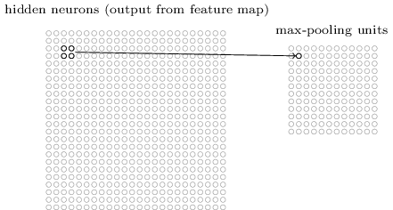

上一章中，我们学习到深度网络比浅层网络难以训练。这很可惜，因为我们有充分的理由相信，如果我们可以训练深度网络，它将比浅层网络强大很多。虽然上一章的消息很令人沮丧，但是我们不会放弃。本章中，我们来看看一些可以训练深度网络的技术。我们还将看看更广阔的画面，看看深度网络最近取得的进展，在图像识别，语音识别，和一些其他方面。然后我们简单展望一下深度网络的未来，人工智能的未来。

本章会比较长，为了帮助一导航，我们来简单过一下所有内容。本章的每节都很独立，如果你比较熟悉神经网络，你可以直接跳到感兴趣的部分。

本章的主要介绍使用很广泛的一种深度神经网络：深度卷积网络。我们将通过一个完整的例子来用卷积网络解决MINIST的图片识别问题：


我们对卷积网络的描述将从浅层网络开始。经过多次的迭代，我们构建出越来越强大的网络。我们将探索很多强大的技术：卷积，pooling,使用GPU,训练集扩展，dropout技术，网络的组合,等等。最终的结果会接近人的识别率。准确率达到9967/10000.下面是识别出错的几张图片,每张图中右上角的是真实分类，右下角是我们网络的输出：


人类识别这些图片都比较困难。例如第一排的第三个图片，在我看来更像是9而不是8,我们的网络也认为是9.


然后本章的剩余章节会从宏观的不那么细节的角度讨论一下深度学习。我们会大概看一下深度学习的其他模型，例如递归神经网络，长短记忆单元，看看这些模型是如何应用在语音识别，自然语言处理等等其他领域的。然后我们展望一下神经网络和深度学习的未来，包括意图驱动的用户交互界面，人工智能中深度学习的作用。

本章是建立在前面几章的基础上是，使用了BP算法，规则化，softmax函数等等技术。但是阅读本章不需要你特别熟悉前面的章节。但是如果你比较熟悉第一章的话，了解神经网络的基础，会很有帮助。当我使用第2，5章的一些概念的时候，我会提供相应的链接。

值得一提是本章不会包含什么内容。本章不是最先进的神经网络的教程。我们也不会训练几十层的深度网络去解决非常前沿的问题。想反，我们的关注的是深度神经网络背后的核心原理，然后应用在我们简单的，好理解的MINIST问题中。也就是说：本章不会直接带领你进入前沿的领域，相反，本章以及之前的章节的意图在于关注基础知识，这样能使你理解想现在广泛的研究工作。


##卷积网络

前面的章节中，我们的神经网络在图片识别的任务中表现的很不错：


我们使用的网络，相邻的网络层之间被完全连接起来，也就是每层的每个神经元都会连接到相邻层的所有神经元：


具体说，我们把图片的每一个像素对应一个输入神经元，输入神经元的输出值为像素的灰度值。对于28x28像素的图片，我们有784(=28x28)个输入神经元。我们训练网络的权重和偏移，希望正确的识别出图片上的数字。


这些网络表现的很好，识别准确率达到了98%以上。但是思考后我们发现，使用完全连接的网络去分类图片,比较奇怪。因为这样的网络没有考虑到图片的空间结构特征，同等看待了距离相近和很远的像素,这些空间特征需要网络自己从训练数据中推导出来。但是，如果我们不使用这样一个"白板"一样的网络，而使用一种能利用空间结构的网络结构呢？本节中我们将介绍卷积神经网络。这类网络充分利用了空间特征，特别适合于图片分类。这种网络的结构也使网络训练比较快，这样有助于我们训练深度多层的网络。如今，深度卷积网络或则一些相近是变种，被广泛用于图片识别的神经网络中。


卷积网络三个基础概念：局部接受区域，共享权重以及pooling.我们来分别看一下。


***局部接受区域：***在前面全连接网络中，我们将输入被表示成直线排列的神经元。在卷积网络中，最好将输入看成28x28正方形排列的神经元，每个神经元的值表示28x28图片中对应像素的灰度值：


依然，输入神经元会连接到隐藏神经元中。但是不会链接到所有的隐藏神经元中。

准确的说，第一隐藏层的神经元会连接输入层中的一小块区域内的所有神经元，如果5x5大小的区域。下图表示一个隐藏神经元的链接方式：


这个区域被称为隐藏神经元的局部接受区域。每条连接对应一个权重值，一个隐藏神经元对于一个偏移值。可以认为这个隐藏神经元在学习怎么分析这块特定的局部接受区域。

然后我们让这块区域在整个输入层中滑动，每一个区域都对应一个隐藏神经元。我们从左上角开始：


然后窗口向右滑动一个像素，对应区域内的神经元连接到第二个隐藏神经元：


依次类推，构建出第一层隐藏层。比如我们的图片是28x28,局部接受区域的大小为5x5,则第一隐藏层包含24x24个神经元。

我的例子中，局域接受局域每次移动的距离为1个像素。实际上这不是必须的，可能会移动不同的距离。例如我们可以向（向下）移动2个像素。每次移动的距离被称为步长（stride length）。本章中大部分情况下步长都是1，但是要知道人们也会使用其他的步长。

***共享权重和偏移:***我已经说过每个隐藏神经元有一个偏移和5x5个权重，连接到局部接受局域内的每个神经元。但是还没说，这24x24个隐藏神经元将共享权重和偏移值。也就是，第$j,k$隐藏神经元的输出是：


$$\sigma(b+\sum_{l=0}^{4}\sum_{m=0}^{4}w_{l,m}a_{j+l, k+m}).\quad(125)$$

其中，$\sigma$是激活函数，可能是sigmoid函数。b是偏移值。$w_{l,m}$是5x5的共享权重矩阵。$a_{x,y}$表示位置（x,y）处的输入值。


这说明第一隐藏层的所以神经元在输入图片的不同位置检测同样的特征。这是有意义的，假定权重和偏移可以检测出一块局部接受区域内的一条垂直的边界，那么这个能力在其他区域也可能有用，所以共享权重和偏移是有用处的。说的抽象一些就是，卷积网络非常适合图片的平移不变性：移动一张猫的图片，还是一张猫的图片。

因此，我们有时候把输入层到隐藏层的映射称为特征映射。特征映射的权重称为共享权重，特征映射的偏移称为共享偏移。有时我们说共享的权重和偏移定义了一个内核或者过滤器。

目前我们讨论的网络只能检测到一类局部特征。图片识别需要更多的特征。所以完整的卷积层包含多个不同的特征映射：


上面例子中，定义个3个特征映射，每个映射包含共享的5x5个权重和1个偏移。使网络可以检测3个不同的特征。

为了简单起见，我只显示2个特征映射的情况。实际中可能包含很多很多的特征映射。最早的卷积网络之一，LeNet-5使用了6个特征映射，局部接受区域大小为5x5，用来识别MINIST图片。本章后面，我们会使用20和40个特征映射的卷积网络。我们来看一下学习到的特征：


这20张图片对应20个不同的特征映射（过滤器或则内核）。每个映射用一个5x5的块状图片表示，对应一个5x5的局部接受区域的权重。浅色的表示权重较小，也就是特征映射对相应的像素响应较小。深色表示权重较大，也就是特征映射对相应位置的像素响应较大。简单来说，以上图片显示了卷积层响应的特征类别。

那么从这些特征映射中我们能总结出什么呢？比较明确的是这里的空间结构不是随机出现的：很多特征映射里包含了明暗的连续子区域。这表示我们的网络真的是学习到了空间结构相关的知识。但是，除了这些，很难看出这些特征映射学习到了什么。毫无疑问，我们不是在学习Gabor过滤器（图像识别领域被广泛使用的方法）。事实上，关于如果更好的理解学习的结果已经有了很多的研究成果，如果你对这方面的工作比较感兴趣，我建议你从Matthew Zeiler和Rob Fergus (2013)的这篇论文开始：[卷积网络的视觉化与理解](http://arxiv.org/abs/1311.2901)

共享权重和偏移的一个巨大的优点是极大的减少了卷积网络中参数。比如，每个特征映射包含5x5=25个权值和一个偏移，总共26个参数。如果有20个特征映射的话，总之20x26=520个参数。对比一下全连接的网络，783x30个权重，加上30个偏移，总共是23,550个参数。足足比卷积网络多了40倍。

当然，两个模型本质上就不一样，很难直接比较参数的个数。但是直观感觉上来说，为了达到全连接网络相同的性能，卷积网络需要的参数会更少。这导致卷积模型的训练比较快，有利于构建深度网络。

捎带提一下，卷积网络的名称来源于公式125有时被称为卷积运算。有时候把公式写成$a^1=\sigma(b+w*a^0)$,其中$a^1$表示特征映射的输出集合，$a^0$表示输入激活，$*$表示卷积运算。我们不会深入的使用卷积运算，所以不用担心。但是知道名称的来源还是值得的。


***池化(pooling)层：***除了卷积层之外，卷积网络还包含pooling层。pooling层通常紧接在卷积层之后。pooling层的工作是简化卷积层的输出。

pooling层把卷积层是所有输出作为输入，然后构建一个紧凑的特殊映射。例如，pooling层的每个神经元可以总结前一层的2x2的区域。举一个具体的例子，一种常见的pooling处理被称为max-pooling，max-pooling层的每个神经元简单的输出前一层移动区域(例如2x2)内输入的最大值:



因为我们啊卷积层有24x24个神经元，所有pool成就有12x12个神经元。

因为卷积层一般不止一个特征映射，每一个特征映射对应一个pooling层。假如有3个特征映射，则网络结构如下图：


max-pooling并不是pooling的唯一一种方式。另一个常见的pooling方式被称为L2 pooling。这种方式里，我们不是简单的去2x2个神经元的输出的最大值，而是取所有数层平方和的根。虽然细节不一样，但是感觉上比较相似:L2pooling也是一种压缩卷积层输出的信息的方式。实际中两种方式都被广泛使用。有时候也会采用其他类型是pooling。如果你是在调优模型，你可以在验证集上验证比较多种pooling方式，选出表现最好的。这里我们不准备担心这类细节。

***总结：***现在我们可以把所有的技术综合到一起，构建一个完整的卷积神经网络。跟之前的网络比较类似，但是多出了一个包含10个神经元的输出层：


网络包含28x28的输入层，每个神经元表示MNIST图片的一个像素值。接着是一个包含3个特征映射的卷积层，局部接受举起大小为5x5，虽有卷积层包含3x24x24个神经元。接下来是max-pooling层，pooling区域的大小为2x2，所以pooling层包含2x12x12个神经元。

最后，max-pooling层完全连接到输出层。也就是pooling层的每个神经元都连接到输出层的所有神经元上。


这种结构更之前的网络结构区别很大。但是整体上看还是有些相似的：网络由一些简单的单元构建，其行为由权重和偏移决定。整体的还是一样的：通过训练集训练网络的权重和偏移，使网络能分类输入的图片。

我们还是会用到随机梯度下降和BP算法来训练网络。这跟之前的过程完全一致。但是需要对BP算法做一些修改。原因是我们之前BP的推导是在全连接的网络中的。幸运的是，可以直接修改卷积层和max-pooling层的导数。


##卷积网络的实践
我们来看一下我们的代码：network3.py.结构类似与network2.py,因为使用了Theano，所以细节方面有所差别。我们从FullyConnetedLayer类开始。有点类似之前学习的层，下面是它的代码：

```
class FullyConnectedLayer(object):

    def __init__(self, n_in, n_out, activation_fn=sigmoid, p_dropout=0.0):
        self.n_in = n_in
        self.n_out = n_out
        self.activation_fn = activation_fn
        self.p_dropout = p_dropout
        # Initialize weights and biases
        self.w = theano.shared(
            np.asarray(
                np.random.normal(
                    loc=0.0, scale=np.sqrt(1.0/n_out), size=(n_in, n_out)),
                dtype=theano.config.floatX),
            name='w', borrow=True)
        self.b = theano.shared(
            np.asarray(np.random.normal(loc=0.0, scale=1.0, size=(n_out,)),
                       dtype=theano.config.floatX),
            name='b', borrow=True)
        self.params = [self.w, self.b]

    def set_inpt(self, inpt, inpt_dropout, mini_batch_size):
        self.inpt = inpt.reshape((mini_batch_size, self.n_in))
        self.output = self.activation_fn(
            (1-self.p_dropout)*T.dot(self.inpt, self.w) + self.b)
        self.y_out = T.argmax(self.output, axis=1)
        self.inpt_dropout = dropout_layer(
            inpt_dropout.reshape((mini_batch_size, self.n_in)), self.p_dropout)
        self.output_dropout = self.activation_fn(
            T.dot(self.inpt_dropout, self.w) + self.b)

    def accuracy(self, y):
        "Return the accuracy for the mini-batch."
        return T.mean(T.eq(y, self.y_out))
```


看完层类，我们来看下遗爱网络类Network,我们从__init__函数开始：

```
class Network(object):
    
    def __init__(self, layers, mini_batch_size):
        """Takes a list of `layers`, describing the network architecture, and
        a value for the `mini_batch_size` to be used during training
        by stochastic gradient descent.

        """
        self.layers = layers
        self.mini_batch_size = mini_batch_size
        self.params = [param for layer in self.layers for param in layer.params]
        self.x = T.matrix("x")  
        self.y = T.ivector("y")
        init_layer = self.layers[0]
        init_layer.set_inpt(self.x, self.x, self.mini_batch_size)
        for j in xrange(1, len(self.layers)):
            prev_layer, layer  = self.layers[j-1], self.layers[j]
            layer.set_inpt(
                prev_layer.output, prev_layer.output_dropout, self.mini_batch_size)
        self.output = self.layers[-1].output
        self.output_dropout = self.layers[-1].output_dropout

```

我们理解了Network如何被初始化之后，我们来看一下网络是如果训练的是，用到的方式是SGD：

```
def SGD(self, training_data, epochs, mini_batch_size, eta, 
            validation_data, test_data, lmbda=0.0):
        """Train the network using mini-batch stochastic gradient descent."""
        training_x, training_y = training_data
        validation_x, validation_y = validation_data
        test_x, test_y = test_data

        # compute number of minibatches for training, validation and testing
        num_training_batches = size(training_data)/mini_batch_size
        num_validation_batches = size(validation_data)/mini_batch_size
        num_test_batches = size(test_data)/mini_batch_size

        # define the (regularized) cost function, symbolic gradients, and updates
        l2_norm_squared = sum([(layer.w**2).sum() for layer in self.layers])
        cost = self.layers[-1].cost(self)+\
               0.5*lmbda*l2_norm_squared/num_training_batches
        grads = T.grad(cost, self.params)
        updates = [(param, param-eta*grad) 
                   for param, grad in zip(self.params, grads)]

        # define functions to train a mini-batch, and to compute the
        # accuracy in validation and test mini-batches.
        i = T.lscalar() # mini-batch index
        train_mb = theano.function(
            [i], cost, updates=updates,
            givens={
                self.x:
                training_x[i*self.mini_batch_size: (i+1)*self.mini_batch_size],
                self.y: 
                training_y[i*self.mini_batch_size: (i+1)*self.mini_batch_size]
            })
        validate_mb_accuracy = theano.function(
            [i], self.layers[-1].accuracy(self.y),
            givens={
                self.x: 
                validation_x[i*self.mini_batch_size: (i+1)*self.mini_batch_size],
                self.y: 
                validation_y[i*self.mini_batch_size: (i+1)*self.mini_batch_size]
            })
        test_mb_accuracy = theano.function(
            [i], self.layers[-1].accuracy(self.y),
            givens={
                self.x: 
                test_x[i*self.mini_batch_size: (i+1)*self.mini_batch_size],
                self.y: 
                test_y[i*self.mini_batch_size: (i+1)*self.mini_batch_size]
            })
        self.test_mb_predictions = theano.function(
            [i], self.layers[-1].y_out,
            givens={
                self.x: 
                test_x[i*self.mini_batch_size: (i+1)*self.mini_batch_size]
            })
        # Do the actual training
        best_validation_accuracy = 0.0
        for epoch in xrange(epochs):
            for minibatch_index in xrange(num_training_batches):
                iteration = num_training_batches*epoch+minibatch_index
                if iteration 
                    print("Training mini-batch number {0}".format(iteration))
                cost_ij = train_mb(minibatch_index)
                if (iteration+1) 
                    validation_accuracy = np.mean(
                        [validate_mb_accuracy(j) for j in xrange(num_validation_batches)])
                    print("Epoch {0}: validation accuracy {1:.2
                        epoch, validation_accuracy))
                    if validation_accuracy >= best_validation_accuracy:
                        print("This is the best validation accuracy to date.")
                        best_validation_accuracy = validation_accuracy
                        best_iteration = iteration
                        if test_data:
                            test_accuracy = np.mean(
                                [test_mb_accuracy(j) for j in xrange(num_test_batches)])
                            print('The corresponding test accuracy is {0:.2
                                test_accuracy))
        print("Finished training network.")
        print("Best validation accuracy of {0:.2
            best_validation_accuracy, best_iteration))
        print("Corresponding test accuracy of {0:.2

```


完整的代码如下：

```
"""network3.py
~~~~~~~~~~~~~~

A Theano-based program for training and running simple neural
networks.

Supports several layer types (fully connected, convolutional, max
pooling, softmax), and activation functions (sigmoid, tanh, and
rectified linear units, with more easily added).

When run on a CPU, this program is much faster than network.py and
network2.py.  However, unlike network.py and network2.py it can also
be run on a GPU, which makes it faster still.

Because the code is based on Theano, the code is different in many
ways from network.py and network2.py.  However, where possible I have
tried to maintain consistency with the earlier programs.  In
particular, the API is similar to network2.py.  Note that I have
focused on making the code simple, easily readable, and easily
modifiable.  It is not optimized, and omits many desirable features.

This program incorporates ideas from the Theano documentation on
convolutional neural nets (notably,
http://deeplearning.net/tutorial/lenet.html ), from Misha Denil's
implementation of dropout (https://github.com/mdenil/dropout ), and
from Chris Olah (http://colah.github.io ).

Written for Theano 0.6 and 0.7, needs some changes for more recent
versions of Theano.

"""

#### Libraries
# Standard library
import cPickle
import gzip

# Third-party libraries
import numpy as np
import theano
import theano.tensor as T
from theano.tensor.nnet import conv
from theano.tensor.nnet import softmax
from theano.tensor import shared_randomstreams
from theano.tensor.signal import downsample

# Activation functions for neurons
def linear(z): return z
def ReLU(z): return T.maximum(0.0, z)
from theano.tensor.nnet import sigmoid
from theano.tensor import tanh


#### Constants
GPU = True
if GPU:
    print "Trying to run under a GPU.  If this is not desired, then modify "+\
        "network3.py\nto set the GPU flag to False."
    try: theano.config.device = 'gpu'
    except: pass # it's already set
    theano.config.floatX = 'float32'
else:
    print "Running with a CPU.  If this is not desired, then the modify "+\
        "network3.py to set\nthe GPU flag to True."

#### Load the MNIST data
def load_data_shared(filename="../data/mnist.pkl.gz"):
    f = gzip.open(filename, 'rb')
    training_data, validation_data, test_data = cPickle.load(f)
    f.close()
    def shared(data):
        """Place the data into shared variables.  This allows Theano to copy
        the data to the GPU, if one is available.

        """
        shared_x = theano.shared(
            np.asarray(data[0], dtype=theano.config.floatX), borrow=True)
        shared_y = theano.shared(
            np.asarray(data[1], dtype=theano.config.floatX), borrow=True)
        return shared_x, T.cast(shared_y, "int32")
    return [shared(training_data), shared(validation_data), shared(test_data)]

#### Main class used to construct and train networks
class Network(object):

    def __init__(self, layers, mini_batch_size):
        """Takes a list of `layers`, describing the network architecture, and
        a value for the `mini_batch_size` to be used during training
        by stochastic gradient descent.

        """
        self.layers = layers
        self.mini_batch_size = mini_batch_size
        self.params = [param for layer in self.layers for param in layer.params]
        self.x = T.matrix("x")
        self.y = T.ivector("y")
        init_layer = self.layers[0]
        init_layer.set_inpt(self.x, self.x, self.mini_batch_size)
        for j in xrange(1, len(self.layers)):
            prev_layer, layer  = self.layers[j-1], self.layers[j]
            layer.set_inpt(
                prev_layer.output, prev_layer.output_dropout, self.mini_batch_size)
        self.output = self.layers[-1].output
        self.output_dropout = self.layers[-1].output_dropout

    def SGD(self, training_data, epochs, mini_batch_size, eta,
            validation_data, test_data, lmbda=0.0):
        """Train the network using mini-batch stochastic gradient descent."""
        training_x, training_y = training_data
        validation_x, validation_y = validation_data
        test_x, test_y = test_data

        # compute number of minibatches for training, validation and testing
        num_training_batches = size(training_data)/mini_batch_size
        num_validation_batches = size(validation_data)/mini_batch_size
        num_test_batches = size(test_data)/mini_batch_size

        # define the (regularized) cost function, symbolic gradients, and updates
        l2_norm_squared = sum([(layer.w**2).sum() for layer in self.layers])
        cost = self.layers[-1].cost(self)+\
               0.5*lmbda*l2_norm_squared/num_training_batches
        grads = T.grad(cost, self.params)
        updates = [(param, param-eta*grad)
                   for param, grad in zip(self.params, grads)]

        # define functions to train a mini-batch, and to compute the
        # accuracy in validation and test mini-batches.
        i = T.lscalar() # mini-batch index
        train_mb = theano.function(
            [i], cost, updates=updates,
            givens={
                self.x:
                training_x[i*self.mini_batch_size: (i+1)*self.mini_batch_size],
                self.y:
                training_y[i*self.mini_batch_size: (i+1)*self.mini_batch_size]
            })
        validate_mb_accuracy = theano.function(
            [i], self.layers[-1].accuracy(self.y),
            givens={
                self.x:
                validation_x[i*self.mini_batch_size: (i+1)*self.mini_batch_size],
                self.y:
                validation_y[i*self.mini_batch_size: (i+1)*self.mini_batch_size]
            })
        test_mb_accuracy = theano.function(
            [i], self.layers[-1].accuracy(self.y),
            givens={
                self.x:
                test_x[i*self.mini_batch_size: (i+1)*self.mini_batch_size],
                self.y:
                test_y[i*self.mini_batch_size: (i+1)*self.mini_batch_size]
            })
        self.test_mb_predictions = theano.function(
            [i], self.layers[-1].y_out,
            givens={
                self.x:
                test_x[i*self.mini_batch_size: (i+1)*self.mini_batch_size]
            })
        # Do the actual training
        best_validation_accuracy = 0.0
        for epoch in xrange(epochs):
            for minibatch_index in xrange(num_training_batches):
                iteration = num_training_batches*epoch+minibatch_index
                if iteration % 1000 == 0:
                    print("Training mini-batch number {0}".format(iteration))
                cost_ij = train_mb(minibatch_index)
                if (iteration+1) % num_training_batches == 0:
                    validation_accuracy = np.mean(
                        [validate_mb_accuracy(j) for j in xrange(num_validation_batches)])
                    print("Epoch {0}: validation accuracy {1:.2%}".format(
                        epoch, validation_accuracy))
                    if validation_accuracy >= best_validation_accuracy:
                        print("This is the best validation accuracy to date.")
                        best_validation_accuracy = validation_accuracy
                        best_iteration = iteration
                        if test_data:
                            test_accuracy = np.mean(
                                [test_mb_accuracy(j) for j in xrange(num_test_batches)])
                            print('The corresponding test accuracy is {0:.2%}'.format(
                                test_accuracy))
        print("Finished training network.")
        print("Best validation accuracy of {0:.2%} obtained at iteration {1}".format(
            best_validation_accuracy, best_iteration))
        print("Corresponding test accuracy of {0:.2%}".format(test_accuracy))

#### Define layer types

class ConvPoolLayer(object):
    """Used to create a combination of a convolutional and a max-pooling
    layer.  A more sophisticated implementation would separate the
    two, but for our purposes we'll always use them together, and it
    simplifies the code, so it makes sense to combine them.

    """

    def __init__(self, filter_shape, image_shape, poolsize=(2, 2),
                 activation_fn=sigmoid):
        """`filter_shape` is a tuple of length 4, whose entries are the number
        of filters, the number of input feature maps, the filter height, and the
        filter width.

        `image_shape` is a tuple of length 4, whose entries are the
        mini-batch size, the number of input feature maps, the image
        height, and the image width.

        `poolsize` is a tuple of length 2, whose entries are the y and
        x pooling sizes.

        """
        self.filter_shape = filter_shape
        self.image_shape = image_shape
        self.poolsize = poolsize
        self.activation_fn=activation_fn
        # initialize weights and biases
        n_out = (filter_shape[0]*np.prod(filter_shape[2:])/np.prod(poolsize))
        self.w = theano.shared(
            np.asarray(
                np.random.normal(loc=0, scale=np.sqrt(1.0/n_out), size=filter_shape),
                dtype=theano.config.floatX),
            borrow=True)
        self.b = theano.shared(
            np.asarray(
                np.random.normal(loc=0, scale=1.0, size=(filter_shape[0],)),
                dtype=theano.config.floatX),
            borrow=True)
        self.params = [self.w, self.b]

    def set_inpt(self, inpt, inpt_dropout, mini_batch_size):
        self.inpt = inpt.reshape(self.image_shape)
        conv_out = conv.conv2d(
            input=self.inpt, filters=self.w, filter_shape=self.filter_shape,
            image_shape=self.image_shape)
        pooled_out = downsample.max_pool_2d(
            input=conv_out, ds=self.poolsize, ignore_border=True)
        self.output = self.activation_fn(
            pooled_out + self.b.dimshuffle('x', 0, 'x', 'x'))
        self.output_dropout = self.output # no dropout in the convolutional layers

class FullyConnectedLayer(object):

    def __init__(self, n_in, n_out, activation_fn=sigmoid, p_dropout=0.0):
        self.n_in = n_in
        self.n_out = n_out
        self.activation_fn = activation_fn
        self.p_dropout = p_dropout
        # Initialize weights and biases
        self.w = theano.shared(
            np.asarray(
                np.random.normal(
                    loc=0.0, scale=np.sqrt(1.0/n_out), size=(n_in, n_out)),
                dtype=theano.config.floatX),
            name='w', borrow=True)
        self.b = theano.shared(
            np.asarray(np.random.normal(loc=0.0, scale=1.0, size=(n_out,)),
                       dtype=theano.config.floatX),
            name='b', borrow=True)
        self.params = [self.w, self.b]

    def set_inpt(self, inpt, inpt_dropout, mini_batch_size):
        self.inpt = inpt.reshape((mini_batch_size, self.n_in))
        self.output = self.activation_fn(
            (1-self.p_dropout)*T.dot(self.inpt, self.w) + self.b)
        self.y_out = T.argmax(self.output, axis=1)
        self.inpt_dropout = dropout_layer(
            inpt_dropout.reshape((mini_batch_size, self.n_in)), self.p_dropout)
        self.output_dropout = self.activation_fn(
            T.dot(self.inpt_dropout, self.w) + self.b)

    def accuracy(self, y):
        "Return the accuracy for the mini-batch."
        return T.mean(T.eq(y, self.y_out))

class SoftmaxLayer(object):

    def __init__(self, n_in, n_out, p_dropout=0.0):
        self.n_in = n_in
        self.n_out = n_out
        self.p_dropout = p_dropout
        # Initialize weights and biases
        self.w = theano.shared(
            np.zeros((n_in, n_out), dtype=theano.config.floatX),
            name='w', borrow=True)
        self.b = theano.shared(
            np.zeros((n_out,), dtype=theano.config.floatX),
            name='b', borrow=True)
        self.params = [self.w, self.b]

    def set_inpt(self, inpt, inpt_dropout, mini_batch_size):
        self.inpt = inpt.reshape((mini_batch_size, self.n_in))
        self.output = softmax((1-self.p_dropout)*T.dot(self.inpt, self.w) + self.b)
        self.y_out = T.argmax(self.output, axis=1)
        self.inpt_dropout = dropout_layer(
            inpt_dropout.reshape((mini_batch_size, self.n_in)), self.p_dropout)
        self.output_dropout = softmax(T.dot(self.inpt_dropout, self.w) + self.b)

    def cost(self, net):
        "Return the log-likelihood cost."
        return -T.mean(T.log(self.output_dropout)[T.arange(net.y.shape[0]), net.y])

    def accuracy(self, y):
        "Return the accuracy for the mini-batch."
        return T.mean(T.eq(y, self.y_out))


#### Miscellanea
def size(data):
    "Return the size of the dataset `data`."
    return data[0].get_value(borrow=True).shape[0]

def dropout_layer(layer, p_dropout):
    srng = shared_randomstreams.RandomStreams(
        np.random.RandomState(0).randint(999999))
    mask = srng.binomial(n=1, p=1-p_dropout, size=layer.shape)
    return layer*T.cast(mask, theano.config.floatX)
```


##图片识别的进展
1998年MNIST问题被提出，最先进的工作站花费数个星期训练的所达到的准确率远远的低于我们用GPU在一小时之内达到的准确率。所以，MNIST问题不再是一个能推动现有技术的问题了。然后它是一个很好的教学和学习的问题。同时，研究的关注点持续进步，引入了更有挑战的图片识别问题。本节中，我简单介绍一些这方面的工作。

本节跟本书的其他部分有些不同。我们一直关注一些有着持续吸引力的思想上，比如BP算法，规则化，卷积网络等等。我有意避开一些在写本书的时候比较流行、但是长远价值未知的思想。科学领域，这些思想往往都是很快退去不会留下持续的影响。有人可能怀疑说：既然图片识别领域的现代研究是昙花一现，两三年之后，情况就会改变，这些结果只有一些前沿专业人士才关心的，那么为什么要讨论他们呢？

一些现代的论文的重要性很逐渐消失，这点怀疑是没有疑问的。但是我们花一点事件了解一下现在的一些令人兴奋的发现还是值得的。


***2012 LRMD论文：***我们从2012年的一篇来自Stanford和Google的论文开始。我们称之为LRMD，来自去四位作者的名字。LRMD论文中采用神经网络分类ImageNet上的图片，这是一个非常具有挑战的图像识别问题。2011年ImageNet上的图片包括了1600万的彩色图片，分成2万个类别。图片全部来自网络，由亚马逊的员工人工分好类别。


毫无疑问这是个比MINIST更有挑战的问题。LRMD的网络达到了15.8%的正确率。结果看起来很一般，但是相比之前的9.3%准确率，已经是很大的进步了。这个提升说明了神经网络或许是视觉识别领域里的强大的工具。

***2012 KSH论文：***KSH的继续了LRMD的工作。KSH在ImageNet数据的一个受限的子集上训练和测试了一个卷积神经网络。这个子集来自与一个流行的机器学习竞赛：LLSVRC.使用竞赛的数据可以方便与其他方法作比较。LLSCRV-2012训练集包含120万ImageNet的图片，分为1000个类别。验证集和测试集分别包含5万和15万图片，也分为1000个类别。

ILSVRC的竞赛的一个困难在于很多ImageNet的图片中包含多个物体。比如一张狗叼着球的图片，所谓的"正确"分类很可能是狗。那么把它分类成球的算法要被惩罚吗？因为存在这个问题，每张图片会有最接近的5个类别，算法输出其中一个就被认为是对的。用这种前5分类的标准，KSH准确率达到了84.7%，远远超过第二名的73.8%。如果使用更严格的标准，要完全正确的分类图片，KSH网络争取率达到了63.3%。

简单介绍一下KSH网络是值得的，因为它启发了很多后来的工作。它也比较类似本章前面训练的网络，只不过是稍微复杂点。KSH网络使用深度卷积网络，在两个GPU上训练。使用两个GPU是因为当时他们使用的GPU没有足够的内存存储整个网络。所以他们将网络一分为二。

KSH网络有7层影藏层。前五层是卷积网络（一些层带了最大池化层），后两层是全连接层。输出层是softmax层，包含1000个输出神经元，对应与图片的1000个分类。下面是网络的结构图，取自KSH论文中，注意到网络的很多层分为两个部分，对应两个GPU.


输入层包含$3x224x224$个神经元，对应像素为$224x224$的图片的RGB值。回忆一下，之前提到ImageNet的图片包含很多中分辨率的。这就有个问题，因为网络的输入层的大小是固定的。KSH通过图片的缩放解决这个问题：每张图片的较短的边缩放到256，然后通过裁剪得到256x256的图片，最后随机从$256x256$的图片中裁剪出$224x224$的区域。他们使用这种随机裁剪的方式扩充训练集，降低过拟合。这个方法对于想KSH这种大型网络来说非常有用。裁剪出的$224x224$的图片作为网络的输入。大多数情况下裁剪的图片依然包含原始图片中的主要物体。


接着看KSH网络的隐藏层，第一隐藏层是个卷积网络，带一个最大池化层。局部感受区局大小为$11x11$，步长为4.总共有96个特征映射。特征映射分成两组，一组48个，分别驻留在一个GPU里。最大池化层池化$3x3$的区域，池化区域允许重叠，吃呀的步长为2.

第二隐藏层也是一个卷积网络，带一个最大池化层。局部感受区域是$5x5$，总过包含256个特征映射，也分为两组，对应连个GPU。注意这层的输入是48而不是96，因为每个GPU里的网络只输入本GPU内的前一层是输出。

第三四五层都是卷积网络，但是没有个带池化层了。他们的参数分别是(3)384个特征映射，3x3局部感受区域，256个输入渠道.（4）384个特征映射，3x3局部感受区域，192输入渠道。(5)256个特征映射，3x3局部感受区域，192输入渠道。

第六七两层是全连接层。每层包含4096个神经元。

输出层包含1000个输出神经元。


KSH网络利用了很多技术。使用矫正线性函数代替了sigmoid函数和tanh函数。KSH网络大概有6千万个学习参数。所以即使有很大的训练集的情况下，也很容易过拟合。为了克服这个问题，他们通过随机裁剪的策略扩展了训练集。还是使用了l2规则化和dropout技术。网络本身也使用基于动量的mini-batch随机梯度下降方式训练。


***2014 LLSVRC比赛:***从2012年开始，竞赛结果持续在进步。2012年的ILSVRC比赛中，涉及了1200万的训练集，1000个分类，标准是前5个分类是否包含正确的答案。冠军队伍，主要来自Google的成员组成，使用一个22层的深度卷积网络。他们将网络称为GoogleLeNet,致敬LeNet-5网络。GoogLeNet的准确率达到了93.33%，大大的超过了2013年的冠军(Clarifai,88.3%)和2012年的冠军(KSH，84.7%)。


GoogLeNet的93.33%的准确率是什么概念呢？2014年有人写了一篇关于ILSVRC的调查文章。他们提到的一个问题：人类在ILSVRC问题上表现如何呢？他们开发了一个系统让人们来分类ILSVRC图片。

结果是，作为一个人类的专家，经过很大的努力才达到了深度网络的准确率。


这些结果很激动人心。的确，这项工作之后，很多组织报告的准确率在95%左右。


***其他活动：***我们一直关注ImageNet，其实有很多其他的活动中也使用神经网络去做图像识别。我来简单介绍接个最近的有趣的结果。

来自Google的一个团队将深度卷积网络应用在了Google街景中的号码识别上。这片论文中，他们报告，它们识别了近一亿的号码，准确率接近人类的操作。系统很快，他们的系统大概在一个小时内识别了所有街景图片中号码。他们说：这些数据极大的提高了Google地图的地域编码的质量。并且他们还是声明：他们相信他们已经解决了短序列识别问题。

或许大家有这样一个映像了：所有这些都是好消息。事实上不是的。神经网络中有一些基础性的工作我们还不明白。比如，2013年的一篇论文显示，深度网络可能会有盲点的问题。考虑下列的几行图片。左边是正却分类的ImageNet图片，右边是稍微修改后的图片，中间显示的是修改的点的位置，却没有被正确的分类。作者发现每张图片都有这种"有抗性"的图片，不是个别的例子:


这个结果很令人不安。论文采用的网络基于KSH网络。这些网络的输出，原则上应该是连续的，当时上面的结果却显示输出的结果是不连续的。更糟糕的是，他们违反了我们的直觉想象。甚至我们不理解是什么导致了不连续性：是损失函数吗？是激活函数吗？是网络的结构吗？或则其他的，我们还不知道。


这些结果也没有听起来那么的坏。虽然这些反例很普遍，但是实际中不太可能存在。就像论文中说的：反例的存在看似跟神经网络的高泛化能力相违背。确实，如果网络能很好的泛化，为什么会被这些与正常图片差别很小的反例误导呢？论文中的解释是这些反例不会或很少会出现在测试集中，但是他们很多(就像有理数一样)，所以能在每个特定的用例附近找到。

虽然如此，但是我们对神经网络的理解的这么少，这点很遗憾。


除了这些结果，整体上来说还是鼓舞人心的。在极端困难的测试中，我们看到了持续的进步，比如ImageNet。显示世界的实际问题上也看到了持续的进步，比如街景图片中的号码识别。到那时，有很多基础的现象我们还理解的太少，比如反例的存在。这些基础问题没被理解之前，我们很难说我们已经解决了图片识别问题。同时这些问题也强烈激发着未来的工作。


##深度学习的其他方法
通篇我们都关注着一个简单的问题：MNIST图片分类问题。通过这个问题我们理解的很多强大的思想：随机梯度下降，BP算法，卷积网络，规则化，等等。但是这还是一个比较狭窄的问题，如果你阅读神经网络方面的论文，你会碰到很多我们没有讨论过的思想：递归神经网络，玻尔兹曼机，生成模型，迁移学习，强化学习等等。神经网络是一个广阔的领域。但是很多重要的思想都是我们讨论过的思想的变化而来，也很容易理解。本节中我们来简单看一下其中的一些思想。我们的讨论不会很细节，也不会很完整 ，这样会极大的增加本书的内容。本节总我会提供一些链接，如果你想学习更多的话，可以参考这些链接。


***递归神经网络（RNNS）：***在我们已经使用的前向传导网络里，网络的输入完全决定余下网络层中神经元的激活输出值。这就像一幅静态的画面:网络中的所有都是固定的。但是假设我们允许网络一直动态的改变呢。比如，隐藏层神经元的行为不完全由前一层的激活输出决定，还依赖于前一段时间的激活输出。确实，一个神经元的输出可能部分依赖与自己之前的输出。这个在前向传播网络中是绝对不会发生的。或则隐藏层的激活和输出层的输出不仅依赖网络现在的输入，而且依赖之前的输入。


这种有随时间变化行为的神经网络被称为递归神经网络或则RNN.上一段中的递归神经网络的语言描述有很多方式数学化。[这里](http://en.wikipedia.org/wiki/Recurrent_neural_network)列举了一些RNN的数学模型。写本书的时候，网页里列举了超过13种的不同模型。但是数学细节先放一边，主要的思想是RNN网络随时间迁移而改变。并且，他们很适合分析和处理随时间改变而改变的数据。比如语音和自然语言处理。

RNN的一个应用与传统的算法思考的方式如图灵机和传统编程语言有关系。2014年的一篇论文中，开发了一个RNN网络，输入是简单的Python程序的文本，输出是程序的执行结果。网络在学习特定的Python程序。还有一篇论文，也是在2014年，使用RNN开始开发一个被称为神经图灵机（NTM）.这事一个完整的计算机，可以通过梯度下降来训练。他们来拿他们的NTM为一些例如排序、拷贝的简单问题推导出算法。


事实上，这些都是极其简单的玩具式的模型。学会执行print(398345+42598)这样简单的Python程序，并不能使网络称为成熟的Python解释器。这些思路能走多远还不清楚。但是结果很有趣的。历史上，神经网络解决了传统算法很难解决的模式识别问题。传统算法又在神经网络不擅长的领域里表现的很好。今天还没有人用神经网络实现一个web服务或则数据库.能开发出结合神经网络和传统算法优点的统一的模型会很好。RNN和RNN启发的思想或许可以帮助我们做到这点。

近些年RNN也被应用在了很多其他的问题上。在语音识别领域特别的有用。基于RNN的方法在音素识别方面刷新了很多记录。它们还被用于开发热门的语言模型。好滴模型能消除发音相似带来的歧义。一个好的模型可以告诉我们"to infinity and beyond"比"two infinity and beyond"更合理一些，虽然两者的发音一样。RNN在这类测试中也刷新了记录。

我说了很多RNN可以做的，但没有说怎么做的。很多前向传播网络中的技术同样可以用到RNN中，这点并不奇怪。具体的，我们可以直接修改梯度下降和BP算法,然后 用于训练RNN.很多其他的思想都可以用在RNN中，从规则化，到卷积，激活输出和损失函数等等。


***长短记忆单元（LSTMs）:***RNN的一个挑战是它非常的难以训练，甚至比深度前向传播网络更难训练。原因在第五章讨论过，就是梯度不稳定问题。回顾一下这个问题，随着梯度的层层向前传播，会变的越来越小，这导致前面网络层的学习变的极其的缓慢。这个问题在RNN中更严重，因为梯度不但随着网络结构层层向前传播，而且随着时间向前传播。如果网络运行了很长一段时间，会导致梯度非常的不稳定，很难从中学习。幸运的是，可以结合一个称为长短记忆单元的技术。

LSTMs由Hochreiter和Schmidhuber在1997年提出，旨在解决梯度不稳定问题。LSTMs使得RNN的训练更简单，能得到更好的结果。很多论文中又有用到LSTMs或类似的思想的地方。

***深度信念网络，生成模型，玻尔兹曼机:***现代时期对神经网络的兴趣从2006那年开始，很多论文解释了如果训练一类称为深度信念网络（DBN）的神经网络。DBN很多年里很有影响力，但是随着前向传播网络和RNN的流行，DBN的流行度慢慢减少了。但是DBN有很多很有趣的特征。

DBN比较有趣的一个原因是，它是生成模型的一个例子。在前向传播神经网络里，我们指定输入，输入决定网络中神经元的输出。类似DBN的生成模型可以类似的方式使用，但是也可以指定一些神经元的取值然后反向运行整个网络，产生输入的值。更准确的说，一个关于手写数字图片识别的DBN网络可以产生一些看起来像是手写数字的图片。也就是说，DBN可以通过先练学会写。这个方面，DBN更像人类的大脑，不但会读数字，而且会写。就像Geoffrey Hinton的著名的话：认识形状，首先得学会生成形状。

DBN有趣的第二个原因是它们可以做非监督和半监督学习。比如，通过训练图片的训练，DBN可以学习到很多特征，用于理解其他图片。而且这种非监督学习的能力在基础科学和具体应用中都很有用。

那么有这么多有吸引力的特征，DBN的流行度为什么会在减少呢？部分是因为前向传播网络和RNN在一些领域取得了可观的成绩，比如图片和语言识别领域。很多注意力被吸引到这些模型上，也是很自然的事。有一个很不幸的理论，就是赢家拿走所有。所以几乎所有的注意力都集中到了目前流行的领域。很难让人们在不流行的思想进行研究，即使这些思想很明显的更有长远的价值。我个人认为DBN和其他的生成模型值得更多的注意。有一天DBN和生成模型超过了当今流行的模型，我一点也不奇怪。想了解更多的关于DBN的这事，可以看[这里](http://www.scholarpedia.org/article/Deep_belief_networks)，我发现[这片文章](http://www.cs.toronto.edu/~hinton/absps/guideTR.pdf)也很有用。但是并没有包含很多关于玻尔兹曼机的信息，而玻尔兹曼机是DBN网络的一个关键组成部分。


***其他思想：***神经网络和深度学习领域还有哪些事呢？还有很多其他的迷人的工作。比较活跃的领域包括使用神经网络做自然语言处理，机器翻译，还有很惊喜的应用比如音乐创作。很多领域，在你学完本书后都可以开始相关的工作了，虽然你需要填补相关的背景知识。


让我通过一篇特别有趣的论文来结束本章的学习。它结合了深度卷积网络和被称为强化学习的技术，学了怎么玩电子游戏。思想是通过卷积网络简化屏幕的像素数据，转化成一组简单的特征，用这些特征来决定应该采取哪些动作：向左，向下，开火，等等。有趣的是，模型的表现非常好，在三个不同的游戏上超过了人类的专家。这听起来想是个噱头。但是考虑到这个系统采用原始像素作为输入，甚至不知道游戏规则是什么。能在这么复杂的环境下做出决策。这还是非常了不起的。


##神经网络的未来
***意图驱动的交互界面：***有这样一个老笑话。一个不耐烦的教授对一个困惑的学生说：不要听我说的是什么，要听我的意思是什么。很长事件以来，计算机就像这个困惑的学生一样，不知道用户的意思是什么。但是情况在改变，我记得一次在google搜索中我写错了一个单词，发现google搜索的结果是:"你的意思是【正确拼写的内容】吗？"Google的CEO Larry Page有一次这么描述完美的搜索引擎：准确理解你的搜索并且准确返回你想要的。

这是意图驱动的用户界面的一个愿景，在这个愿景里，搜索不会响应字面的检索，而是接受不准确的用户输入，准确理解用户的意思，基于这些理解采取进一步的动作。

意图驱动的交互界面不仅仅可以应用到搜索里。未来几十年里，会有很多公司利用机器学习技术开发出能够容忍模糊输入，理解真是意图的交互界面。例如：Apple的Siri,Wolfram Appha,IBM的Watson.可以注释照片和电影的系统等等。


这些系统大部分都会失败。优秀的交互界面是很困难的。我希望很多公司利用强大的机器学习技术开发出优秀的交互界面。如果交互界面很烂再好的机器学习也发挥不了作用。但是留下的产品会成功。我们与计算机的关系会发生极大的改变。不就以前，比如2005年，跟计算机交互需要精确无误，人们对这点习以为常。确实，计算机教育很大程度上固话了计算机极端精确的思想。错一个分号可能会完全改变结果。但是未来的几十年里，我期望能有成功的意图驱动用户界面出现，而且这将极大的改变人机交互的方式。


***机器学习，数据科学，创新的良性循环：***当然，机器学习不止用来开发意图驱动的交互界面。另一个主要的应用是数据分析，机器学习用来寻找数据中的"已知的未知".这又是一个流行的领域，关于它的论文也很多，我不会说太多。但是我想提一点这种趋势的结果：长远来说，机器学习的最大突破不会在单一概念方面。最大的突破可能是机器学习变得可以赚钱。如果一个公司投入1美元回报是1美元10美分，那么很多资金会进入机器学习领域的研究。结果是很多专家很低资源会出现在这个领域。这可能是机器学习未来的发展方向，一个良性的循环。


***神经网络和深度学习的角色：***我们讨论了很多关于机器学习作为技术新机会的创造者。深度学习和神经网络会在这当中扮演什么角色呢？

为了回答这个问题，回顾一下历史很有帮助。1980年代对神经网络充满了激动和乐观，特别是BP算法广泛认识以后。激动退去了，1990年代机器学习的接力棒传到了其他的技术，例如支撑向量机。如今，神经网络再次得意，刷新了很多记录，很多问题上打败了对手。但是谁又能说将来没有新的技术创造出来，打败神经网络呢？或则神经网络的发展停滞了，也没出现什么新的技术立即替代它们。

因此，宏观的思考机器学习的未来比神经网络要简单。部分是因为我们对神经网络所知甚少。为什么神经网络泛化的会这么好？给定如此大量的参数需要训练，他们怎么避免的过拟合？为什么随机梯度下降能这么有效？随着数据集的扩展，神经网络表现会怎样？例如ImaegNet扩大10倍。神经网络的表现会比其他机器学习技术进步更多吗？这些都是简单的基础问题。但是现在我们对这些问题理解的太少。因此，很难说清未来机器学习领域里神经网络会扮演什么角色。

我做一点预测：我相信深度学习会一致存在。学习分层次的概念，构建多层的抽象的能力，似乎是理解世界的基础。这并不意味着未来的深度学习者与现在的没有根本的区别。组成单元，组织结构或则学习算法都可能出现大的改变。这些改变可能重大到我们不再认为这个系统是神经网络。但是还是在做深度学习。


***神经网络和深度学习会很快带来人工智能吗？***本章中，我们一直关注的是使用神经网络完成一些特定的任务，比如分类图片等。让我们来拓宽一下我们的野心：神经网络和深度学习能解决通用人工智能的问题吗？如果能，由于深度学习近期的快速进步，通用的AI会很快出现吗？

完全回答这些问题需要单独的一本书。这里提一点观察到的现象，基于被称为Conway法则：

	任何组织设计的系统的结构不可避免的都拷贝了这个组织的通信结构。

那么，Conway法则表明，一架波音747飞机的设计会反应出在设计747的时候波音公司和承包商的组织结构。一个简单的例子，比如一家公司要创建一个复杂的软件，如果软件的控制台部分需要通过一些机器学习算法进行整合，那么创建控制台的人最好与公司的机器学习专家谈一谈。Conway就这样一个观察到的现象。

听到这个法则后很多人多第一反应是："这不是很明显吗？"或则"这不是错的吗？"让我从反对的意见开始说明。反对者提出了一个问题：波音公司的财务部门体现在747设计的哪了？管理部门呢？后勤部门呢？答案是这些部门都没有显示在747设计的任何地方。所以我们理解Conway法则的时候，要知道法则指的是跟设计和工程直接相关的部门。

其他的意见呢，说Conway法则很平庸和显而易见呢？这个或许是对的，但是我不这样认为，因为很多时候组织的结构形式违背了Conway法则。开发新产品的组织经常违背这了法则，没有雇佣关键领域的相关人员。想想那些有很多复杂但是无用功能的产品，想想那些有明显重大缺陷的产品，比如一个特别恶劣的交互界面。这类问题经常都是因为雇佣了不该雇佣的团队。Conway法则或许很明显，但是并不代表人们不会忽视它。

在一些我们知道怎么开发，比较了解有哪些组成部分的领域里，我们可以应用Conway法则。在AI领域就不行，因为我们不知道AI有哪些组成部分,我们甚至不知道基本问题是什么。也就是，AI更是一个科学问题，而不是一个工程问题。就像是在不知道什么是喷气式引擎，什么是空气动力学的情况下去设计波音747飞机，你不会知道该雇佣哪些专家。 Wernher von Braun说过：基础研究就是在不知道我们在做什么的时候做的事。在科学而非工程问题上，有没有类似Conway法则的法则呢？

为了理解这个问题，我们来思考一下医学的历史。早期，医学的从业者都是像Galen和Hippocrates一样研究整个身体。但是随着知识量的增长，人们被迫分化。我们发现很多深度的新思想：比如病菌理论，或则对抗体工作的理解，或则对心脏，肺，静脉和动脉组成的整个心血管系统的理解, 免疫学，很多心血管系统的交叉学科。并且我们的知识结构塑造了医学领域的社会结构。所以我们有了整个医学领域：有专家，会议，奖项，等等。所有的这些围绕一些看不见也不明确的存在而组织起来。

这个模式在很多科学领域出现：不仅仅是医学，还有物理学，数学，化学，等等。这些领域从一个整体出发，有一些深度的思想。早期的专家可以掌握所有的思想。但是随着时间的推移情况有了改变，我们发现了很多有深度的思想，一个人已经没办法掌握全部。结果，这个领域的社会结构围绕着这些思想重新组织和分化。领域内部出现了子领域，一个复杂的,递归的社会结构出现了，这个结构反应了我们对领域最深层的领悟。所以，我们知识的结构塑造了科学领域的社会结构，但是这个社会结构反过来限制并决定了我们能发现什么。这就是科学领域的Conway法则。


那么，这个跟深度学习和AI有什么关系呢?

从AI的早期开始，就存在两个针锋相对的看法，一方认为：这不会太难，因为我们有了超级武器。另一方则认为：超级武器是不够的。我在这种争论里听到的最近的超级武器是深度学习，早期还有逻辑，专家系统，和一些当时最强大的技术。这些争论的问题是都没有很好的定义任何超级武器有多强大。当然，我们刚刚花了一整章回顾了深度学习确实可以解决一些极富挑战的问题。毫无以为结果看起来很兴奋和可靠。但是Prolog或则Eurisko或则专家系统当时也出现了类似的情况。所以这并不能说明什么。我们怎么知道深度学习与这些早期的思想确实不一样呢？Conway法则提示了一个粗糙的启发式的衡量标准：我们可以评估一下这些思想相关的社会结构的复杂程度。


那么，就产生了两个问题。首先，根据这个社会复杂度的标准，深度学习相关的理论有多强大。其次，构建一个通用的AI需要多强大的理论。

对于第一个问题：我们来看今天的深度学习，是一个令人激动的并且发展快速的领域，但同时也是相对比较整体。有少数深度的思想，少数的会议，很多跟其他会议重合。一篇接着一篇的论文关于同一个基础思想：使用随机梯度下降(或则相近的变体)去优化目标函数。这些思想的成功本身是很好的。但是我们没有看见子领域的出现，每个子领域有一些深度的思想，将深度学习在不同的方向上推进。所以，根据社会复杂度的衡量，深度学习还是一个比较浅层的领域。一个人还是有可能掌握领域内所有的深度思想的。

第二个问题上：创建AI需要多复杂和强大的理论？当然，问题的答案是:没人知道。但是在附录中我检查了这个问题上的一些迹象。我的结论是，乐观估计，需要很多很多深度的理论。Conway负责提示为了实现这个目标，需要很多很多相关的学科出现，学科间的复杂和不可思议的结构反应我们对AI的最深的理解。神经网络和深度学习领域我们还没有看见这个丰富的社会结构出现。所以我认为使用深度学习实现AI至少还需要几十年。


我付出了很多努力，得出的结论是不确定的和没有绝对结论的。这对于渴望确定性的人们来说无疑是会感到很失望的。我发现网上的很多人大声的发出一些关于AI的很确定的观点，经常是基于一些很脆弱的推理和不存在的证据。我的观点是：现在谈论它为时过早。有一个老大的玩笑是这么说到，如果你问一个专家还要多久一个发现会出现，他回答说10年，实际上他真实的意思是我不知道。AI就像是可控的核聚变一样，60年以来一直被认为是10年以后的事。另一方面来说，我们确实拥有一个深度学习领域很强大的技术，它的极限还没有变发现，很多基础问题还没解决。这是一个令人激动的机会。


